# GitHub 协作详细教程

为保证代码安全、避免合并冲突、顺利推进开发，**请全员严格遵守以下 Git/GitHub 协作流程**。本文档为开发必读指南。

***

## 一、加入项目前的准备（首次配置）

1. **接受仓库邀请**：检查邮箱或 GitHub 通知，点击 `Accept invitation`。（这一步应该都完成了）

2. **安装 Git**：Windows 下载 [Git Bash](https://git-scm.com/)，macOS 运行 `brew install git`。

   - Windows 可以用 `git --version` 检查是否下载

     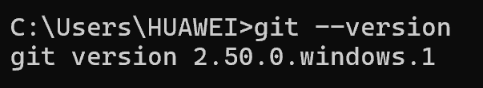

3. **配置身份信息**（终端执行一次）：

   ```bash
   git config --global user.name "你的姓名拼音"
   git config --global user.email "你的注册邮箱"
   ```

4. 配置 SSH 连接：[使用 SSH 连接到GitHub - GitHub 文档](https://docs.github.com/zh/authentication/connecting-to-github-with-ssh)

5. **克隆仓库到本地**：

   1. 找一个路径放你的项目，到该路径下打开cmd（可以在地址栏输cmd+回车）：

      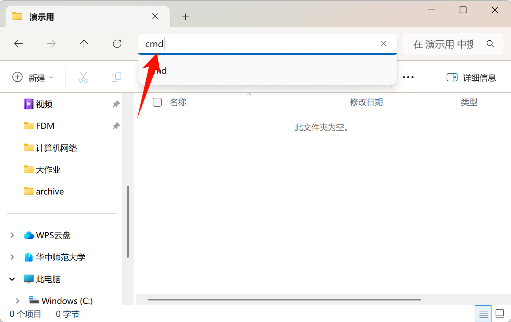

   2. 运行下面的代码：

   ```bash
   git clone git@github.com:ZiChen-Whisper/student-academic-tracker.git
   ```

   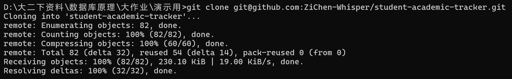

   这就是成功了，可以在本地看到克隆下来的仓库：

   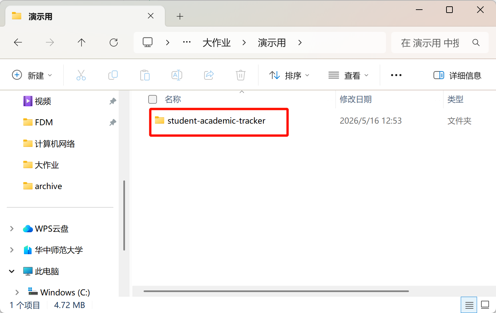

***

## 二、标准开发过程

1. 在仓库的路径下打开cmd（在地址栏输cmd+回车）：

   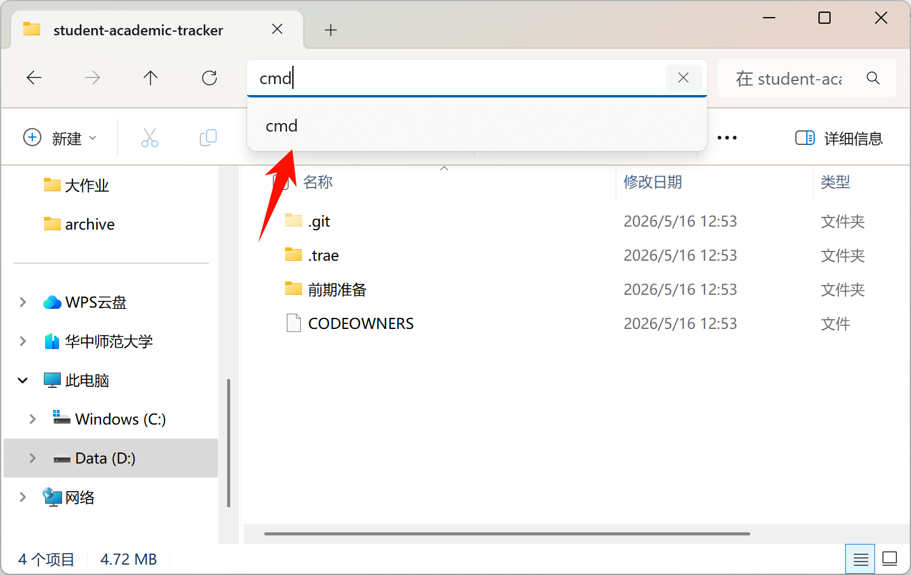

2. 切换回主分支（`main`分支）：

   ```bash
   git checkout main
   ```

   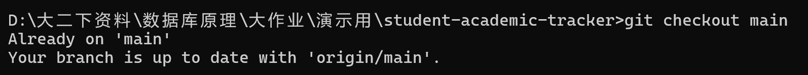

   如果刚克隆过来默认就是在`main`分支的，所以会看到`Already on 'main' Your branch is up to date with 'origin/main'.`的提示。但日后切换分支以后需要这一步切换回来才能进行后面的拉取操作。

3. 从远程仓库拉取最新代码：

   ```bash
   git pull origin main
   ```

   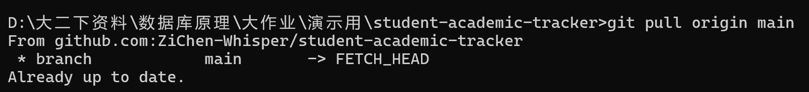

   这一步是为了每次开始协作之前自己的仓库都是最新的。

4. 创建并切换至你自己的分支：

   这里需要解释一下，我们开发协作并不会用`main`分支，我们需要每个人有不同的分支才不会冲突。

   对于分支的管理，我已经在远程仓库创建了`feature`、`fix`和`docs`三个基于`main`分支的分支，分别的用途如下：

   - `feature`分支：新增功能时使用
   - `fix`分支：修改bug时使用
   - `docs`分支：更改文档时使用（也就是我们现在的任务类型）

   我们需要在这三个分支里选一个分支，在该分支下创建自己的分支，命名格式是`姓名拼音-工作描述`

   比如现在的数据库调研任务就可以创建分支：`Zichen_Zou-数据库调研任务`

   具体创建方法：

   ```bash
   git fetch origin  # 拉取远程仓库的所有分支信息
   git checkout -b Zichen_Zou-数据库调研任务 origin/docs  # 基于远程的 docs 分支创建并切换你的新分支（如果要基于其他分支可以自己改掉）
   ```

   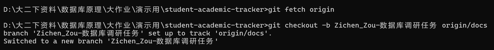

   这样就创建好`Zichen_Zou-数据库调研任务`分支，并且自动切换到你创建的分支了

5. 可以进行对应的修改了：

   推荐使用IDE的可视化界面操作（其实前面几步也可以用可视化界面，但我们这种新手还是老老实实用命令行吧）

   （VScode等IDE都可以，我这里用trae演示，和VScode界面应该是一致的）：

   这是操作界面的含义：

   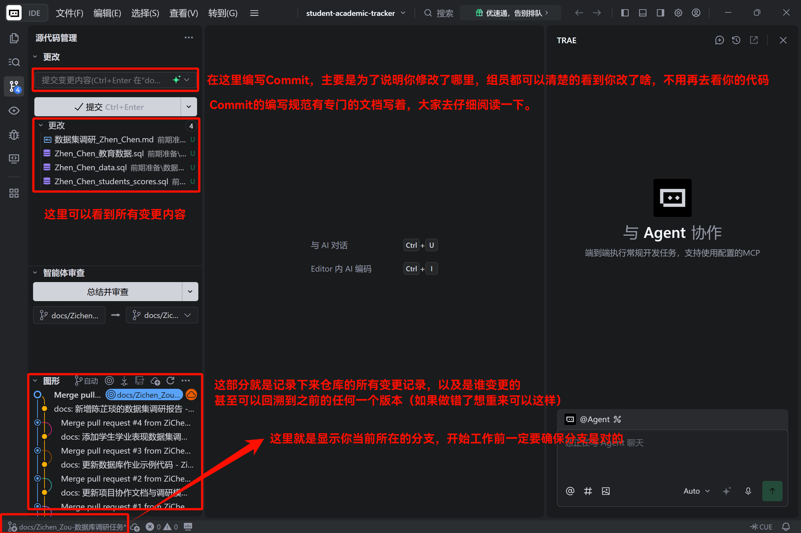

6. 检查改动了哪些文件（如果是用IDE的可以在上面的可视化界面看得到，如果你要用命令行可以用下面的命令查看）：

   ```bash
   git status
   ```

7. 添加所有改动到暂存区:

   如果是用可视化界面，可以点击更改旁边的+号按钮：

   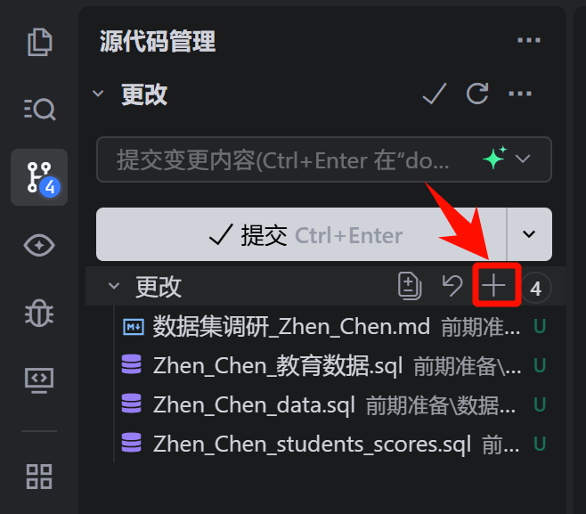

   如果要用命令行，可以执行下面的命令：

   ```bash
   git add .
   ```

8. 编写Commit并提交：

   要注意看Commit编写规范.md！！！如果你跟我一样是用的trae，可以点击旁边的ai总结按钮，它会根据你的修改自动总结并填进去（我已经把编写规范放在仓库里了，它编写完检查一遍没问题就可以直接用了，一般ai编写的都是规范的）

   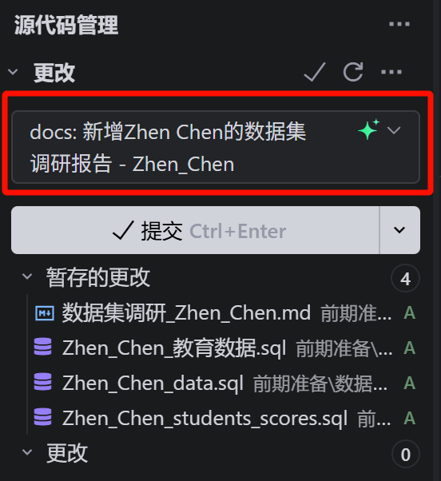

   再点击提交按钮即可。

   如果要用命令行操作：

   ```bash
   git commit -m "docs: 新增Zhen Chen的数据集调研报告 - Zhen_Chen"
   ```

   （因为这里我是帮陈震传她的文件上去作为演示，大家编写的时候要写自己的名字）

9. 推送到远程仓库：

   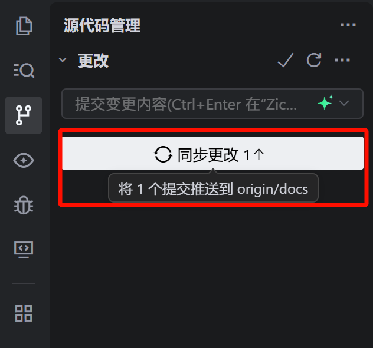

10. 回到GitHub界面发起pull request(PR)：

    上一步成功推送以后GitHub界面会出现这个提示，这个点击按钮。

    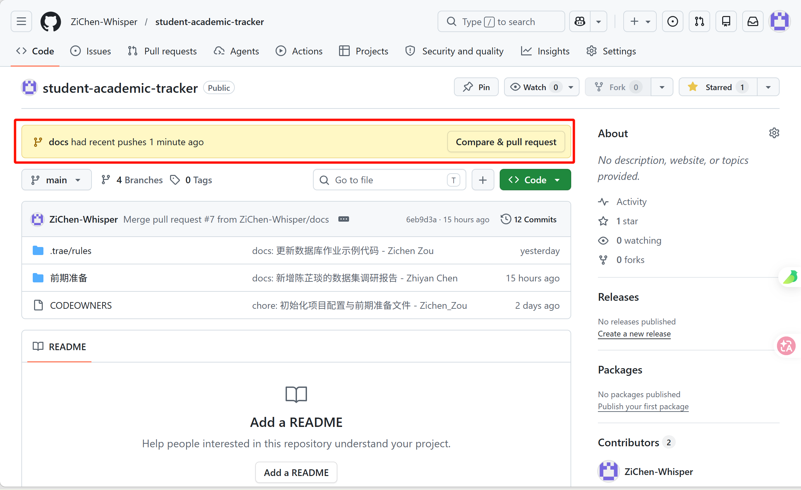

    点击“Create pull request”

    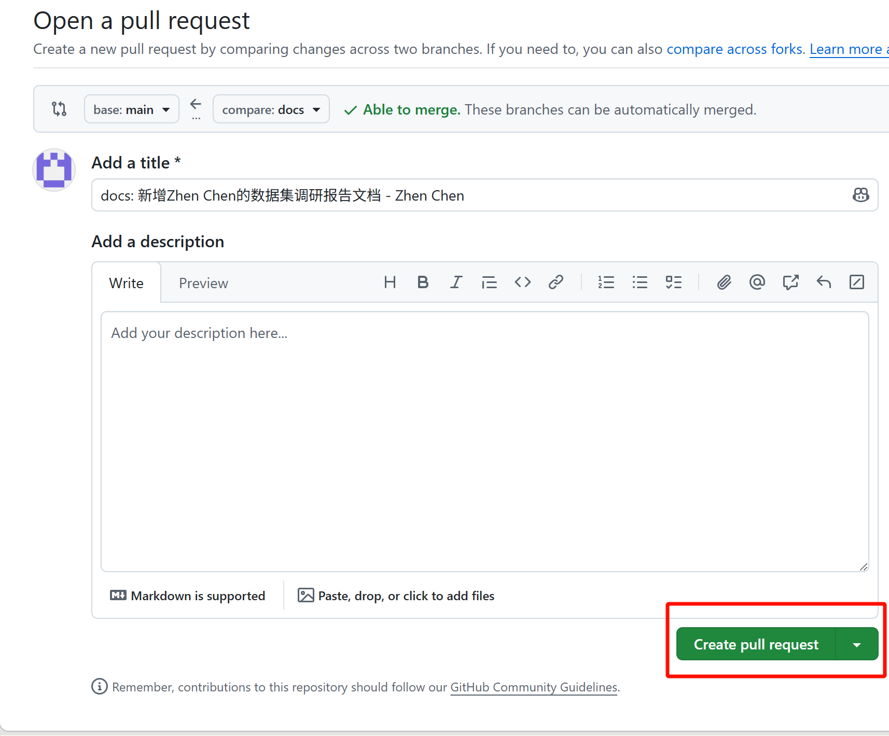

    发起成功后就等待组长审核就可以了（组员如果收到通知不要去审核，组长统一审核就好）

11. 删除新建的这个临时分支：

    ```bash
    git checkout main  # 先切换到main分支
    git branch -d Zichen_Zou-数据库调研任务  # 再删掉新建的分支
    ```

    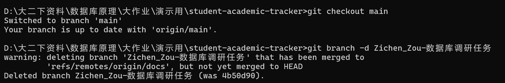

下次协作的时候从第一步重新开始即可。

***

## 📎 附录：速查命令表

```bash
# 查看状态 & 历史
git status                # 查看当前改动
git log --oneline --graph -5  # 查看最近 5 条提交历史

# 分支操作
git branch -a             # 查看所有分支
git checkout -b <分支名>  # 创建并切换
git checkout main         # 切回主分支
git branch -d <分支名>    # 删除本地已合并分支

# 同步 & 暂存
git pull origin main      # 拉取并合并 main 最新代码
git stash                 # 临时保存当前改动（切分支时用）
git stash pop             # 恢复暂存的改动
```

***

如果遇到什么其他问题可以问AI
