# 数据库需求与 ER 建模

## 2.1 引言

确定数据库需求（database requirement）并创建能将这些需求可视化的概念数据库模型，是开发数据库过程的第一步，也是最关键的步骤。 

数据库需求是一系列表述，这些表述指明了该数据库数据及元数据的细节和约束。数据库需求可从业务人员、业务文件、业务政策或者从这三者与其他资源的结合中得到。 

正确收集的需求应该确切地描述数据库将记录哪些信息，以及以什么方式记录这些信息。实体－联系建模（entity-relationship（ER）modeling）是一种广泛使用的概念数据库建模方法，这种方法可以对收集到的需求进行构建和组织，同时以图形的方式将需求展示出来。 

在本章中，我们将介绍如何适当地收集数据库需求，并使用 ER 建模技术将其形象地表示出来。 

## 2.2 ER 建模基本构件

ER 建模后得到的 ER 图（ER diagram，ERD）是整个数据库的蓝图。实体 (entity) 和联系 (relationship) 是 ER 图的两个基本构件。目前还没有一个所有数据库都遵循的通用 ER 符号体系。相反，当前采用的 ER 符号体系种类繁多。虽然采用来自不同符号体系的 ER 符号来表示实体和联系时差异巨大，但其含义通常是相同的。本书将采用陈氏 ER 符号体系的修改版本来表示所有构件，主要原因如下： 

- 教学价值：易于初学者学习和使用。 

- 完整性：所有基本 ER 概念都有相应的表示。 

- 清楚可辨别：所有概念都有图形化的表示，概念间可辨别性强。 

- 与软件兼容：本书提供的数据库建模软件 ERDPlus（ersplus.com 可下载）也采用了该符号体系。 

一旦掌握了一种 ER 符号体系，开发者就可以快速、直接地适应任意其他符号。本章的末尾将给出几种其他符号体系的描述，同时也将说明：熟悉某种 ER 符号的开发者可以非常轻易、自然地理解和使用其他 ER 符号系统。 

## 2.3 实体

实体是 ER 图的基本组件，用于描述数据库所记录的内容。实体 $^{①}$ 可以表示现实世界中的众多概念，如人、地点、对象、事件、项目等。例如，一个零售公司的 ER 图可能包含顾客（CUSTOMER）、商店（STORE）、产品（PRODUCT）和交易额（SALES TRANSACTION） 

四个实体。 

ER 图用矩形代表实体，实体名写在矩形里面，同一个 ER 图中的不同实体应该有不同名字。图 2-1 展示了 CUSTOMER 及 STORE 两个实体的例子。 

图 2-1 中每个实体包含多个实体实例 / 实体成员（entity instance/entity member），如实体 CUSTOMER 可能包含 Joe、Sue、Pat 等实例。实体本身需要画在 ER 图中，实体实例虽 

然不需要表示在 ER 图中，但会被记录到根据该 ER 图所创建的数据库之中。 

图2-1 两个实体

## 2.4 属性（唯一和非唯一）

ER图中每个实体都有属性，实体的一个属性描述该实体的一种特征。由于实体表示的是数据库所记录内容的组件，因而实体属性表示每个实例需要记录的细节。例如，对实体CUSTOMER可以记录以下属性：编号（CustID）、姓名（CustName）、生日（CustBDate）、性别（CustGender）。图2-2描述了如何将属性填入ER图中：每个属性由一个写有属性名字的椭圆表示，同一个实体的不同属性名字不同，每个椭圆用一条线连接到相应实体。唯一属性 (unique attribute) 是指可以唯一标识实体实例的属性。通常来说一个实体至少要有一个唯一属性。如图 2-2 所示，ER 图中实体的唯一属性都带有下划线。该图所示的数据库需求表明，每个顾客的编号必须唯一，但两个或多个顾客的生日、姓名或性别则可以相同。 

图2-2 一个带属性的实体

## 2.5 联系

ER 图中每个实体必须通过联系至少与一个其他实体相关联。在 ER 图中联系 $^{①}$ 表示为一个菱形，菱形中间写有代表联系名字的词或短语，菱形与所有参与该联系的实体进行连线。 

### 基数约束

ER 图中，在实体与联系的连线上往往写有一些符号，这些符号就是基数约束（cardinality constraint）。基数约束用于表示该实体可以有多少实例与另一实体的实例存在联系。考虑图 2-3 中的 ER 图，菱形 “ReportsTo” 表示实体 EMPLOYEE 和实体 DEPARTMENT 之间的联系。而表示基数约束的符号则常常写于实体和联系之间靠近实体一端的连线上。 

图 2-3 两个实体间的联系

每个基数约束包含以下两个部分： 

14 

- 最大基数（maximum cardinality）——靠近实体一端的基数约束部分； 

- 最小基数 / 参与（minimum cardinality/participation）——远离实体一端的基数约束部分。最大基数可以是一个（表示为 “|”）或多个（表示为 “→”）。 

最小基数可以是可选的（表示为“0”）或者是强制的（表示为“|”）。 

图 2-4 列出了实体 A 与联系 B 之间所有四种可能的基数约束。 

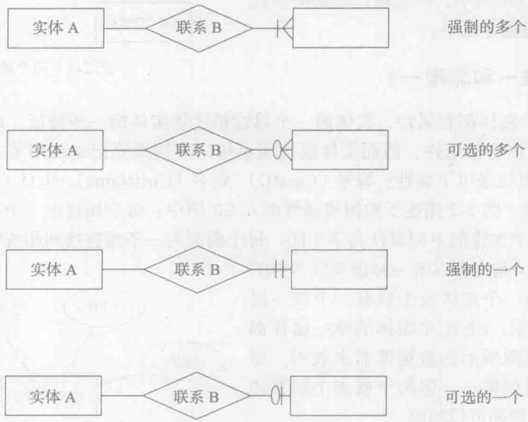

图 2-4 四种可能的基数约束

接下来将以图 2-3 中包含关系 ReprotsTo 的 ER 图为例说明基数约束的概念。以下是图 2-3 中 ER 图的基本需求： 

- 数据库将记录职员（employee）和部门（department）信息。 

- 对每个职员记录其姓名及唯一职员编号（employeeID）。 

- 对每个部门记录其唯一部门编号（departmentID）和位置。 

- 每个职员必须且只能为一个部门作报告。一个部门可以有许多职员为其报告，但也可以没有任何职员。 

首先考虑图 2-3 中 ReprotsTo 菱形右侧的基数约束符号 “||”。强制参与符号（本例中的左侧竖线）表示每个职员必须至少为一个部门作报告。换言之，关系 ReortsTo 的 EMPLOYEE 实体的最大基数约束是 1。最大基数约束符号一个（本例中的右侧竖线）表示每个职员至多可以为一个部门作报告。因此，这两个符号放在一起，表示每个职员必须且只能为一个部门作报告。 

接下来考虑 ReportsTo 菱形左侧的基数约束符号 “→0”。可选参与符号（0）表示部门可以没有职员来作报告，换言之，ReportsTo 关系中的 DEPARTMENT 实体的最小基数约束是 0，最大基数约束多个（→）表示一个部门可能有多个职员来作报告。因此，这两个符号放在一起表示每个部门可以有多个职员来作报告，但也可以没有。换言之，一个部门最少有 0 个职员，最多有多个职员。 

注意，解释 ER 图中联系的合理方法，是利用矩形－菱形－基数约束－矩形规则分别从 

相反方向分两次来考虑这个关系。例如，联系 ReportsTo 就可以解释成： 

- 一个方向：矩形（职员）-菱形（作报告）-基数约束（有且仅有一个）-矩形（部门）； 

- 另一个方向：矩形（部门）-菱形（接受报告）-基数约束（从0到多个）-矩形（职员）。为进一步重申关系和基数约束的概念，本书接下来将在图2-5中给出ReportsTo联系的几种可能版本（为简洁起见，省略了实体属性）。 

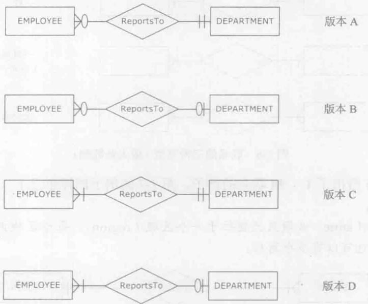

图 2-5 ReportsTo 联系的几种可能版本

以下是每个版本的需求。 

#### 版本 A

- 每个职员必须且只能为一个部门作报告。一个部门可能同时有多个职员作报告，也可能没有。 

#### 版本 B

- 一个职员可以为一个或者不为任何部门作报告。一个部门可以同时有多个职员作报告，也可能没有任何职员。 

#### 版本 C

- 每个职员必须且只能为一个部门作报告。一个部门必须有至少一个职员作报告，也可以同时有多个职员。 

#### 版本 D

- 一个职员可以为一个或者不为任何部门作报告。一个部门必须有至少一个职员作报告，也可以同时有多个职员。 

## 2.6 联系类型（最大基数侧）

联系两侧的最大基数约束可为一个或者多个。因此，若不考虑最小基数而仅考虑最大基数，则联系共有以下几种情况： 

- 一对一联系（1：1）。 

- 一对多联系（1：M）。 

- 多对多联系（M：N）。 

图 2-6 给出了这三种类型的联系及其最大基数侧（由于最小基数不影响最大基数，为简明起见，将其省略）。 

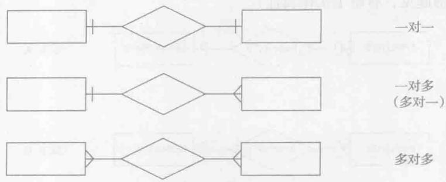

图 2-6 联系的三种类型（最大基数侧）

图 2-3 和 2-5 给出了 1 : M 联系的例子。图 2-7 的例子同样也是 1 : M 联系，该联系反映了如下需求： 

- 每个商店（store）必须且只能位于一个区域（region）。每个区域内至少要有一个商店，当然也可以有多个商店。 

图 2-7 1 : M 联系

图 2-8 给出了一个 M : N 联系的例子，反映的需求如下： 

- 一个职员（employee）可能分配了多个项目（project），但也可能一个项目也没有。一个项目至少应分配给一个职员，当然也可以分给多个职员共同完成。 

图 2-8 M : N 联系

图 2-9 给出了一个 1:1 联系，反映的需求如下： 

- 每个职员（employee）要么分有一辆车（vehicle），要么一辆也没有。每辆车必须且只能分给一个职员。 

图2-9 1：1联系

## 2.7 联系和联系实例

前面曾经讲过，每个实体都有自己的实例，如实体 EMPLOYEE 可能有实例 Bob、Lisa、Maria 等。实体本身需要画在 ER 图中，实体实例虽然不需要表示在 ER 图中，但会被记录 到根据该 ER 图所创建的数据库之中。与此类似，联系也有自己的实例。图 2-10 给出了一个联系及其实例的例子。 

图2-10 一个联系及其实例

如图 2-10 所示，当一个实体的实例通过联系与另一个实体的实例相关联时，一个联系实例就产生了。就像实体和实体实例的情况一样，联系本身会被画进 ER 图，联系实例则不需要表示在 ER 图中，但会被记录到根据该 ER 图所创建的数据库中。 

注意，图 2-10 中的实体 EMPLOYEE 在联系 AssignedTo 中为可选参与，所以才可能存在职员（如 Matt）与右边所有项目都不相连的情况。而由于 PROJECE 实体在联系 AssignedTo 中为强制参与，因此每一个 PROJECT 的实例都必须至少与一个 EMPLOYEE 实体的实例存在连线。 

## 2.8 联系属性

在许多情况下，多对多联系有自己的属性，这些属性就是联系属性（relationship attributes）。图 2-11 给出了一个例子，该 ER 图的需求如下： 

- 数据库将记录学生（students）和校园组织（campus organizations）信息。 

- 对每个学生记录其唯一学号（student ID）、姓名（name）及性别（gender）。 

- 对每个校园组织记录其唯一组织编号（organization ID）和位置（location）。 

- 数据库中每个学生必须至少属于一个校园组织，也可以同时属于多个组织。 

- 数据库中每个校园组织至少有一个学生加入其中，也可以同时拥有多个学生。 

- 对属于某个校园组织的每个具体的学生实例，记录该学生在该校园组织中的职能（function）（如主席、副主席、会计、成员等）。 

图 2-11 带有一个属性的 M : N 联系

上面的最后一条需求表明，一个学生在不同的校园组织中可以有多个不同的职能。若将职能作为实体 STUDENT 的一个或多个属性，则无法知道某个职能是该学生在哪个社会组织中的职能。若将职能作为 ORGANIZATION 的一个或多个属性，又无法知道该社会组织的某职能具体由哪个学生来担任。因此，如图 2-11 所示，职能属性唯一恰当的位置是作为 BelongsTo 联系的属性。 

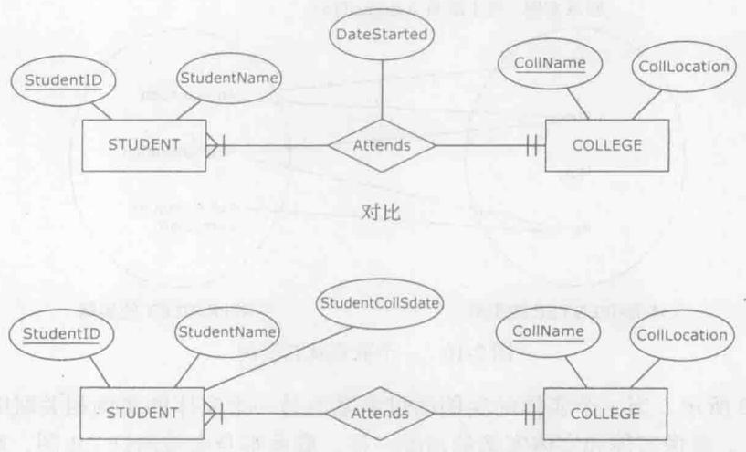

图2-12 带有和不带有一个属性的1：M联系

接下来讨论 1:1 联系与 1:M 联系是否也可以拥有属性。为了回答这个问题，图 2-12 给出了两个有细微差别的 ER 图，这两个图的需求如下： 

- 数据库记录学生（student）和学院（college）信息。 

- 对每个学生记录其姓名和唯一学号（student ID）。 

- 对每个学院记录其唯一名称（name）和位置（location）。 

- 每个学生必须且只能加入一个学院。 

- 每个学院有多个学生。 

- 对每个学生记录其注册进入学院的日期。 

图 2-12 的上半部分给出了 1 : M 联系的一个属性。下半部分基于同样的需求，但将学生的注册日期作为实体 STUDENT 的属性 StudentCollSdate，而不是作为联系 Attends 的属性 DateStarted。由于一个学生只能加入一个学院，因此该学生加入该学院的日期可以作为 STUDENT 实体本身的一个属性。如本例所述，1 : M 联系的一个属性可转化为在该联系中最大基数为 1 的实体属性（本例中的 STUDENT）。更一般地讲，联系属性可以转化为在该联系中最大基数为 1 的实体属性。因此，1 : M 联系或 1 : 1 联系的属性都不是必要的。相反，如图 2-11 所示，对一些 M : N 联系来说，属性则是必要的。 

## 2.9 实例：数据库需求集及其 ER 图

下面这些与零售相关的实例都是数据库需求及其对应 ER 图的例子。 

ZAGI 零售公司的销售部门准备创建一个数据库来记录销售过程的细节。在访问公司并学习了公司文件以后，数据库团队抽取出了如下需求。 

ZAGI 零售公司销售部门数据库将收集如下数据： 

- 对每个在售产品（product）：产品号（product ID）（唯一）、产品名称（product name）、价格（price）； 

- 对每个种类（category）：种类号（category ID）（唯一）、种类名称（category name）； 

- 对每个自动售货机（vendor）：售货机号（vendor ID）（唯一）、售货机名称（vendor name）； 

- 对每位顾客（customer）：顾客号（customer ID）（唯一）、姓名（name）、邮政编码（zip code）； 

- 对每个商店（store）：商店号（store ID）（唯一）、邮政编码（zip code）； 

- 对每个区域（region）：区域号（region ID）（唯一）、区域名称（region name）； 

- 对每项销售交易（sales transaction）：交易号（transaction ID）（唯一）、交易时间（date of transaction）。 

- 每个产品必须且只能由一个售货机供应； 

- 每个售货机可以包含一个或多个产品。 

- 每个产品必须且只能属于一个种类； 

- 每个种类可以包含一个或多个产品。 

- 每个商店必须且只能位于一个区域； 

- 每个区域可以包含一个或多个商店。 

- 每项销售交易只能出现在一个商店中； 

- 每个商店可以有一项或多项销售交易发生。 

- 每项销售交易必须且只能跟一位顾客相关； 

- 每位顾客可以与一项或多项销售交易相关。 

- 每个产品可以通过一项或多项销售交易售出； 

- 每项销售交易可以包含一个或多个产品。 

- 对于每个通过销售交易售出的产品实例，记录其售出的数量。 

图 2-13 给出了基于以上需求得到的 ER 图。注意，ER 符号体系的知识，能够为数据库需求收集人员获得结构化的、有用的需求提供帮助。换言之，ER 图的构建必须以完成数据库需求搜集过程为基础，认清这一点可以帮助数据库需求收集人员提出恰当的问题。下面列出了几个相应问题的例子（来自图 2-13 中 ER 图的需求搜集过程）： 

- 对一位顾客，你最想记录什么信息？（顾客号、姓名及邮政编码） 

- 每位顾客的顾客号是否唯一？（是的） 

- 每位顾客的姓名是否唯一？（不是） 

- 一个产品属于一个种类还是多个？（一个） 

- 一个产品是否只能来自一个售货机？（是的） 

- 是否曾经有过某售货机不提供任何产品的情况？（没有） 

- 是否需要记录那些到目前为止没有买过任何商品的顾客（那些没有参与任何销售交易的顾客）？（不需要） 

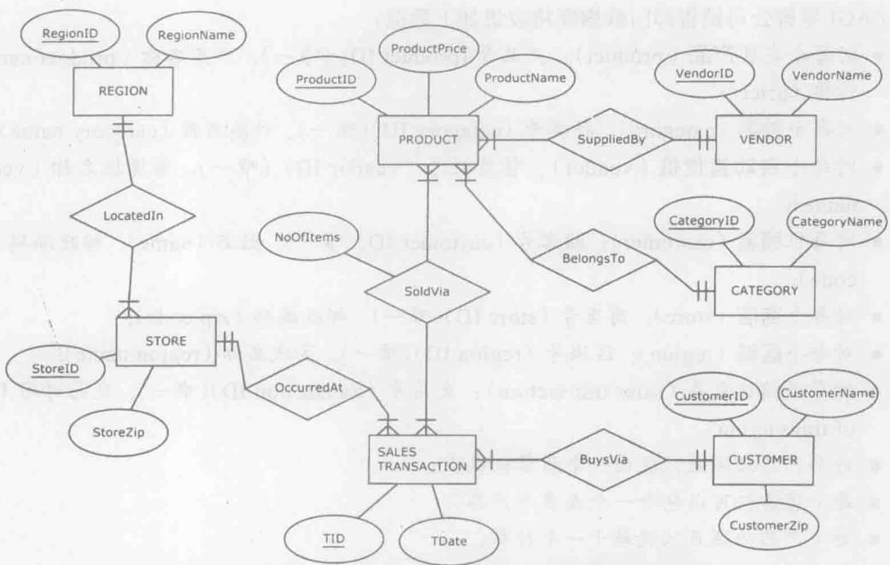

图 2-13 一个 ER 图实例：ZAGI 零售公司销售部门数据库

## 2.10 复合属性

除前文中提到的常规属性外，ER图还可以描述几种其他属性，复合属性（composite attribute）就是其中的一种。复合属性是若干属性的组合，图 2-14 就给出了一个复合属性的例子。 

在图 2-14 中，属性 CustFullName（顾客全名）由两个部分组成：属性 CustFName（顾客名字）和属性 CustLName（顾客姓氏）。复合属性用于表示由若干单个属性组成的属性集合拥有新含义的情况。在图 2-14 中，实体 CUSTOMER 有 5 个属性：编号 

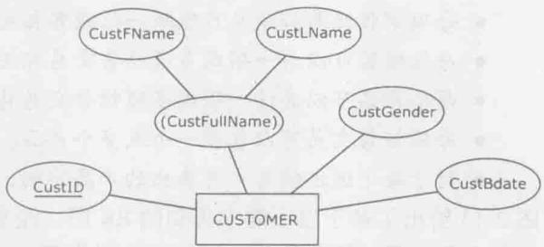

图2-14 拥有复合属性的实体

(CustID)（描述顾客信息的唯一标识号）、性别（CustGender）、生日（CustBdate）、名字（CustFName）、姓氏（CustLName）。全名并不是实体 CUSTOMER 的额外属性，相反，它仅仅表示将名字和姓氏结合起来以后所得到的完整的顾客姓名。 

图 2-15 给出了另一个复合属性的例子。实体 STORE 共有 6 个属性，每个属性都有自己的意义。若将属性街道（Street）、编号（StreetNumber）、城市（City）、州（State）、邮编（Zip）放在一起考虑，则可得到一个新的含义：商店地址（Store Address）。 

图 2-16 给出了包含 7 个属性的 BOUTIQUECLIENT 实体的例子。这家独具一格的裁缝店记录了每位顾客的尺寸信息及顾客的名字（firstname）。同时，该裁缝店还记录了顾客的 5 种穿衣指数：腿长（inseam）、腰围（waist）、袖长（sleeves）、肩宽（shoulders）以及领围（collar）。这个例子说明一个简单属性可能是多个复合属性的组成部分。腿长及腰围可组成属性裤子尺寸（pantsize），而腰围、肩宽、领围及袖长可组成属性衬衣尺寸（shirtsize）。 

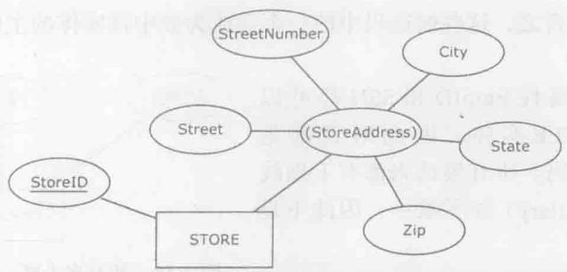

图2-15 另一个拥有复合属性的实体

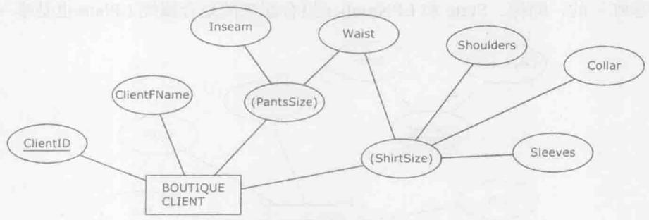

图 2-16 复合属性共享成分

## 2.11 复合的唯一属性

图 2-17 给出了拥有复合的唯一属性（composite unique attribute）的实体例子。在图 2-17 中，教学楼（Building）、房间号（Room Number）、座位数（Number of seats）是实体 CLASSROOM 的三个属性，但它们都不唯一。CLASSROOM 实体的需求表示如下： 

- 同一栋教学楼中可以有多个教室（如 A 教学楼中有若干个教室）。 

- 可以有多个教室拥有相同的房间号（如 A 教学楼的 111 房间与 B 教学楼的 111 房间）。 

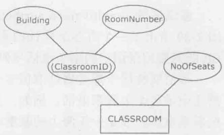

图 2-17 拥有复合的唯一属性的实体

- 可以有多个教室拥有相同的座位数（如若干个教室都有40个座位）。 

由于三个属性都不唯一，所以 CLASSROOM 没有一个可以唯一标识其本身的简单属性（single-component）。然而教学楼和房间号两个属性的结合却是唯一的（因为在整个数据库中，给定教学楼和房间号可以确定唯一教室），因此，这两个属性组成的复合属性可以作为唯一属性。 

复合属性 ClassroomID 使得实体 CLASSROOM 符合每个实体至少要有一个唯一属性的规则。 

## 2.12 多个唯一属性（候选码）

图 2-18 给出的实体同时拥有多个唯一属性，这里的每个唯一属性就叫做一个候选码 (candidate key)。“候选”的意义在于：这些属性都可作为构建整个数据库时主要区别属性（或 称主码）的备选。换言之，这些候选码中的一个会成为表中该实体的主码。主码将在第3章进行讨论。 

在图 2-18 中，属性 EmpID 和 SSN 都可以区分一个 EMPLOYEE 实体，因此两者都是 EMPLOYEE 的候选码。所有候选码都有下划线标识。属性薪水（Salary）并不唯一，因此不是候选码。 

图 2-18 拥有多个唯一属性（候选码）的实体

一个实体可以同时将常规属性（单个复合属性）或复合属性作为主码。图2-19中，实体VEHICLE的属性VIN（vehicle identification number）是唯一的，同样，State和LPNumber组合起来的复合属性LPlate也是唯一的。

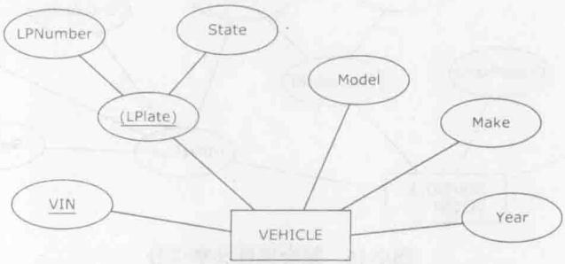

图 2-19 拥有一个单一的和复合的候选码的实体

## 2.13 多值属性

多值属性（multivalued attribute）用于实体实例的同一属性可以有多个不同取值的情况。图 2-20 给出了一个有多值属性的实体例子，标识多值属性的椭圆外画有双线。图 2-20 中的 ER 图需要记录用户的多个电话号码。 

多值属性用于那些属性取值多于一个的实体，图 2-20 就是这样的情景：对于每个职员，需要记录若干个联系电话。例如，某职员可能有两个联系电话，而有些职员可能有多于两个的联系电话，或是少于两个的联系电话。 

如图 2-21 所示，若对每个职员都记录两个联系电话（办公室电话和手机），则不需要使用多值属性，只要分别使用两个单值属性就可以了。 

图2-20 一个多值属性

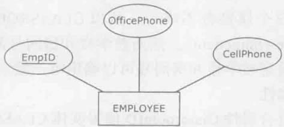

图 2-21 不使用多值属性的场景

## 2.14 派生属性

派生属性（derives attribute）是非永久性存于数据库的属性。派生属性的值可以从别的 属性值或其他数据（如当前日期）派生出来。图 2-22 给出了一个从 ER 模型中得到派生属性的例子。 

派生属性用虚线的椭圆标识，属性 Opening-Date 作为一个常规属性会存于最终的数据库中，YearsInBusiness 作为一个派生属性则不会存于数据库中，而是从商店的 OpeningDate 及当前日期中派生出来。如果 YearsInBusiness 是一个常规属性，其值将存于数据库中且需要人工更 新（一般每年一次），否则数据库中将出现错误信息。而将 YearsInBusiness 作为派生属性后，就可以确保数据库以后将该属性作为一个公式，用于得到正确的当前 YearsInBusiness 的属性值。 

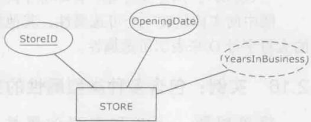

图2-22 一个派生属性的例子

图 2-23 给出了另一个派生属性的例子。在本例中，对与 REGION 的实例有 IsLocatedIn 联系的 STORE 实例进行计数，就可以得出派生属性 NoOfStores 的值。 

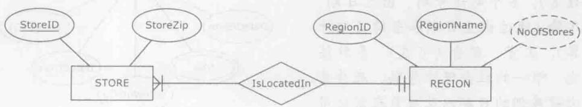

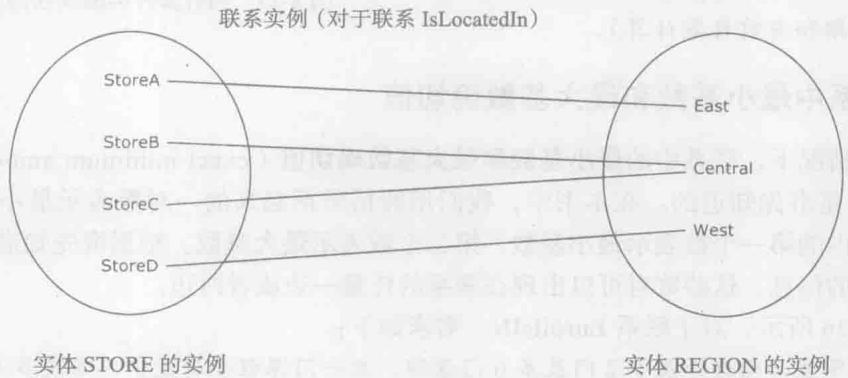

图 2-23 另一个派生属性的例子

在本例中，属性 NoOfStores 在东区（East）、中心区（Central）、西区（West）的值分别为 1、2、1。如果实体 STORE 有了一个新的实例 StoreE，且该实例通过新的 IsLocatedIn 联系实例与 REGION 实例 West 相关，则西区（West）的派生属性 NoOfStores 会自动地从 1 增加为 2。 

## 2.15 可选属性

对每个实例，实体的大部分属性都有相应的取值，但有的属性也可能没有取值，这些属性就是可选属性（optional attribute）。图 2-24 给出了一个可选属性的例子，表示了如下需求： 

图2-24 一个可选属性

- 对每个职员记录其唯一的编号（employee ID）及其薪水（salary）和年终奖（annual bonus）。但并非所有职员都有年终奖（annual bonus）。 

图中的实体只有一个可选属性，其他属性均为必需属性。我们在属性名后加一个带括号的大写字母 O 来表示可选属性。 

## 2.16 实例：包含多种类型属性的实体

简单回顾一下各种类型的属性，图 2-25 展示了一个包含多种类型属性的实体。该实体反映了以下需求： 

- 数据库将记录雇员信息。 

- 对于每一名雇员，将记录以下属性：雇员的唯一ID、唯一的e-mail、姓、名（姓和名可以组合成完整的姓名）、多个电话号码、出生日期、年龄（通过出生日期和当前日期计算）、工资、奖金（可选）、多种技能、唯一的社会保险号码、雇员首次被雇佣的日期以及雇员在该公司的工作年限（通过雇员首次被雇佣的日期和当前日期计算）。 

图 2-25 拥有多种类型属性的实体

## 2.17 联系中最小基数和最大基数确切值

在某些情况下，联系中的最小基数和最大基数确切值（exact minimum and/or maximum cardinality）是事先知道的。在本书中，我们用圆括号括起来的一对数表示最小基数和最大基数，括号内的第一个数表示最小基数，第二个数表示最大基数。根据事先知道的最小基数和最大基数的信息，这些数对可以出现在联系的任意一边或者两边。 

如图 2-26 所示，对于联系 EnrollsIN，需求如下： 

- 每名学生必须选择最少2门最多6门课程，且一门课程要有最少5名最多40名学生。 

图 2-26 具有确定最小基数和最大基数的联系

具体的最大基数和最小基数是用菱形符号和基数约束符号之间的数对表示的。 

本书中，当需要用圆括号括起来的数对表示最小和最大基数时，即使它们中的一个是不确定的值，我们仍需要将两个值（最小值和最大值）都表示出来。如图 2-27 所示，对于联系 EnrollsIN，需求如下： 

- 每名学生最多选择6门课程，也可以不选任何课程。一门课程必须要有至少5名学生，选课人数没有上限。 

图 2-27 一个既有确定的又有不确定的基数的联系

在这个例子中，通过两种方式表明实体 STUDENT 可选地参与到联系 EnrollsIn 中：一种是使用最小基数的可选参与符号；另一种是通过联系符号与基数约束符号之间的数对说明最小约束为 0。同样，实体 CLASS 的最大基数（多个但没有确定值）也是通过两种方式来说明的：一种是通过鸭掌符号（ $\epsilon$ ）说明最大基数；另一种是通过数对中的字母 M 表明最大基数。 

## 2.18 一元联系和联系的角色

联系的度（degree of a relationship）表示有多少个实体参与到该联系中。目前为止， 

本书所涉及的联系都只涉及两个实体。两个实体之间的联系叫做二元联系（binary relationship）或者度为2的联系（因为该联系涉及两个实体）。尽管绝大多数业务ER图中的联系都是二元联系，但是也会出现度不为2的联系。度为1的联系也称为一元联系（unary relationship）或者递归联系（recursive relationship），出现在一个实体与它自己相联 系的情况中。图 2-28 展示了三个一元联系的例子，分别是 1 : N、M : N 和 1 : 1 三种情况。 

例A（1：M）

例B(M:N)

例C（1：1）

图2-28 一元联系的例子

图 2-28 中，例 A 的需求如下： 

- 一个客户可以推荐多个客户，也可以不推荐任何客户。每个客户可以由另一个客户推荐或者没有被任何客户推荐。 

图 2-28 中，例 B 的需求如下： 

- 一个雇员可以指导许多雇员，也可以不指导任何雇员。一个雇员可以被多个雇员指导，也可以不被任何雇员指导。 

图 2-28 中，例 C 的需求如下： 

- 在一个赠送礼物活动数据库中（神秘圣诞老人 $^{①}$ ），每个人只能向另一个人赠送礼物，每个人也只能收到另一个人的礼物。 

在 ER 图中，联系角色（relationship role）可以表达额外的语义信息。数据建模者可以使用联系角色进一步说明每个实体在联系中的角色。联系角色可以用在任何度的联系中，但联系角色的作用通常体现在一元联系中。我们用写在联系连线旁边的文本来表示联系角色。图 2-29 展示了一些带有特定联系角色的一元联系的例子。 

图 2-29 中的各图可以做如下额外解释。 

图 2-29 具有角色名的一元联系的例子

图 2-29 中，例 A 的解释如下： 

- 一个客户可以是推荐者，推荐多个客户。该客户也可以不是推荐者。 

- 一个客户可以是被推荐者，且只能被一个客户推荐。该客户也可以不是被推荐者。 

图 2-29 中，例 B 的解释如下： 

- 一个雇员可以是指导者，指导多个雇员，也可以不是指导者。 

- 一个雇员可以是被指导者，被多个雇员指导，也可以不是被指导者。 

图 2-29 中，例 C 的解释如下： 

- 一个人必须是礼物赠送者，且只能向一个人赠送礼物。 

- 一个人必须是礼物接受者，且只能接受一个人的礼物。 

图 2-30 展示了一个二元联系中联系角色的例子。 

图 2-30 具有角色名的二元联系的例子

正如前文中提到的，ER 图建模者可以任意使用联系角色。在某些情况下，联系角色能够使问题变得清晰，然而过度使用联系角色会产生重复问题。例如，在图 2-30 中，有一定经验的读者不需要显式地通过联系角色来理解联系 “Ships” 的含义。因此，不标明联系角色的 ER 图将提供同样的信息，并且更加简明。 

## 2.19 相同实体间的多种联系

ER 图中，相同实体之间通过多种联系连接起来的情况是很常见的。图 2-31 展示了这种情况。该例子基于如下需求： 

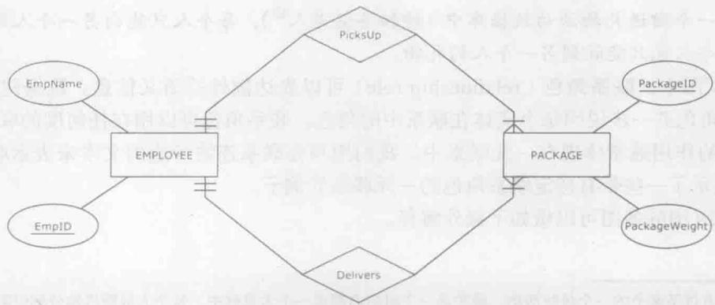

图 2-31 相同实体间的多种联系

- 一个船运公司要创建一个数据库以记录它的雇员信息和包裹信息。 

- 每个包裹只能由一个雇员分拣。 

- 每个雇员可以分拣多个包裹。 

- 每个包裹只能由一个雇员递送。 

- 每个雇员可以递送多个包裹。 

## 2.20 弱实体

通常情况下，实体至少要有一个唯一属性。在 ER 图中，弱实体（week entity）用来表示没有唯一属性的实体。弱实体是用双框的矩形表示的。在 ER 图中，弱实体必须和它的属主实体（owner identity）通过标识性联系（identifying relationship）连接起来。该联系是用双框的菱形表示的。 

图 2-32 展示了一个弱实体的例子。该例子基于如下需求： 

- 一个公寓出租公司要创建一个数据库以记录它的建筑物信息和公寓房间信息。 

- 对于每个建筑物，将记录唯一的建筑物 ID 和该建筑物的层数。 

- 对于每套公寓，将记录公寓编号和公寓内的房间数。 

- 每个建筑物内有多套公寓，每套公寓只能位于一个建筑物内。 

- 在我们的数据库中，多套公寓可以有相同的公寓编号，但在一个建筑物内每套公寓只能有一个唯一的公寓编号。 

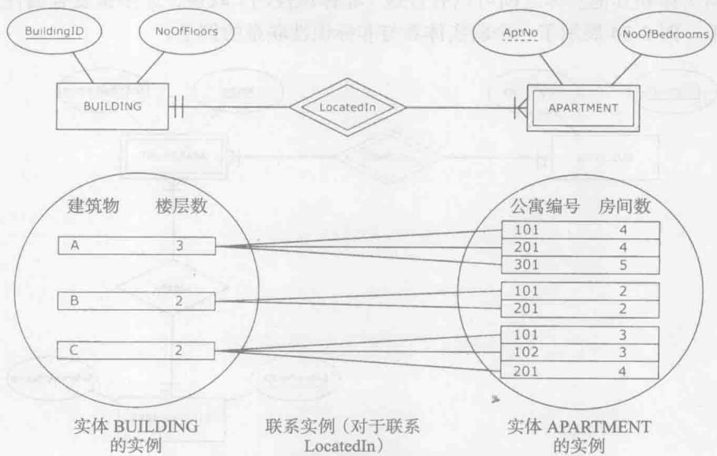

图2-32 一个弱实体的例子和该实体的实例

正如需求中描述的，实体 APARTMENT 没有唯一属性。然而，在每个建筑物内部，公寓编号是唯一的，这种属性叫做部分码（partial key），在 ER 图中用下划虚线表示。部分码和属主实体的唯一属性的组合可以唯一标识弱实体的每个实例。例如，弱实体 APARTMENT 的实例可以由它的部分码 AptNo 和属主实体 BUILDING 的主码 BuildingID 唯一标识，如下所示： 

A 101, A 201, A 301, B 101, B 201, C 101, C 102, C 201 

31 事实上，弱实体的概念和多值复合属性的概念很相似。图 2-33 说明了这一点。 

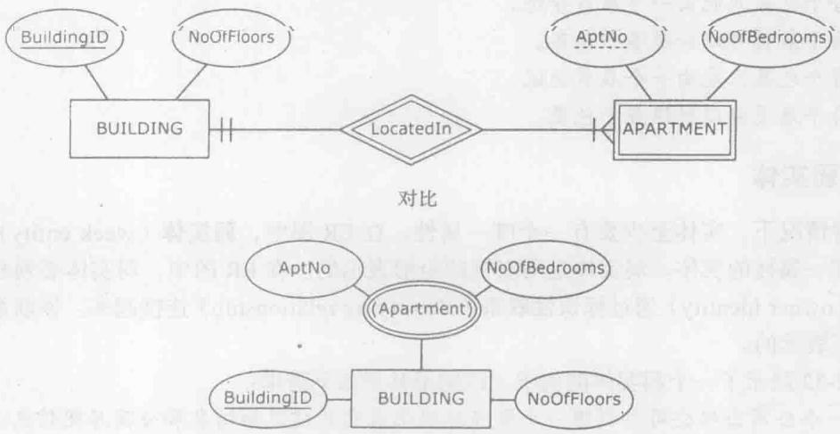

图 2-33 弱实体与多值复合属性

图 2-33 中的两个 ER 图都满足同样的数据库需求。然而弱实体符号能描述部分码，而多值复合属性则不能。例如，图 2-33 上半部分的 ER 图中，我们能显式地说明一个建筑物内的公寓编号是唯一的，而图 2-33 下半部分的 ER 图则不能。 

一个弱实体和其他实体之间可以有普通（非标识性的）联系，而多值复合属性则不能表现这种联系。图 2-34 展示了一个弱实体参与非标识性联系的例子。 

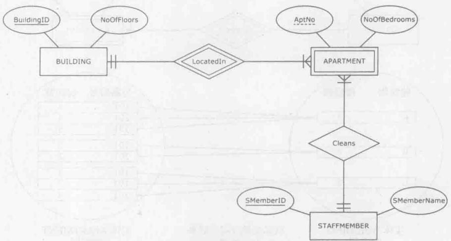

图 2-34 一个有标识性联系和普通联系的弱实体

尽管弱实体和多值复合属性有很多相似之处，然而，正如前文所述，这两个概念之间还是有显著区别的。 

每个弱实体在和其主实体之间的标识性联系中总存在强制的一基数约束，用以确保每个弱实体的实例只和属主实体的一个实例发生关联。另一方面，属主实体可以强制性或选择性地参与到标识性联系中。也就是说，属主实体中的实例可以不与任何弱实体中的实例发生关联。 

大多数情况下，标识性联系都是1：M的联系。然而，也会出现1：1联系的情况，在这种情况下，弱实体中的部分码就不必作为标识属性了。图2-35说明了这种情况。该例子基于如下需求： 

- 数据库将记录雇员以及他们的配偶信息。 

- 对于每个雇员，将记录他的唯一ID和姓名。 

- 对于每个配偶，将记录他的姓名和出生日期。 

- 每个雇员可以有一个配偶或者没有配偶。 

每个配偶只能和一个雇员结婚。 

图 2-35 一个有 1:1 标识性联系的弱实体

需要注意的是，弱实体 SPOUSE 不需要部分标识，因为每个雇员只能和一个配偶相关联，因此不需要部分标识来区别不同的配偶。 

## 2.21 实体、属性和联系的命名约定

在 ER 建模的过程中，采取特定的准则来为实体、联系和属性命名是一个很好的做法。在本书中，我们约定：使用大写字母来命名实体，使用大写字母和小写字母的组合来命名属性和联系。 

对于命名实体和属性，一个常见的准则是使用单数（不使用复数）名词以使 ER 图尽量清晰易读。例如，实体名 STUDENT、STORE 和 PROJECT 要比 STUDENTS、STORES 和 PROJECTS 更好。同样，属性名 Phone 要比属性名 Phones 好，尽管它是一个多值属性。实体和多值属性都有多个实例，这点从概念本身就能理解，并不需要使用一个复数形式的词来说明。 

对于命名联系，通常是使用动词或动词短语而不是名词。例如，用 Inspects、Manages 和 BelongsTo 来命名联系是比 Inspection、Management 和 Belonging 更好的选择。 

当命名实体、属性和联系时，建议尽量简洁但又不要太过简略而使概念模糊不清。例如，在一个大学的 ER 图中，实体名 STUDENT 要比实体名 UNIVERSITY STUDENT 更好。在上下文环境中，很显然 STUDENT 是指大学学生，因此 UNIVERSITY STUDENT 就有些冗长了。同样，使用 US 作为 “University Student” 的缩写对于将来使用该数据库的一般用户来说又太过隐晦了。这并不是说使用多个单词或者缩写总是不好的选择。例如，SSN 就是一个很好的属性名，因为大家都知道它是社会安全号码的缩写。而使用多个单词的短语 NoOfFloors 命名属性则是比单个单词 Floor 或者缩写 NoF 更好的选择，因为使用 Floor 会产生歧义，大多数用户也都不会理解 NoF 的含义。 

正如本章开始所提到的，ER 建模的一条基本规则是同一个实体内的属性必须有不同的名称。而 ER 建模中一个良好的规则是使整个 ER 图中的属性名均不相同。例如，不要使用单词 Name 表示两个不同实体 EMPLOYEE 和 CUSTOMER 的两个不同属性，而应该使用不同的单词，如 EmpName 和 CustName。 

这里提到的准则都不是强制性的，并且会有例外的情况。然而，如果始终遵守这些准则，这样得到的 ER 图通常会比不使用这些准则得到的 ER 图更加清晰易读。 

## 2.22 多个ER图

在一个 ER 图中，每个实体总能通过直接或间接的联系连接到其他所有实体。换句话说，在每个 ER 图中，每两个实体之间总会有一条路径。 

如果一个 ER 模式包含不能互相连接的实体，实际上，这个 ER 模式表示了多个单独数据库的 ER 图。例如，图 2-36 中，实体 A、B、C 与实体 D、E、F、G 不相连。因此，实体 A、B、C 属于一个 ER 图的组成部分，而实体 D、E、F、G 属于另一个 ER 图的组成部分。 

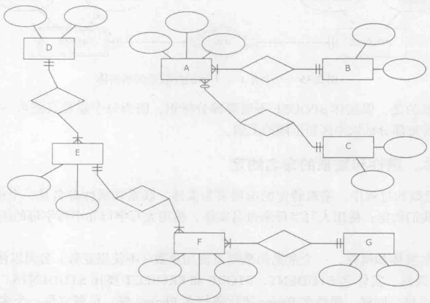

图 2-36 一个模式中包含两个独立的 ER 图（可能会产生误导）

总的来说，当描述多个 ER 图时，每个图应该分开表示。不要采用图 2-36 的方式，一个模式中包含两个 ER 图，更好的选择是如图 2-37 所示，单独呈现每个 ER 图。这可消除由于没有注意到模式包含多个（不相连的）ER 图而造成的混淆。 

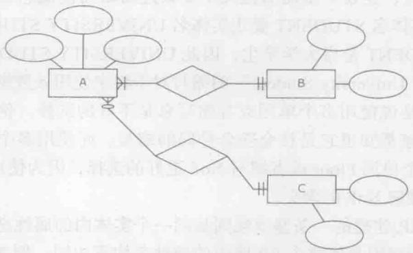

图2-37 单个模式中包含单个的ER图

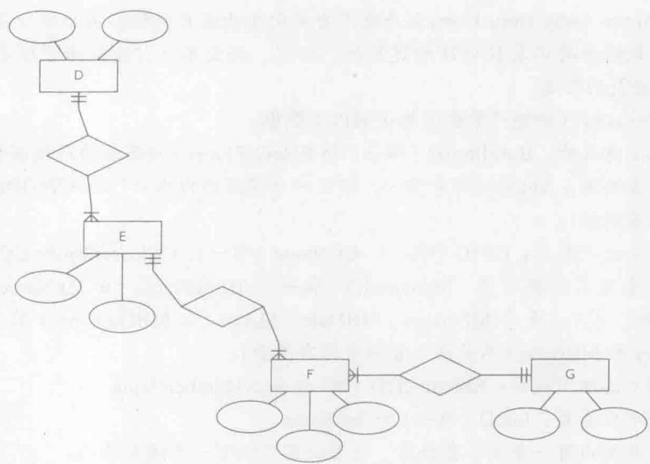

图 2-37 (续)

## 2.23 实例：另一组数据库需求及其 ER 图

复习一下已经介绍过的 ER 模型的概念，请看图 2-38 中另一个 ER 图的例子。该例子基于以下需求： 

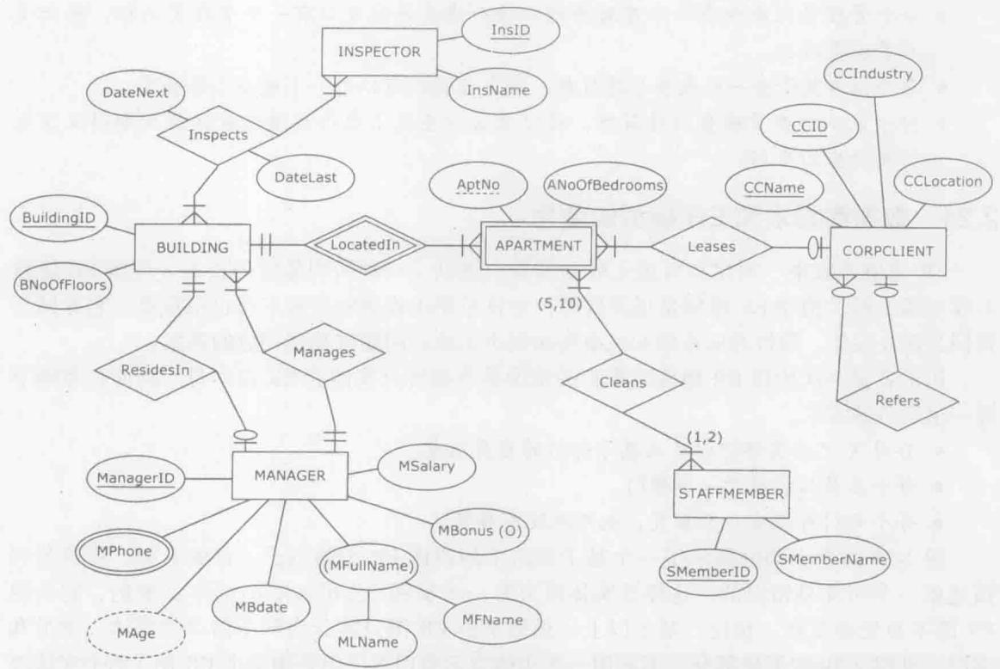

图 2-38 另一个 ER 图的例子：房地产公司 HAFH 的地产数据库

HAFH（Home Away from Home）房地产公司向企业客户提供公寓出租业务。HAFH 房地产公司地产数据库将记录 HAFH 的建筑物、公寓、企业客户、建筑物管理员、清洁工成员和建筑物检查员的信息。 

房地产公司 HAFH 的地产数据库将记录以下数据： 

- 对于每个建筑物：BuildingID（唯一）和BNoOfFloors（建筑物内的楼层数）。 

- 对于每套公寓：AptNo（部分唯一，即在一个建筑物内唯一）和 ANoOfBedrooms（公寓内的房间数）。 

- 对于每个企业客户：CCID（唯一）、CCName（唯一）、CCLocation和CCIndustry。 

- 对于每个建筑物管理员：ManagerID（唯一）、MFullName（由MFName和MLName组合形。成）、多个MPhones、MBDate、MAge（由MBDate和当前日期生成）、MSalary和MBonus（不是每个管理员都有奖金）。 

- 对于每个清洁工成员：SMemberID（唯一）和 SMemberName。 

- 对于每个检查员：InsID（唯一）和 InsName。 

- 每个建筑物内有一套或多套公寓。每套公寓只位于一个建筑物内。 

- 每套公寓要么只出租给一个企业客户，要么没有出租。每个企业客户可以租用一套或多套公寓。 

- 每个企业客户可以推荐许多企业客户也可以不推荐任何企业客户。每个企业客户只能被一个企业客户推荐或者不被任何企业客户推荐。 

- 每套公寓由一个或两个清洁工负责清理。每个清洁工负责清理 5～10 套公寓。 

- 每个建筑物管理员管理一个或多个建筑物。每个建筑物只能由一个管理员管理。 

- 每个管理员只能住在一个建筑物内。每个建筑物内要么有一个管理员居住，要么没有管理员居住。 

- 每个检查员检查一个或多个建筑物。每个建筑物可以有一个或多个检查员。 

- 对于某个检查员检查的建筑物，将记录该检查员上次检查该建筑物的日期以及下次将要检查的日期。 

## 2.24 数据库需求和 ER 模型的使用

ER 建模为收集、构建和可视化数据库需求提供了一种简明易懂的技术。理解 ER 建模不仅对基于需求构建 ER 模型是很重要的，并且对需求收集的过程本身也很重要。它有助于我们为建立实体、属性和联系的相关事实而提出正确的问题或找到相应的答案。 

初学者第一次使用 ER 建模时常犯的错误是不能区分实体和 ER 图本身。例如，考虑下面一组简单的需求： 

- 公司 X 记录其部门以及从属于部门的雇员信息。 

- 每个雇员只能属于一个部门。 

- 每个部门可以有多个雇员，也可以没有雇员。 

图 2-39 的上半部分展示了一个基于该需求的错误 ER 图的例子。该例表明，将该公司描述成一个实体是错误的，这样该实体将只有一个实例（公司 X），这是不必要的，它会使 ER 图本身变得复杂。相反，基于以上一组需求的 ER 图只需分为两个简单的实体：雇员和部门，见图 2-39 的下半部分。不是用一个实体表示公司 X，而是用整个 ER 图（两个实体以及它们之间的联系）表示公司 X。 

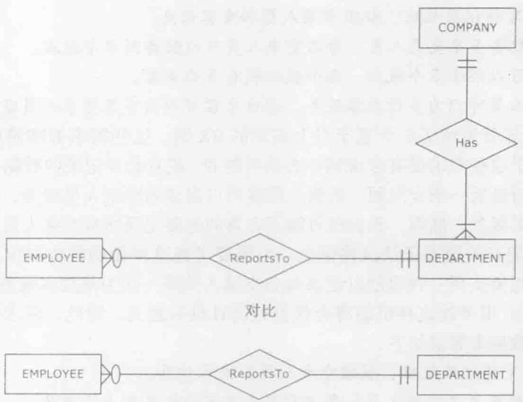

图 2-39 错误阐释和正确阐释需求的 ER 图

注意，如果上述需求的第一条变为一个行业协会想要记录其成员公司、部门以及雇员，这时图2-39上半部分的图就是正确的。然而，需求中明确说明了这是一个公司记录其雇员和部门的数据库，因此，图2-39下半部分的图对于该需求是正确的。 

为了进一步说明这一点，考虑图 2-40 中的 ER 图。 

图 2-40 包含学生和大学实体的 ER 图

图 2-40 对于以下需求是正确的： 

- 一个非盈利的基金会记录它所资助的奖学金获得者。 

- 对于每名学生（奖学金获得者），记录他的唯一学生 ID、姓名以及他就读大学的入学日期。 

- 对于每一所拥有该基金会资助学生的大学，基金会记录该大学唯一的大学名称和大学的地理位置。 

- 每一名奖学金获得者只能就读于一所大学。数据库中的每所大学至少有一名奖学金获得者。 

注意，图 2-40 中的 ER 图对于只记录一所大学的数据库是不正确的。在这种情况下，实体 COLLEGE 是不必要的，就像图 2-39 中的实体 COMPANY 一样。 

另一个数据库需求收集和 ER 建模中常见的新手错误是不区分以下两者： 

- 对需要被记录的数据建模。 

- 对发生在一个组织内的所有事情建模。 

例如，下面的一组需求就没有区分这两者： 

- 航空公司 X 想记录航班、航班空乘人员和乘客信息。 

- 每个航班配备多名空乘人员。每名空乘人员可以配备到多个航班。 

- 每位乘客可以乘坐多个航班。每个航班载有多位乘客。 

- 每名空乘人员可以为多位乘客服务。每位乘客可以由多名空乘人员服务。 

图 2-41 上半部分展示了一个基于以上需求的 ER 图。这些需求都准确地表示了航空公司 X，但问题在于这些需求没有考虑到什么是可能和 / 或有必要记录的数据。这组需求的前三条是合理的，而最后一条有问题。的确，乘客可以由多名空乘人员服务，每名空乘人员也可为多位乘客提供服务。然而，我们很可能不会真的想要记录所有空乘人员为乘客提供服务的组合。即使我们真的想要记录这些信息，也需要考虑这样做的代价和实用性。在这个例子中，如果我们想要实现一种机制以记录每名空乘人员第一次为某旅客服务的信息（如拿饮料、回答问题等），很可能这种机制将会代价过高且没有意义。因此，需求的最后一条应该删除，删除后的数据库需求如下： 

- 航空公司 X 想记录航班、航班空乘人员和乘客信息。 

- 每个航班配备多名空乘人员。每名空乘人员可以配备到多个航班。 

- 每位乘客可以乘坐多个航班。每个航班载有多名乘客。 

因此，应该如图 2-41 的下半部分所示来构建 ER 图。 

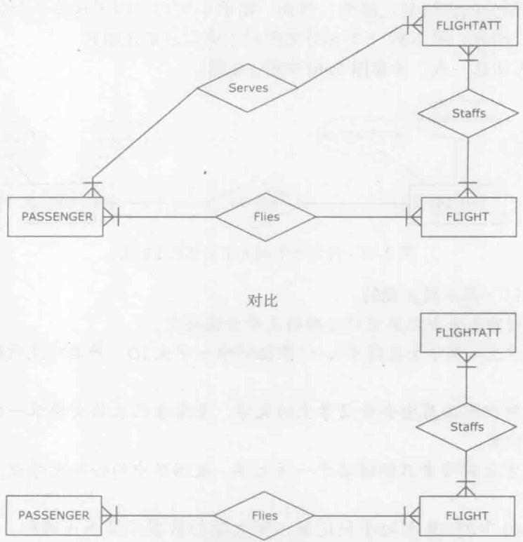

图 2-41 基于不可行的需求与适当需求的 ER 图

## 2.25 各种 ER 符号体系

正如前文所提到的，现在没有一个所有数据库工程都遵守的且被普遍接受的 ER 符号体 系。相反，目前常用的 ER 符号体系有许多种。然而，如果设计者熟悉某一种 ER 符号体系，那么掌握其他的 ER 符号体系则会很容易。 

图 2-42 用三种不同的符号体系说明了同样的 ER 图。图 2-42 顶部的图使用本书的符号体系来表示 ER 图。 

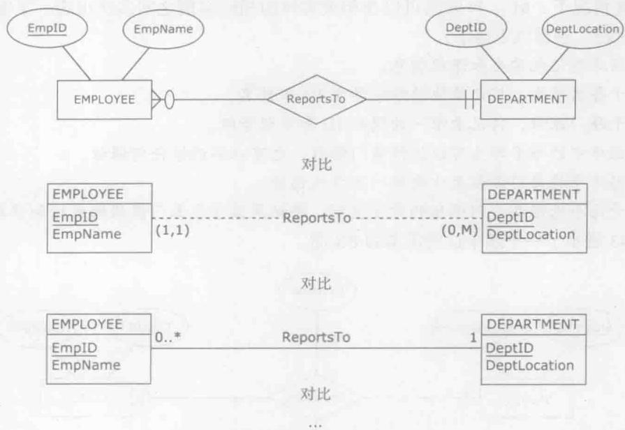

图 2-42 各种 ER 符号体系的例子

图 2-42 中间的图使用了另一种符号体系。在该符号体系中，属性名和实体名放在同一个矩形内，联系用连接实体的虚线表示，联系名嵌入该虚线中。基数约束用括号内的一对数表示，但基数约束是反过来的（与本书所用的符号体系相比）。解释联系的规则是实体－基数约束－联系－实体。例如，实体 EMPLOYEE 的每个实例只和实体 DEPARTMENT 的实例参与到联系 ReportsTo 中一次，而实体 DEPARTMENT 的每个实例可以和实体 EMPLOYEE 的实例 0 次或多次参与到联系 ReportsTo 中。 

图 2-42 底部的图使用 UML(Unified Modeling Language) 符号体系来表示同样的 ER 图。该符号体系中实体和联系的表示方法和中间图的表示方法很相似，但基数约束的解释方法和顶部的图是一样的。如果最小基数是可选的，则用两个点分开的数字表示；如果是强制的，则只用一个数字表示。 

除了这里已经列出来的 ER 符号体系，还有许多其他的 ER 符号体系。幸运的是，它们都描述了同样的概念：实体、联系和属性。熟悉这些概念的开发者能很快适应任何 ER 符号体系。 

## 2.26 扩展的ER模型

扩展的 ER 模型（enhanced ER，EER）是对 ER 符号体系的扩充，可以描述标准 ER 模型之外的一些概念。附录 A 给出了一个 EER 的简要总结。尽管 EER 对传统 ER 概念的扩展有时会很有用，但大多数业务数据库都可以使用本章介绍的 ER 符号来建模。如果有需要，一个有经验的 ER 建模者能够很容易地学习和应用 EER 扩展。 

本章涵盖了数据库需求和 ER 建模的大部分基本问题。下面几节是与 ER 建模有关的几个额外问题。 

## 2.27 问题说明：相同实体之间具有多个实例的 M:N 联系

在某些情况下，M：N联系可以在相关实体的相同实例之间多次出现。下面的例子说明了这种情况。观察以下需求： 

- 数据库将记录学生和课程信息。 

- 对于每名学生，将记录他的唯一学生ID和姓名。 

- 对于每门课程，将记录唯一的课程 ID 和课程等级。 

- 数据库中的每名学生可以选修多门课程，也可以不选修任何课程。 

- 数据库中的每门课程至少要被一名学生选修。 

- 对于每个选修某一门课程的学生实例，将记录该学生本门课程的成绩和学期。 

图 2-43 展示了一个基于这些需求的 ER 图。

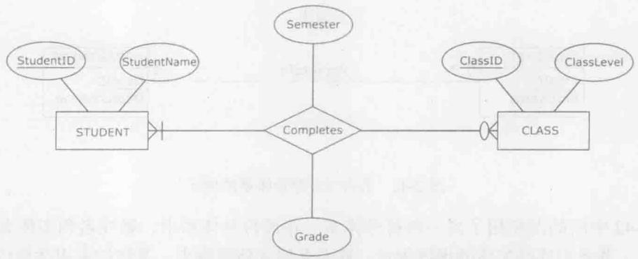

图 2-43 一个描述学生完成课程的 M : N 联系的 ER 图

图 2-44 展示了图 2-43 中联系的几个可能的实例。

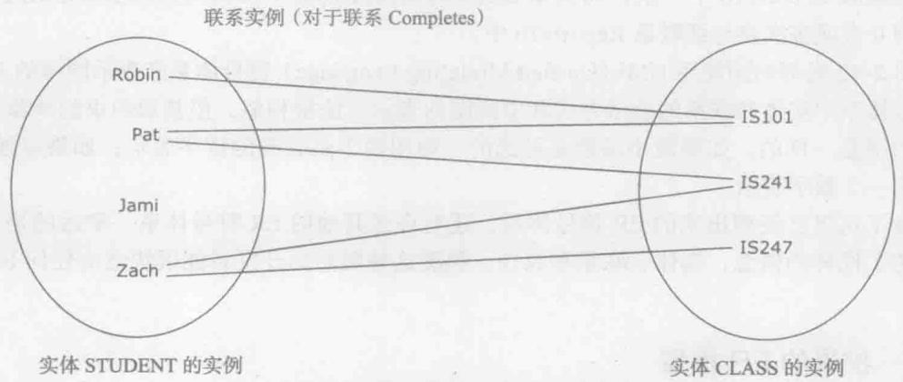

图2-44 图2-43中M：N联系的实例

如果我们在上面的需求中增加一条很小但很重要的需求，这将会彻底改变 M:N 联系的性质： 

- 一名学生可以多次选修同一门课程（例如，如果一名学生该课程的成绩低于最低成绩 

要求，他需要重选该课程，直到达到最低成绩要求）。 

这条增加的需求，可允许实体的相同实例之间的联系具有多个联系实例。如图 2-45 所示，Pat 选修了课程 IS101 三次。 

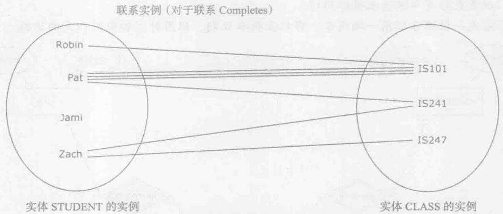

图 2-45 针对新增需求的 M : N 联系 Completes 的实例

这种扩展的需求不能用一个 M : N 联系描述。如图 2-46 所示，我们将使用有两个主实体的弱实体。 

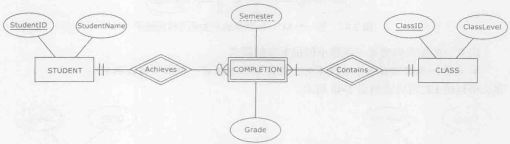

图 2-46 一个 M : N 联系表示为一个弱实体的 ER 图

我们使用弱实体的原因是使属性 Semester 成为一个部分标识符。这样，即使某学生多次选修一门课程的成绩相同，也能通过属性 Semester 区分同一学生多次选修的同一门课程。例如，假设一个学生多次选择一门课程，每次的成绩都是 D，最终，他重选该课程并且以成绩 C 通过了该课程。 

当使用弱实体表示一个 M : N 联系时，弱实体的基数约束总是强制为 1，M : N 联系的基数约束被转移到相应的非弱实体上。考虑图 2-43 和图 2-46。在图 2-43 中，联系 STUDENT Completes CLASS 与图 2-46 中的联系 STUDENT Achieves COMPLETION 相对应，它们都是可选的最大基数为多个的联系。同样，图 2-43 中的联系 CLASS Completed by STUDENT 与图 2-46 中的联系 CLASS Contains COMPLETION 相对应，它们都是强制性的最大基数为多个的联系。 

图 2-47 展示了另外一个相同实体的多个实例之间具有 M : N 联系的例子，使用弱实体表示该联系。这个例子的需求如下： 

- 一个汽车出租公司想要记录它的车辆和租用车辆的顾客信息。 

- 对于每位顾客，将记录他的唯一ID和姓名。 

- 对于每辆汽车，将记录它的唯一的 VIN 和品牌。 

- 一位顾客可以租用多辆汽车，但至少要租用一辆。一辆汽车可以被许多顾客租用，但是也会有车辆从未被租用过。 

- 每次一位顾客租用一辆汽车，将记录租车日期、租用时间和租用一天的价格。 

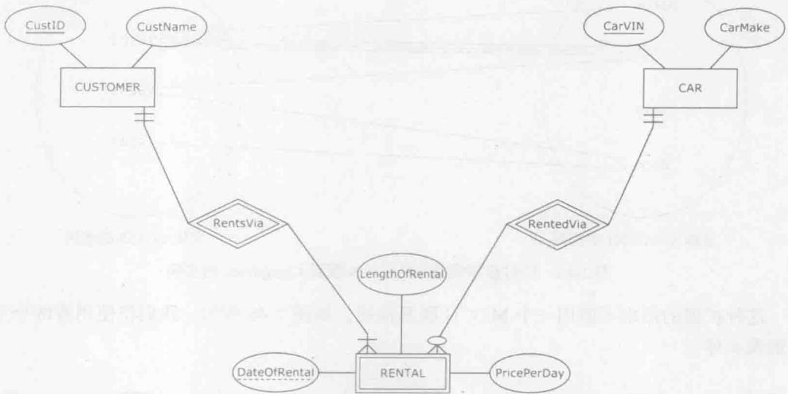

图 2-47 另一个 M : N 联系表示为弱实体的例子

注意，如果我们增加一条很小但很重要的需求： 

- 每当一位顾客租用一辆汽车时，这次出租都会有一个唯一的出租 ID。那么得到的 ER 图应该如图 2-48 所示。 

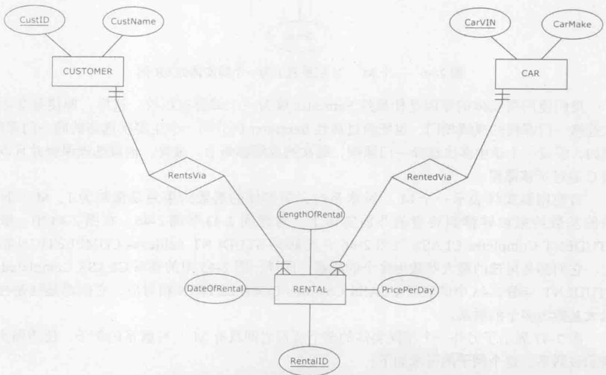

图 2-48 一个普通实体，而不是将 M : N 联系表示成一个弱实体

既然每次出租都有一个唯一属性，那么我们就不必用弱实体表示出租，而是用一个普通实体来表示它。 

正如图 2-48 的例子所展示的，在需求中为一个 M:N 联系（尤其是具有多个属性的 M:N 联系）增加一个唯一标识属性，将会把这个 M:N 联系转换成一个普通实体。采用这种方式来简化 ER 图以及后续的结果数据库是一种很常用的技术。 

## 2.28 问题说明：关联实体

关联实体（associated entity）是一种概念，是用于描述 M : N 联系的替代方式之一。关联实体用一个内部有菱形的矩形来表示。关联实体没有唯一或部分唯一的属性，且通常没有任何属性。 

图 2-49 展示了一个 M : N 联系以及其用关联实体替代的形式。在图 2-49 中，上、下两图是相互等价的，且是根据完全相同的需求来设计的。只要联系 AssignedTo 没有属性，则这个相应的关联实体 ASSIGNMENT 也没有属性。 

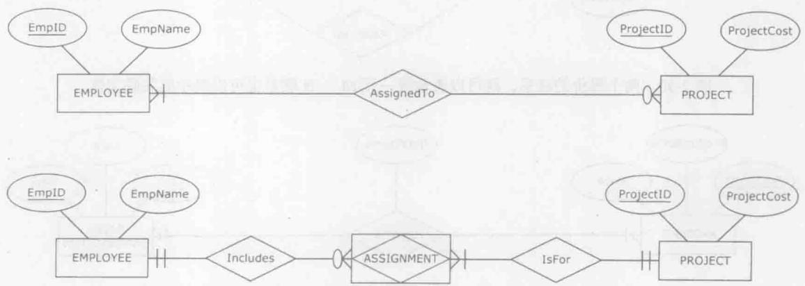

图 2-49 两个等价的联系，既可以表示成 M：N 联系也可以表示成关联实体

在图 2-49 的上图中，实体 EMPLOYEE 是可选择性参与到联系 AssignedTo 中的。相应地，在图 2-49 下图所示与其等价的关联实体 ASSIGNMENT 中，实体 EMPLOYEE 也是可选择性参与到联系 Includes 中的。另一方面，在图 2-49 上图中，实体 PROJECT 是强制参与到联系 AssignedTo 中的。相应地，在图 2-49 下图所示与其等价的关联实体 ASSIGNMENT 中，实体 PROJECT 也是强制参与到联系 IsFor 中的。同时需要注意的是，关联实体自身的基数约束在两种联系中都是强制唯一的（一般来说这是关联实体的问题）。 

图 2-50 展示了一个一元 M : N 联系以及其用关联实体表示的替代形式。在图 2-50 中，上、下两图是相互等价的，且是根据完全相同的需求设计的。 

图 2-51 展示的是带一个属性的 M : N 联系以及其用关联实体表示的替代形式。在图 2-51 中，上、下两图是相互等价的，且是根据完全相同的需求设计的。在上图中，只要联系 SoldVia 有一个属性 NoOfItems，则在相应的下图中，其等价的关联实体 LINEITEM 同样有一个属性 NoOfItems。每一次销售事务可以包含多个不同数量的产品，如上图所示。因此，在下图中，每一次销售事务可以有多个项目行，每一个项目行代表在一次销售事务中销售了某种产品及其销售数量。 

图 2-50 两个等价的联系，既可以表示成一元 M : N 联系也可以表示成关联实体

图 2-51 两个等价的联系，既可以表示成有一个属性的 M : N 联系也可以表示成关联实体

关联实体并不是描述二元或一元联系的必需结构。正如上面的例子所展示的那样，对于二元或一元联系而言，关联实体仅仅是另一种描述联系的方式。若不用关联实体，同样可以很容易地描述这种联系。但正如下一小节所述，对那些度大于2的联系（如三元联系）而言，关联实体则提供了一种消除ER图中潜在歧义的方法。 

## 2.29 问题说明：三元（及更高阶）联系

一个度为 3 的联系，包含 3 个实体，也称为三元联系（ternary relationship）。本书将利用下面的例子来展示三元联系。 

MG (Manufacturing Guru) 公司想要记录它的供应商、零部件和产品。 

特别地，MG 公司想要记录哪家供应商提供了哪些零部件给哪类产品。在需求收集的过程中，MG 提供了下列具体需求： 

我公司有多类产品。 

- 我公司有多家供应商。 

- 我公司有多类零部件。 

- 我公司想要记录哪家供应商提供了哪些零部件给哪类产品。 

- 每类产品包含一个或多个零部件，每一零部件有一家或多家供应商供应。 

- 每一家供应商可以提供多种零部件给多类产品，但是也可不提供任何零部件给任何产品。 

- 每一类零部件可以被一家或多家供应商提供给一类或多类产品。 

简单地在这三个实体之间创建三个二元联系并不能完整地描述以上需求。图 2-52 展示了三个联系，分别表示：哪类产品与哪些供应商有关联，哪家供应商与哪些零部件有关联，哪种零部件与哪些产品有关联（为简单起见，这部分中所有实体都没有带属性）。但是，基于图 2-52 创建的数据库并不能记录哪家供应商提供了哪些零部件给哪类产品。 

图 2-52 三个二元联系不足以描述 MG 公司的需求

比如，基于图 2-52 创建的数据库，我们可以描述供应商 A1 和 A2 是零部件 B 的供应方，同时，零部件 B 是产品 C 的零部件之一。但是，假设供应商 A1 为产品 C 供应零部件 

B，供应商 A2 没有为产品 C 供应零部件 B（即供应商 A2 供应零部件 B，但是不为产品 C 提供零部件 B），则以图 2-52 为基础建立的数据库就不能描述这样一个场景。 

为了涵盖所有可能的合理应用场景，所有三个实体都必须统一集中于一种联系，这样就得到了一个三元联系。 

三元联系的一个棘手问题是在某一种三元联系中，不能明确地表示基数限制。图 2-53 中展示了一种包含实体 SUPPLIER、PRODUCT 和 

图 2-53 一个三元联系

COMPONENT 的三元联系 Provides，图中没有给出基数限制的原因是无法毫无歧义地标明基数限制。 

在图 2-53 中，对那些没有为任何产品提供任何零部件的供应商，图中并没有清楚表示我们可以在什么地方放置记录这些供应商的符号。若只是在联系的零部件一侧设置一个可选符号，这样虽然简洁但依然存在歧义：究竟是希望记录那些不为任何产品提供任何零部件的供应商，还是希望记录那些没有任何供应商为其提供任何零部件的产品。 

换句话说，这种表示方式根本不能清楚地描述一个联系的基数。但是，如图 2-54 所示，如果用关联实体来替代的话，就可以清楚地描述三元联系的所有可能的基数限制了。 

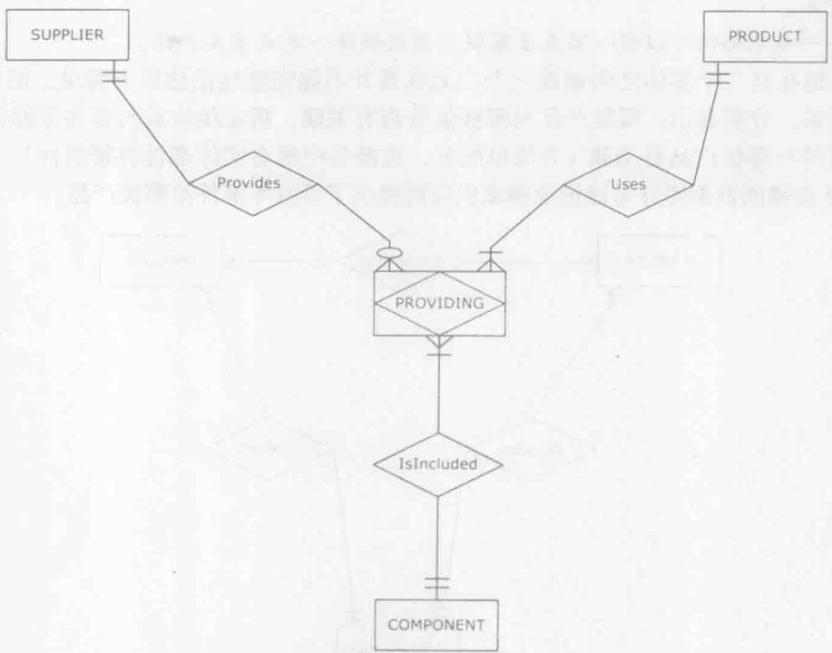

图2-54 通过关联实体建立的三元联系

注意，图 2-54 描述了哪家供应商为哪类产品提供了哪些零部件。如果我们要为供应商记录下产品零部件的实际交付量，则需要增加额外的属性，如数量。但是，在图 2-54 所示的关联实体中仅简单地为供应商增加数量（quantity）这一属性也无法解决上述问题，因为同一家供应商可以不止一次地为同一产品提供同等数量的同一零部件。如果只增加数量这个属性，就没有办法唯一区分同一家供应商为同一产品提供等数量的同一零部件的不同实例。对这一情况的解决办法之一是创建另一属性作为一个唯一交付标识。如果给这些需求增加一项规定，对于每一供应商为某一特定产品供应特定零部件，都认为是一个单独的个体交付并且有自己独特的交付标识，这样一来，就不需要用关联实体来表示了，而是可以用图 2-55 所示的常规实体来表示。 

三元联系中还需要注意的是，除了少数例外情况，三元联系适用于绝大多数像多对多对多（many-to-many-to-many）这样的联系。图2-56展示了一个多对多对一（many-to-many-one）的三元联系。 

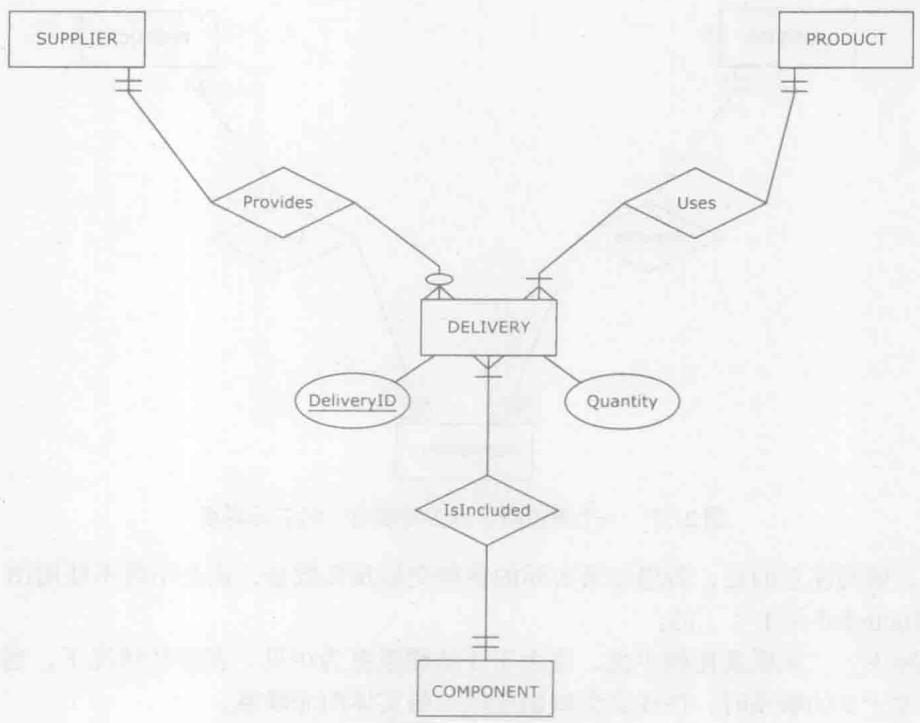

图 2-55 普通实体代替三元联系

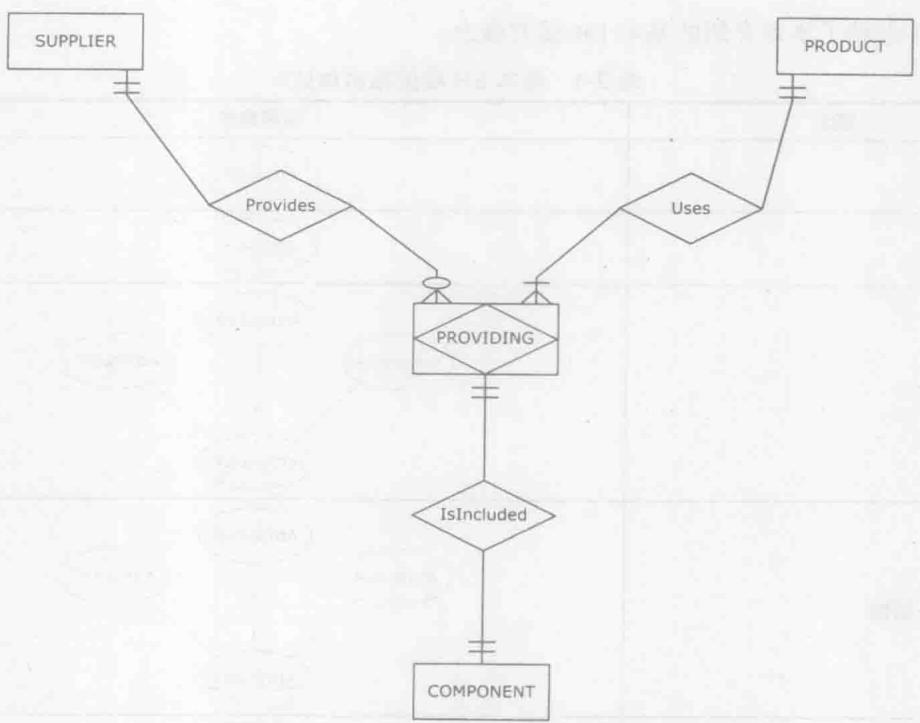

图2-56 一个多对多对一的三元联系

图 2-56 表示每一零部件都是由某一家供应商专门为某一产品供应的。因此，此图可以简化成如图 2-57，从而消除了转化成三元关系的必要性。 

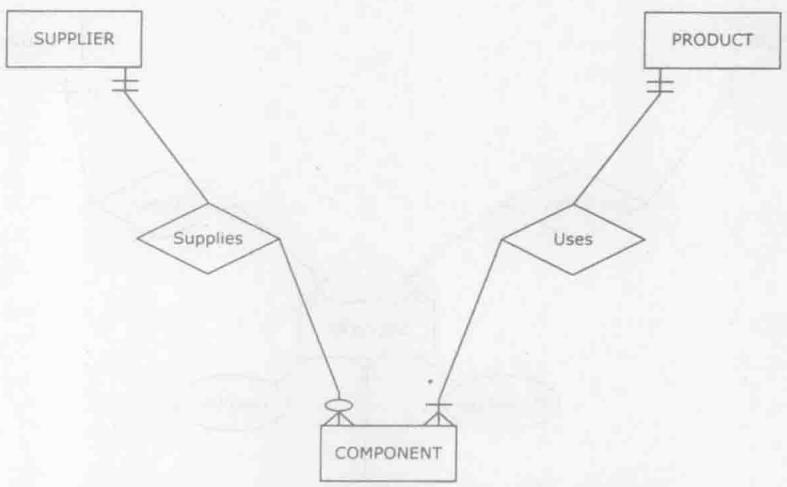

图2-57 一个被消除了的多对多对一的三元联系

但是，值得注意的是，若想记录实际的各种交易及其数量，还是不得不使用图 2-55，除非联系 IsIncluded 是 1:1 的。 

在实际中，三元联系比较少见，度大于3的联系更为少见。在多数情况下，当设计者试图创建度大于2的联系时，往往会尝试创建额外的实体而非联系。 

## 总结

表 2-1 总结了本章介绍的基本 ER 模型概念。 

表 2-1 基本 ER 模型概念总结

<table><tr><td>概念</td><td>图形表示</td></tr><tr><td>一般属性</td><td>Attribute</td></tr><tr><td>唯一属性</td><td>Attribute</td></tr><tr><td>复合属性</td><td>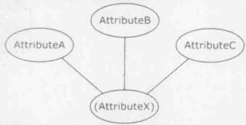</td></tr><tr><td>复合的唯一属性</td><td>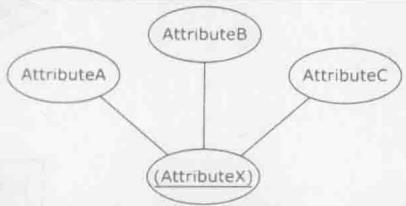</td></tr><tr><td>多值属性</td><td></td></tr><tr><td>派生属性</td><td></td></tr><tr><td>可选属性</td><td>Attribute (O)</td></tr><tr><td>带有属性的实体注:每个实体必须至少有一个唯一属性在一个实体内,每个属性名不同在一个ER图内,每个实体名不同</td><td>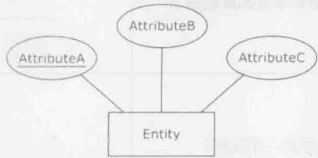</td></tr><tr><td>联系</td><td>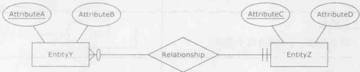</td></tr><tr><td>基数约束</td><td>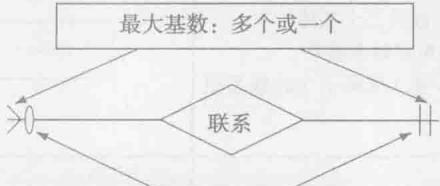参与(最小基数):可选或强制</td></tr><tr><td>四种可能的基数约束</td><td>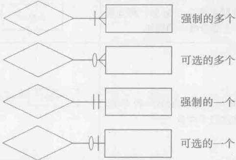</td></tr><tr><td>三种类型的联系(最大基数侧)</td><td>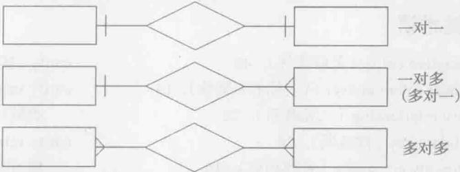</td></tr><tr><td>带有一个属性的联系注:可适用于多对多联系</td><td>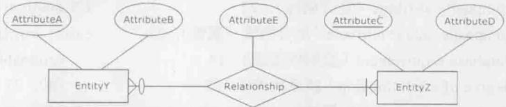</td></tr><tr><td>具有确定最小基数和最大基数的联系</td><td>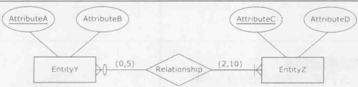</td></tr><tr><td>一元联系联系的度:1(涉及一个实体)</td><td></td></tr><tr><td>二元联系联系的度:2(涉及两个实体)</td><td></td></tr><tr><td>三元联系联系的度:3(涉及三个实体)注:多用作多对多对多联系三元联系很少见(度高于3的联系更少见)</td><td>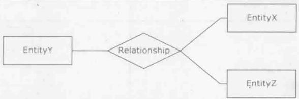</td></tr><tr><td>弱实体注:总是与其主实体通过标识性联系(1:M或1:1)关联起来如果标识性联系是1:M的,那么弱实体必须有一个部分唯一的属性</td><td>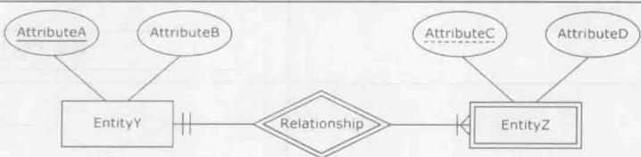</td></tr><tr><td>关联实体注:描述M:N联系的另一种方法,特别适用于描述三元联系</td><td>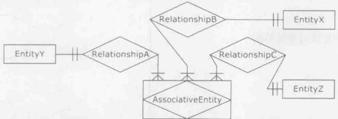</td></tr></table>

## 关键术语

associative entity (关联实体), 43 

attribute (of an entity) ((实体的) 属性), 14 

binary relationship (二元联系), 28 

candidate key (候选码), 24 

cardinality constraint (基数约束), 15 

composite attribute (复合属性), 22 

composite unique attribute (复合的唯一属性), 23 

database requirement (数据库需求), 13 

degree of a relationship (联系的度), 28 

derived attribute (派生属性), 25 

enhanced ER (EER, 扩展的 ER), 40 

entity (实体), 13 

entity instance/ entity member (实体实例 / 实体成员), 14 

entity-relationship/ER modeling（实体－联系建模/ER建模），13 

ER diagram (ERD, ER 图), 13 

exact minimum cardinality and/or maximum cardinality (最小基数和/或最大基数确切值), 27 

identifying relationship (标识性联系), 30 

many-to-many relationship/M : N relationship (多 

对多联系), 17 

maximum cardinality (最大基数), 15 

minimum cardinality/participation（最小基数/参与），15 

multivalued attribute (多值属性), 25 

one-to-many relationship/1 : M relationship (一对多联系), 17 

one-to-one relationship/1 : 1 relationship (一对一联系), 17 

optional attribute (可选属性), 26 

owner entity (主实体), 30 

partial key (部分码), 31 

relationship（联系），13 

relationship attribute (联系属性), 19 

relationship instance (联系实例), 18 

relationship role (联系的角色), 29 

ternary relationship (三元联系), 45 

unary relationship/recursive relationship (一元联系 / 递归联系), 28 

unique attribute (唯一属性), 14 

weak entity (弱实体), 30 

## 复习题

Q2.1 ER 建模的目的是什么？ 

Q2.2 ER 模型的基础结构是什么？ 

Q2.3 唯一属性是什么？ 

Q2.4 基数限制的定义是什么？ 

Q2.5 四种可能的基数限制是什么？ 

Q2.6 三种基数的类型是什么（最大基数侧）？ 

Q2.7 复合属性是什么？ 

Q2.8 候选码是什么？ 

Q2.9 多值属性是什么？ 

Q2.10 派生属性是什么？ 

Q2.11 可选属性是什么？ 

Q2.12 最小基数和最大基数确切值限制在联系里是如何定义的？ 

Q2.13 二元联系是什么？ 

Q2.14 一元联系是什么？ 

Q2.15 弱实体是什么？ 

Q2.16 关联实体是什么？ 

Q2.17 三元联系是什么？ 

## 练习

E2.1 建立一个有多个属性的实体实例。 

E2.2 为一个有两个实体（都包含多个属性）的应用场景创建需求和 ER 图，需要包含以下联系： 

E2.2a 1: M 联系，参与要求是在 1 这方是强制性的而在 M 这方是可选择的参与。 

E2.2b 1: M 联系，参与要求是在 1 这方是可选择的而在 M 这方是强制性的参与。 

E2.2c 1: M 联系，参与要求是在两方都是强制性的参与。 

E2.2d 1: M 联系，参与要求是在两方都是可选择的参与。 

E2.2e M : N 联系，参与要求是在一方是强制性的而在另一方是可选择的参与。 

E2.2f M : N 联系，参与要求是在两方都是强制性的参与。 

E2.2g M : N 联系，参与要求是在两方都是可选择的参与。 

E2.2h 1:1 联系，参与要求是在一方是强制性的而在另一方是可选择的参与。 

E2.2i 1:1 联系，参与要求是在两方都是强制性的参与。 

# 关系数据库建模

## 3.1 引言

在第 1 章中我们曾用 “逻辑数据库模型” 这一术语来特指 DBMS 软件所采用的数据库模型。其中最常用的逻辑数据库模型是关系数据库模型。采用关系数据库模型建模的数据库称作关系数据库。 

在创建关系数据库的过程中，一旦数据库的需求以 ER 图的形式被收集并可视化，接下来的工作就是将 ER 图转化为一个逻辑数据库模型，即关系模式（relational schema）。关系模式是对关系数据库模型进行可视化描述的关系图表。 

目前大多数商业 DBMS 软件包，比如 Oracle、MySQL、Microsoft SQL server、PostgreSQL、Teradata、IBM DB2 以及 Microsoft Access，都是关系数据库管理系统（relational DBMS，RDBMS）软件包。它们都采用关系数据库模型并用于实现关系型数据库。 

在本章中，我们将讲述关系数据库模型的基本概念，以及如何将 ER 图转化为关系模式。 

## 3.2 关系数据库模型基本概念

关系数据库模型中，一个重要的概念是关系（relation）。一个关系在关系数据库中的存在形式是包含行与列的一张表。而一个关系数据库就是一系列具有不同名称的相关关系的集合。 

一个关系有时也称作一张关系表（relation table），或简称为表（table）。表中的一列（column）有时被称为一个域（field）或一种属性（attribute）。表中的一行（row）有时被称为一个元组（tuple）或记录（record）。关系数据库中各术语的同义词在表3-1中给出。 

如表 3-1 所示，我们常将一种关系称作一张表。但我们要牢记：尽管所有的关系都是表，但并非所有的表都是关系。一张表如果能够称作一个关系，它需要满足如下条件： 

表 3-1 关系数据库模型所使用的同义词

<table><tr><td>关系</td><td>=</td><td>关系表</td><td>=</td><td>表</td></tr><tr><td>列</td><td>=</td><td>属性</td><td>=</td><td>域</td></tr><tr><td>行</td><td>=</td><td>元组</td><td>=</td><td>记录</td></tr></table>

1. 每一列必须有一个名称。在同一张表中，不能有相同的列名。 

2. 在同一张表中，不能有完全相同的行。 

3. 在每一行中，属于任何一列的值必须为单值。表中任一行中不允许出现多值。 

4. 每一列中的值必须属于同一个（预定义的）域。 

我们将在图 3-1 的例子中说明这些规则。在该图中，我们采用两张表来记录雇员信息，并假设在记录雇员信息的表中有如下一些预定义的域： 

雇员 ID: 4 位数字。 

雇员姓名：20个字符以内。 

雇员性别：字符 M 或 F。 

雇员电话号码：字母 x（代表扩展）后接三位数字。 

雇员出生日期：日期（日，月，年）。 

关系表（关系）

<table><tr><td>EmpID</td><td>EmpName</td><td>EmpGender</td><td>EmpPhone</td><td>EmpBdate</td></tr><tr><td>0001</td><td>Joe</td><td>M</td><td>x234</td><td>1/11/1985</td></tr><tr><td>0002</td><td>Sue</td><td>F</td><td>x345</td><td>2/7/1983</td></tr><tr><td>0003</td><td>Amy</td><td>F</td><td>x456</td><td>4/4/1990</td></tr><tr><td>0004</td><td>Pat</td><td>F</td><td>x567</td><td>3/8/1971</td></tr><tr><td>0005</td><td>Mike</td><td>M</td><td>x678</td><td>5/5/1965</td></tr></table>

非关系表

<table><tr><td>EmpID</td><td>EmpInfo</td><td>EmpInfo</td><td>EmpPhone</td><td>EmpBdate</td></tr><tr><td>0001</td><td>Joe</td><td>M</td><td>x234</td><td>1/11/1985</td></tr><tr><td>0002</td><td>Sue</td><td>F</td><td>x345</td><td>2/7/1983</td></tr><tr><td>0001</td><td>Joe</td><td>M</td><td>x234</td><td>1/11/1985</td></tr><tr><td>0004</td><td>Pat</td><td>F</td><td>x567, x789</td><td>3/8/1971</td></tr><tr><td>0005</td><td>Mike</td><td>M</td><td>x678</td><td>a long time ago</td></tr></table>

图 3-1 关系以及非关系表的实例

图 3-1 中位于上部的表就是一张满足以上条件的合格关系表：没有同名的列，没有相同的行，每一行中的属性值都是单值，每一列中的属性值都属于相同的域。 

而图 3-1 中位于下部的表则是一张非关系表，该表违背了前述提及的所有条件：有两列同名，有两行完全相同，有一个记录中雇员电话号码这一属性的取值是多值，且有一行中雇员出生日期的取值不满足预定义的域。 

注意：图 3-1 中的两张表均可由 MS Excel 等电子制表工具来实现，但仅上面的那张表可以由 RDBMS 来实现。RDBMS 不允许实现下面的那张表，当试图实现下面那张表时，RDBMS 将会显示违规的错误提示。 

除了前述提及的四项关系表条件之外，关系表还具有两个额外的属性： 

5. 列顺序无关。 

6. 行顺序无关。 

这两个属性告诉我们，无论关系表中的行与列如何排序，表中都将包含同样的信息，即都会被视作同一张表。当某张表中的所有行与列都被重新排序后，每一行仍然包含着同样的信息（只是顺序不同而已），且表中仍然包含着同样的行（只是顺序不同而已）。图3-2中的例子说明了这个问题，它显示了两张行列顺序不同的表，这两张表其实是相同的表。 

一个关系

<table><tr><td>EmpID</td><td>EmpName</td><td>EmpGender</td><td>EmpPhone</td><td>EmpBdate</td></tr><tr><td>0001</td><td>Joe</td><td>M</td><td>x234</td><td>1/11/1985</td></tr><tr><td>0002</td><td>Sue</td><td>F</td><td>x345</td><td>2/7/1983</td></tr><tr><td>0003</td><td>Amy</td><td>F</td><td>x456</td><td>4/4/1990</td></tr><tr><td>0004</td><td>Pat</td><td>F</td><td>x567</td><td>3/8/1971</td></tr><tr><td>0005</td><td>Mike</td><td>M</td><td>x678</td><td>5/5/1965</td></tr><tr><td>EmpName</td><td>EmplD</td><td>EmpGender</td><td>EmpBdate</td><td>EmpPhone</td></tr><tr><td>Joe</td><td>0001</td><td>M</td><td>1/11/1985</td><td>x234</td></tr><tr><td>Amy</td><td>0003</td><td>F</td><td>4/4/1990</td><td>x456</td></tr><tr><td>Sue</td><td>0002</td><td>F</td><td>2/7/1983</td><td>x345</td></tr><tr><td>Pat</td><td>0004</td><td>F</td><td>3/8/1971</td><td>x567</td></tr><tr><td>Mike</td><td>0005</td><td>M</td><td>5/5/1965</td><td>x678</td></tr></table>

图 3-2 行和列出现顺序不同的关系表实例

## 3.3 主码

每一个关系都有一列（在一些情况下允许多列）作为主码（primary key）。其目的是在关系中区分不同的行。以下是主码的定义。 

主码 

每一个关系必须有一个主码，对于每一行来说，主码是取值不同的一列（或几列的集合）。 

在图 3-3 所示的雇员关系中, EmpID 列可作为主码。注意, 主码名称下面有一条下划线, 以将主码和其他列区分开来。 

EMPLOYEE

<table><tr><td>EmpID</td><td>EmpName</td><td>EmpGender</td><td>EmpPhone</td><td>EmpBdate</td></tr><tr><td>0001</td><td>Joe</td><td>M</td><td>x234</td><td>1/11/1985</td></tr><tr><td>0002</td><td>Sue</td><td>F</td><td>x345</td><td>2/7/1983</td></tr><tr><td>0003</td><td>Amy</td><td>F</td><td>x456</td><td>8/4/1990</td></tr><tr><td>0004</td><td>Pat</td><td>F</td><td>x567</td><td>3/8/1971</td></tr><tr><td>0005</td><td>Mike</td><td>M</td><td>x678</td><td>5/5/1965</td></tr><tr><td>0010</td><td>Mike</td><td>M</td><td>x666</td><td>8/1/1974</td></tr><tr><td>0007</td><td>Barbara</td><td>F</td><td>x777</td><td>4/5/1980</td></tr><tr><td>0011</td><td>Ivan</td><td>M</td><td>x777</td><td>3/4/1981</td></tr><tr><td>0009</td><td>Amy</td><td>F</td><td>x777</td><td>1/11/1985</td></tr></table>

图 3-3 带下划线主码的关系表

在图 3-3 的例子中，每一个雇员具有独一无二的 EmpID 取值。而这个关系中的其他列不能作为主码，这是因为，不同的雇员可能会拥有相同的姓名、相同的性别、相同的出生日期以及相同的电话号码。 

## 3.4 将实体映射为关系

如前所述，一旦 ER 图建立，接下来的工作就是将其映射为一系列的关系。这一过程始于将实体映射为关系，即每一个常规实体成为一个关系，每一个常规实体中的常规属性成为新创建的关系中的一列。如果一个实体中有一个单值的且唯一标识的属性，那么这个属性在最终映射得到的关系中就可作为主码 $^{①}$ 。 

图 3-4 中给出了一个实例以说明一个实体如何映射为一个关系。用一个长方形来表示关系，长方形中包含了关系中所有列的列名。注意，其中 CustID 这一列名下面有下划线，表明 CustID 是关系 CUSTOMER 中的主码。 

一旦映射关系作为关系数据库的一部分被创建，它就可以装载数据。图 3-5 展示了 CUSTOMER 关系的样例数据。 

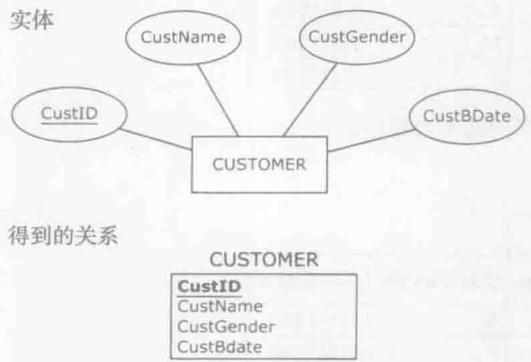

图 3-4 将实体映射成关系

CUSTOMER

<table><tr><td>CustID</td><td>CustName</td><td>CustGender</td><td>CustBdate</td></tr><tr><td>1111</td><td>Tom</td><td>M</td><td>1/1/1965</td></tr><tr><td>2222</td><td>Jenny</td><td>F</td><td>2/2/1968</td></tr><tr><td>3333</td><td>Greg</td><td>M</td><td>1/2/1962</td></tr><tr><td>4444</td><td>Sophia</td><td>F</td><td>2/2/1983</td></tr></table>

图 3-5 图 3-4 所示关系表的样本数据记录

## 3.5 将具有复合属性的实体映射为关系

如果一个实体包含复合属性，则复合属性中的每一个组成部分都将映射为关系中的一列，而复合属性自身并未显式地出现在映射后的关系中。 

图 3-6 给出了一个例子以说明如何将一个具有复合属性的实体映射为关系。注意，复合属性的名称并未出现在映射得到的关系中。 

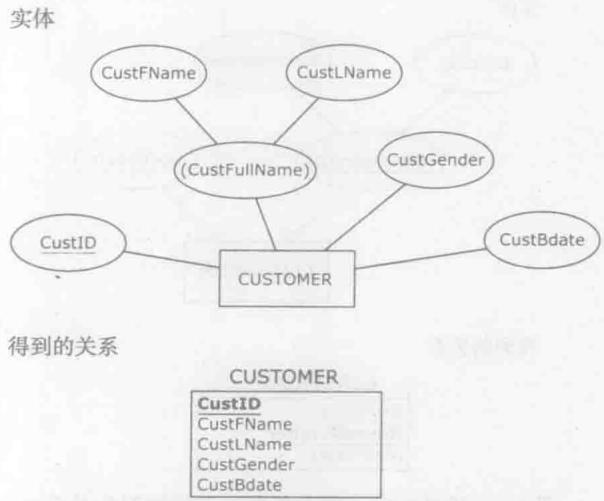

图 3-6 将具有复合属性的实体映射为关系

一旦映射关系作为关系数据库的一部分被创建，它就可以装载数据，如图 3-7 所示。 

尽管复合属性的名称并没有作为关系模式的一部分，但它仍然可能作为基于关系数据库的前端应用的一部分。举个例子来说，如图 3-7 所示，包含 CUSTOMER 关系的数据 库前端应用也许会存在一个复合属性 CustFullName，这个复合属性包含了 CustFName 和 CustLName。图 3-8 说明了如何通过相应数据库的前端应用 $^{①}$ 向用户展示关系信息。 

CUSTOMER

<table><tr><td>CustID</td><td>CustFName</td><td>CustLName</td><td>CustGender</td><td>CustBdate</td></tr><tr><td>1111</td><td>Tom</td><td>Lendrum</td><td>M</td><td>1/1/1965</td></tr><tr><td>2222</td><td>Jenny</td><td>Jones</td><td>F</td><td>2/2/1968</td></tr><tr><td>3333</td><td>Greg</td><td>Newton</td><td>M</td><td>1/2/1962</td></tr><tr><td>4444</td><td>Sophia</td><td>Danks</td><td>F</td><td>2/2/1983</td></tr></table>

图 3-7 图 3-6 所示关系的样本数据记录

CUSTOMER

<table><tr><td></td><td colspan="2">CustFullName</td><td colspan="2"></td></tr><tr><td>CustID</td><td>CustFName</td><td>CustLName</td><td>CustGender</td><td>CustBdate</td></tr><tr><td>1111</td><td>Tom</td><td>Lendrum</td><td>M</td><td>1/1/1965</td></tr><tr><td>2222</td><td>Jenny</td><td>Jones</td><td>F</td><td>2/2/1968</td></tr><tr><td>3333</td><td>Greg</td><td>Newton</td><td>M</td><td>1/2/1962</td></tr><tr><td>4444</td><td>Sophia</td><td>Danks</td><td>F</td><td>2/2/1983</td></tr></table>

图 3-8 将图 3-7 所示的关系在终端应用程序中展示给用户

## 3.6 将具有唯一复合属性的实体映射为关系

第 2 章中曾提到一个实体可能拥有一个具有唯一标识的复合属性。图 3-9 中进一步说明了如何将一个具有唯一标识复合属性的实体映射为一个关系。 

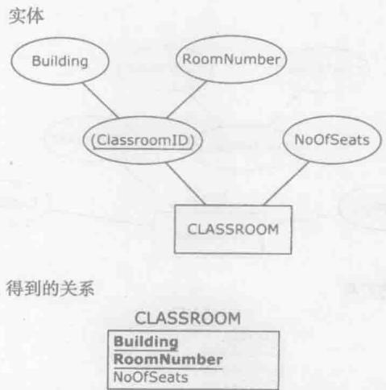

图 3-9 将具有唯一复合属性的实体映射为关系

注意，在得到的关系中，Building列和RoomNumber列的名称下面都有下划线，这是因为这两列组合起来形成CLASSROOM关系的主码。由多个属性组合起来形成的主码称为复 合主码（composite primary key）。图 3-10 展示了由 CLASSROOM 关系的样例数据所描述的四个不同教室及其座位容量。注意，对于每一行而言，没有任一个单独的列具有独一无二的取值，但由 Building 和 RoomNumber 组成的复合属性却具有唯一的取值。 

<table><tr><td>Building</td><td>RoomNumber</td><td>NoOfSeats</td></tr><tr><td>Maguire</td><td>110</td><td>100</td></tr><tr><td>Maguire</td><td>210</td><td>50</td></tr><tr><td>Houser</td><td>110</td><td>50</td></tr><tr><td>Houser</td><td>210</td><td>50</td></tr></table>

图 3-10 图 3-9 所示关系的样本数据记录

## 3.7 将具有可选属性的实体映射为关系

第 2 章中曾提到一个实体可以包含可选属性，可选属性的取值允许为空。当可选属性被映射为关系时，所得结果中的可选列被标记为 (O)，如图 3-11 所示。 

一旦图 3-11 中的关系作为关系数据库的一部分得以实现，它就可以装载数据，如图 3-12 所示。属性 Bonus 是可选属性，所以在 Bonus 这一列中允许属性取值为空。 

注意，图 3-12 雇员关系表的第一行和最后一行记录的 Bonus 列中都没有属性取值。在数据库术语中，一个未被赋值的记录称为 “空”，意为 “没有取值”。所以，我们可以将第一行和最后一行的 Bonus 属性取值称为空值。 

## 3.8 实体完整性约束

术语 “约束” 是指为确保关系数据库的有效性而需满足的各种规则。实体完整性约束（entity integrity constraint）则是指 “所有的主码属性必须有非空取值” 这一关系数据库规则。 

实体 

得到的关系 

图 3-11 将具有可选属性的实体映射为关系

EMPLOYEE

<table><tr><td>EmpID</td><td>Salary</td><td>Bonus</td></tr><tr><td>1234</td><td>$75,000</td><td></td></tr><tr><td>2345</td><td>$45,000</td><td>$10,000</td></tr><tr><td>3456</td><td>$55,000</td><td>$4,000</td></tr><tr><td>1324</td><td>$70,000</td><td></td></tr></table>

图 3-12 图 3-11 所示关系的样本数据记录

### 实体完整性约束

在一张关系表中，不存在包含空值的主码列。 

换言之，实体完整性约束是一种要求没有可选属性存在的主码列规则。每一种 RDBMS 都需执行这个规则。 

举例来说，在图 3-13 雇员关系中的每一条记录，在 EmpID 这项属性上都必须有一个非空取值，因为 EmpID 是该关系中的主码。如果 EmpID 属性有空值，则将违反完整性约束。 

因此，RDBMS 不允许插入的雇员关系记录中 EmpID 属性值为空。 

<table><tr><td>EmpID</td><td>Salary</td><td>Bonus</td></tr><tr><td>1234</td><td>$75,000</td><td></td></tr><tr><td>2345</td><td>$50,000</td><td>$10,000</td></tr><tr><td>3456</td><td>$55,000</td><td>$4,000</td></tr><tr><td>1324</td><td>$70,000</td><td></td></tr><tr><td colspan="3">VALID</td></tr></table>

图 3-13 实体完整性约束：遵守与违反的例子

同样，在图 3-14 中，每一个在 CLASSROOM 关系中记录的 Building 和 RoomNumber 属性也不能为空，因为这两项属性组合起来构成一个复合主码。 

<table><tr><td>Building</td><td>RoomNumber</td><td>NoOfSeats</td></tr><tr><td>Maguire</td><td>110</td><td>100</td></tr><tr><td>Maguire</td><td>210</td><td>50</td></tr><tr><td>Houser</td><td>110</td><td>50</td></tr><tr><td>Houser</td><td>210</td><td>50</td></tr></table>

图 3-14 实体完整性约束：另一个遵守与违反的例子

## 3.9 外码

在将 ER 图映射为关系模式的过程中，除了映射实体之外，实体间的联系也是需要映射的。外码（foreign key）正是用来刻画关系数据库模型中实体间联系的一种机制。外码的定义如下： 

外码 

外码是某关系中的一列，这一列又恰好是另外一个关系中的主码。 

每当有外码出现在关系模式中时，都会包含一条从外码指向相应主码的连线。 

本章中的例子通过关系模式说明了外码的概念，并描述了外码如何应用在关系数据库模型的一对一（1：1）、一对多（1：M）以及多对多（M：N）的关系中。 

## 3.10 将联系映射为关系数据库组件

前面已经介绍了如何将 ER 图映射为关系。接下来将介绍如何将实体间的联系映射为关系模式。 

### 3.10.1 1: M 联系的映射

首先看看一对多联系的映射规则： 

由一对多联系中属于M侧的实体所映射得到的关系有一个外码，这个外码对应于由1侧的实体映射得到的关系中的主码。 

图 3-15 中的例子展示了这一规则的应用。在一对多关系 ReportsTo 中，雇员实体属于 M 侧而部门实体属于 1 侧。在将雇员实体映射得到的关系中，有一个外码列 DeptID，这一列对应于部门这一关系中的主码。图 3-15 所示的关系模式中，从雇员关系的外码到部门关系的主码间有一条连线。 

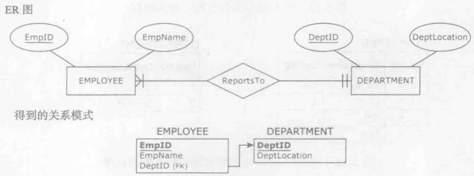

图 3-15 一对多联系的映射

图 3-15 所示的关系模式一旦作为关系数据库得以实现，它就可以装载数据，如图 3-16 所示。 

注意，外码值（雇员关系中 DeptID 这列的取值）将雇员与他们隶属的部门关联了起来。 

我们接下来将讨论可选参与和强制参与对关系数据库中的1侧和M侧的影响。 

1 侧的强制参与 首先来看看强制参与在 1 侧的影响。注意，图 3-15 所示的雇员实体在隶属关系上是强制参与的，则雇员关系中的 DeptID 外码列要求有非空取值。因此，在图 3-16 中可以看到，雇员关系中的每一条记录在 DeptID 列都有一个非空值。 

M侧的强制参与 我们再来看看强制参与在M侧的影响。图3-15所示的部门实体在隶属关系中要求强制参与，所以在图3-16中所有的部门都至少有一个雇员与之相对应。换句话说， 在部门关系中，不存在没有与之对应的雇员关系的记录。部门（1，SuiteA）对应于雇员（1234，Becky）和（3456，Rob），而部门（2，SuiteB）对应于雇员（2345，Molly）和（1324，Ted）。 

1 侧的可选参与 图 3-17 反映了可选参与在 1 侧的影响。在这个例子中，雇员实体在其隶属关系上是可选参与的，因此，雇员关系中的 DeptID 这一外码是一个可选列。 

一旦图 3-17 所示的关系模式作为关系数据库实现，它就可以加载数据，如图 3-18 所示。 

EMPLOYEE

<table><tr><td>EmpID</td><td>EmpName</td><td>DeptID</td></tr><tr><td>1234</td><td>Becky</td><td>1</td></tr><tr><td>2345</td><td>Molly</td><td>2</td></tr><tr><td>3456</td><td>Rob</td><td>1</td></tr><tr><td>1324</td><td>Ted</td><td>2</td></tr></table>

DEPARTMENT

<table><tr><td>DeptID</td><td>DeptLocation</td></tr><tr><td>1</td><td>Suite A</td></tr><tr><td>2</td><td>Suite B</td></tr></table>

图 3-16 图 3-15 所示关系数据库的样本数据记录

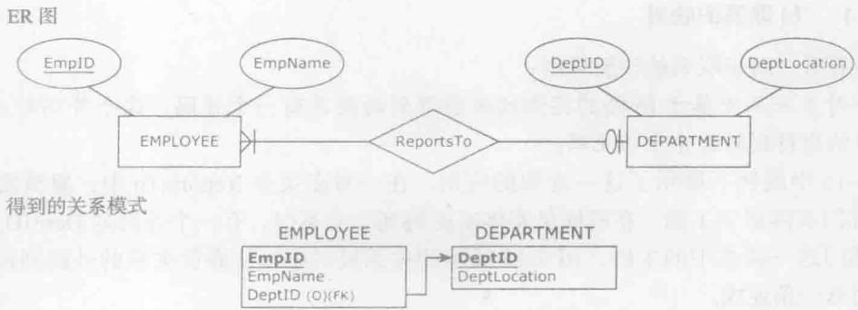

图 3-17 在 1 侧可选参与的一对多映射

<table><tr><td>EmpID</td><td>EmpName</td><td>DeptID</td></tr><tr><td>1234</td><td>Becky</td><td>1</td></tr><tr><td>2345</td><td>Molly</td><td>2</td></tr><tr><td>3456</td><td>Rob</td><td></td></tr><tr><td>1324</td><td>Ted</td><td>2</td></tr></table>

<table><tr><td>DeptID</td><td>DeptLocation</td></tr><tr><td>1</td><td>Suite A</td></tr><tr><td>2</td><td>Suite B</td></tr></table>

图 3-18 图 3-17 所示关系数据库的样本数据记录

注意，图 3-18 中的雇员表与图 3-16 中的不同。在图 3-18 中，并不是所有的 DeptID 列都有取值，如雇员（3456，Rob）就没有 DeptID 属性值。 

M 侧的可选参与 让我们再来看看在 M 侧的可选参与的例子。如图 3-19 和图 3-20 所示。 

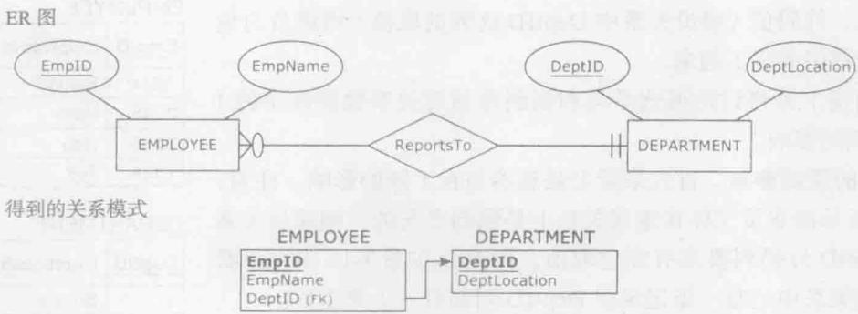

图 3-19 在 M 侧可选参与的一对多映射

一旦图 3-19 的关系模式作为关系数据库实现，它就可以装载数据，如图 3-20 所示。 

<table><tr><td>EmpID</td><td>EmpName</td><td>DeptID</td></tr><tr><td>1234</td><td>Becky</td><td>1</td></tr><tr><td>2345</td><td>Molly</td><td>2</td></tr><tr><td>3456</td><td>Rob</td><td>1</td></tr><tr><td>1324</td><td>Ted</td><td>2</td></tr></table>

<table><tr><td>DeptID</td><td>DeptLocation</td></tr><tr><td>1</td><td>Suite A</td></tr><tr><td>2</td><td>Suite B</td></tr><tr><td>3</td><td>Suite C</td></tr></table>

图 3-20 图 3-19 所示关系数据库的样本数据记录

注意，图 3-20 中存在一个部门（3，SuiteC），没有与之相对应的雇员记录。如图 3-19 

中的部门实体，其隶属关系在 M 侧的可选参与将导致这一现象的出现。 

外码的重命名 图 3-21 展示了另外一个将一对多关系映射为关系模式的例子。在这个例子中，教授关系中的主码 ProID 在其对应的学生表中更名为 AdvisorID。将外码重命名是完全合法的。在本例中，我们将教授 ID 重命名为导师 ID，会帮助我们更好地理解学生关系中教授所扮演的角色（即指导角色）。 

图3-21 另一个一对多联系的例子

如图 3-22 所示，一旦图 3-21 中所示的关系模式实现为一个关系数据库，我们就可向其中添加数据。 

<table><tr><td>StudentID</td><td>StudentName</td><td>AdvisorID</td></tr><tr><td>1111</td><td>Robin</td><td>P11</td></tr><tr><td>2222</td><td>Pat</td><td>P22</td></tr><tr><td>3333</td><td>Jami</td><td>P11</td></tr></table>

<table><tr><td>ProfID</td><td>ProfLname</td></tr><tr><td>P11</td><td>Zydiak</td></tr><tr><td>P22</td><td>Lash</td></tr></table>

图 3-22 图 3-21 所示关系数据库的样本数据记录

### 3.10.2 M : N 联系的映射

首先看看多对多联系映射的规则： 

除了多对多联系的两个实体需映射为关系之外，多对多联系本身也需要映射为关系。这种新关系有两个外码，对应多对多联系中两个实体的主码。这两个外码就构成了这个新关系的复合主码。 

图 3-23 的例子中展示了学生（STUDENT）与组织（ORGANIZATION）这两个实体间的多对多联系——从属（BelongsTo）关系，并说明了多对多联系映射规则的具体应用。当图 3-23 中的 ER 图映射为关系模式时，除了学生和组织这两个关系之外，还要建立一个代表“从属”这个多对多联系的关系。诸如“从属”这样的多对多联系，有时候也被称作桥关系（bridge relation）。从属关系有两个外码，每一个外码都用一条连线与它们的对应源实体相连。其中一条连线由从属关系中的 StudentID 连接到学生关系中的主码 StudentID，另一条连线则由从属关系的 OrgID 连接到组织关系中的主码 OrgID。在从属关系的两个外码 StudentID 和 OrgID 下面都有一条下划线，表示这两个码组合起来形成从属关系的复合主码。（一个桥关系可以取与原 ER 图实体多对多联系不一样的名字，比如，数据库设计者也许会决定使用“参与”（PARTICIPATION）这个名字来代替“从属”，因为前者比后者更适合。尽管如此，我们在这个例子中仍然采用从属这个名称。） 

一旦图 3-23 中的关系模式作为关系数据库实现，它就可以装载数据，如图 3-24 所示。注意从属关系中的取值是如何将学生与他们从属的组织联系起来的。 

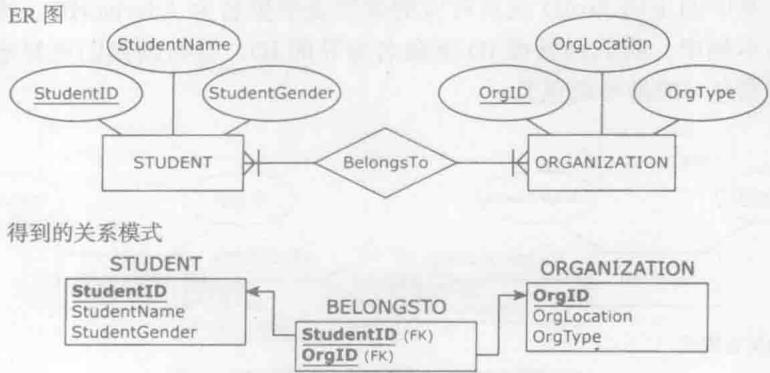

图 3-23 多对多联系的映射

STUDENT

<table><tr><td>StudentID</td><td>StudentName</td><td>StudentGender</td></tr><tr><td>1111</td><td>Robin</td><td>Male</td></tr><tr><td>2222</td><td>Pat</td><td>Male</td></tr><tr><td>3333</td><td>Jami</td><td>Female</td></tr></table>

ORGANIZATION

<table><tr><td>OrgID</td><td>OrgLocation</td><td>OrgType</td></tr><tr><td>O11</td><td>Student Hall</td><td>Charity</td></tr><tr><td>O41</td><td>Damen Hall</td><td>Sport</td></tr><tr><td>O47</td><td>Student Hall</td><td>Charity</td></tr></table>

BELONGSTO

<table><tr><td>StudentID</td><td>OrgID</td></tr><tr><td>1111</td><td>O11</td></tr><tr><td>1111</td><td>O41</td></tr><tr><td>2222</td><td>O11</td></tr><tr><td>2222</td><td>O41</td></tr><tr><td>2222</td><td>O47</td></tr><tr><td>3333</td><td>O11</td></tr></table>

图 3-24 图 3-23 所示关系数据库的样本数据记录

如果学生实体在从属关系中是可选参与的，则可能会存在额外的属于学生关系中的学生，但这些学生的ID没有出现在从属关系表的StudentID中。同样，如果组织实体在从属关系中是可选参与的，则可能会存在额外的属于组织关系中的组织，这些组织的ID也没有出现在从属关系表的OrgID中。这样的情况在图3-25和图3-26中有所体现。图3-25展示了两侧均为可选参与的从属关系。一旦图3-25所示的关系模式作为关系数据库实现，它就可以装载数据，如图3-26所示。注意，学生（4444，Abby）并不属于任何组织；而组织（O50，DamenHall, Politics）也同样没有任何学生。这可能是图3-25中的从属关系两边的可选参与导致的。 

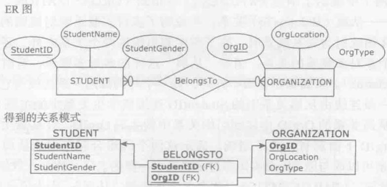

图 3-25 （两侧同时具有可选参与的）多对多联系

STUDENT

<table><tr><td>StudentID</td><td>StudentName</td><td>StudentGender</td></tr><tr><td>1111</td><td>Robin</td><td>Male</td></tr><tr><td>2222</td><td>Pat</td><td>Male</td></tr><tr><td>3333</td><td>Jami</td><td>Female</td></tr><tr><td>4444</td><td>Abby</td><td>Female</td></tr></table>

ORGANIZATION

<table><tr><td>OrgID</td><td>OrgLocation</td><td>OrgType</td></tr><tr><td>O11</td><td>Student Hall</td><td>Charity</td></tr><tr><td>O41</td><td>Damen Hall</td><td>Sport</td></tr><tr><td>O47</td><td>Student Hall</td><td>Charity</td></tr><tr><td>O50</td><td>Damen Hall</td><td>Politics</td></tr></table>

BELONGSTO

<table><tr><td>StudentID</td><td>OrgID</td></tr><tr><td>1111</td><td>O11</td></tr><tr><td>1111</td><td>O41</td></tr><tr><td>2222</td><td>O11</td></tr><tr><td>2222</td><td>O41</td></tr><tr><td>2222</td><td>O47</td></tr><tr><td>3333</td><td>O11</td></tr></table>

图 3-26 图 3-25 所示关系数据库的样本数据记录

我们曾在第2章中提到，一个多对多联系可以有自己的属性。当一个具有自身属性的多对多联系被映射为关系模型时，多对多联系中的每一个属性都将映射为关系中的一列。图3-27展示了这种情况。 

67 

ER图

得到的关系模式

图 3-27 具有属性的多对多映射

一旦如图 3-27 所示的关系模式被作为关系数据库实现，它就可以加载数据，如图 3-28 所示。 

STUDENT

<table><tr><td>StudentID</td><td>StudentName</td><td>StudentGender</td></tr><tr><td>1111</td><td>Robin</td><td>Male</td></tr><tr><td>2222</td><td>Pat</td><td>Male</td></tr><tr><td>3333</td><td>Jami</td><td>Female</td></tr></table>

ORGANIZATION

<table><tr><td>OrgID</td><td>OrgLocation</td><td>OrgType</td></tr><tr><td>O11</td><td>Student Hall</td><td>Charity</td></tr><tr><td>O41</td><td>Damen Hall</td><td>Sport</td></tr><tr><td>O47</td><td>Student Hall</td><td>Charity</td></tr></table>

BELONGSTO

<table><tr><td>StudentID</td><td>OrgID</td><td>Function</td></tr><tr><td>1111</td><td>O11</td><td>President</td></tr><tr><td>1111</td><td>O41</td><td>Member</td></tr><tr><td>2222</td><td>O11</td><td>V.P.</td></tr><tr><td>2222</td><td>O41</td><td>Member</td></tr><tr><td>2222</td><td>O47</td><td>Treasurer</td></tr><tr><td>3333</td><td>O11</td><td>Member</td></tr></table>

图 3-28 图 3-27 所示关系数据库的样本数据记录

### 3.10.3 1:1联系的映射

一对一联系的映射与一对多联系的映射很相似。映射得到的某个关系中将会有一个外码，这个外码指向另一个关系的主码。在一对多联系映射中我们需要遵从一条规则，这个规则要求由1侧映射得到的关系的主码，同时是由M侧得到的关系的外码。在一对一联系中，两个实体的最大基数值为1。因此，我们可简单地挑选任意一个映射关系，并将其外码对应 

另一个映射关系的主码即可。 

若选取某一个关系包含外码并没有特别明显的优势，那么此时的选择可以是任意的。然而，很有可能选择其中某一个关系来包含外码，比选择另一关系包含外码更有效率。举个例子，如果待选择的关系中，其中一个的外码是可选性的，而另一个是强制性的，那么选择强制性的外码将更可取。考虑图3-29和图3-30所示的情况，这是一个一对一的联系，我们将选择VEHICLE这个关系来包含外码EmpID，这样可以保证外码的取值没有空值。如果我们采用另一种选择，即用EMPLOYEE关系来包含外码VehicleID，这个外码就是可选性的，这将使得外码中存在空值。可选性的外码虽是合法的（如图3-17和图3-18所示），但是当可选性和强制性外码同时可供选择时，我们最好选择强制性外码。 

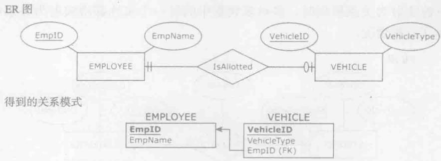

图 3-29 1:1 关系的映射

<table><tr><td>EmpID</td><td>EmpName</td><td></td></tr><tr><td>1234</td><td>Becky</td><td></td></tr><tr><td>2345</td><td>Molly</td><td></td></tr><tr><td>3456</td><td>Rob</td><td></td></tr><tr><td>1324</td><td>Ted</td><td></td></tr><tr><td>VehicleID</td><td>Vehicletype</td><td>EmpID</td></tr><tr><td>111</td><td>Sedan</td><td>1234</td></tr><tr><td>222</td><td>Van</td><td>2345</td></tr><tr><td>333</td><td>Van</td><td>3456</td></tr></table>

图 3-30 图 3-29 所示关系数据库的样本数据记录

## 3.11 参照完整性约束

参照完整性约束（referential integrity constraint）是在关系数据库中对外码有效取值的定义规则。 

### 参照完整性约束

在包含外码的关系中，每一行的外码取值要么对应其参照关系中的主码取值，要么为空。 

以上定义允许外码取值为空。当带外码的联系具有可选参与的实体，并且该实体在映射为关系后同样具有外码时，将允许那些映射后具有外码的实体具有可选参与性。我们采用图 3-17 所示的例子来说明参照完整性约束的定义。 

在图 3-17 所示的 ER 图中，实体 EMPLOYEE 在与实体 DEPARTMENT 的关系中具有可选参与性。在相应的关系模式中，EMPLOYEE 关系有一个外码 DeptID。图 3-31 中给出了对应于图 3-17 的几个符合和违反参照完整性约束的例子。 

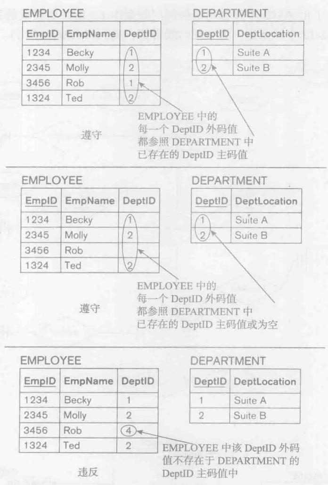

图 3-31 参照完整性约束：遵守和违反的例子

在图 3-31 上面的例子中，所有在 EMPLOYEE 关系中的外码都参照了已有的 DEPARTMENT 关系中的主码，因此没有违反参照完整性约束。 

在图 3-31 中间的例子中，所有在 EMPLOYEE 关系中的外码都参照了已有的 DEPARTMENT 关系中的主码。其中的一个外码取值为空，这也符合参照完整性约束（并且符合图 3-17 中 EMPLOYEE 实体在关系中的可选参与）。 

在图 3-31 下面的例子中，EMPLOYEE 关系中的一个外码取值（DeptID=4）并没有参照已有的 DEPARTMENT 关系中的主码，因此这是一个违反参照完整性约束的例子。 

如前所述，关系模式是由关系和关系之间的连线构成的，其中连线将由外码连接到相应的主码。由于每一条从外码连接到相应主码的连线都要服从完整性约束，所以我们把这样的连线称作参照完整性约束连线（referential integrity constraint line）。 

## 3.12 实例：将 ER 图映射为关系模式

我们现在给出一个具体的实例来总结一下前面提到的那些将 ER 图映射为关系数据库的 规则。图 3-32 展示了由 ZAGI 零售公司销售部门数据库 ER 图映射而成的关系模式（这个实例曾在前一章的图 2-13 中展示过，为方便后续讲解，我们将其重新给出）。 

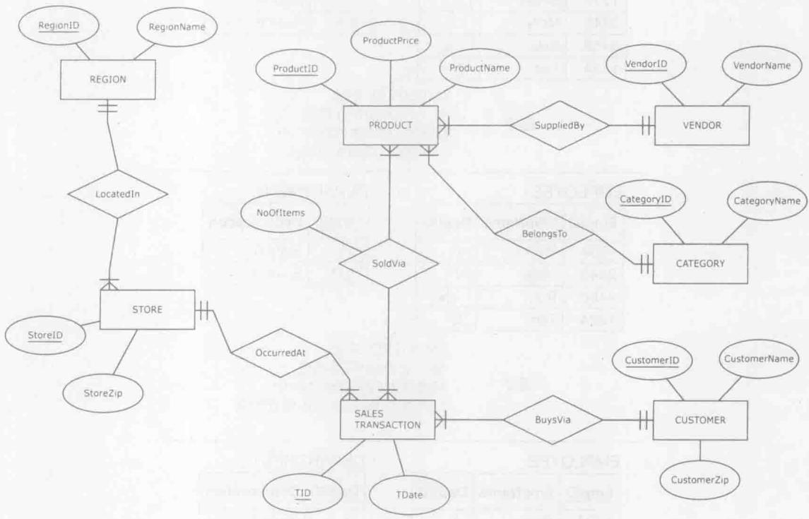

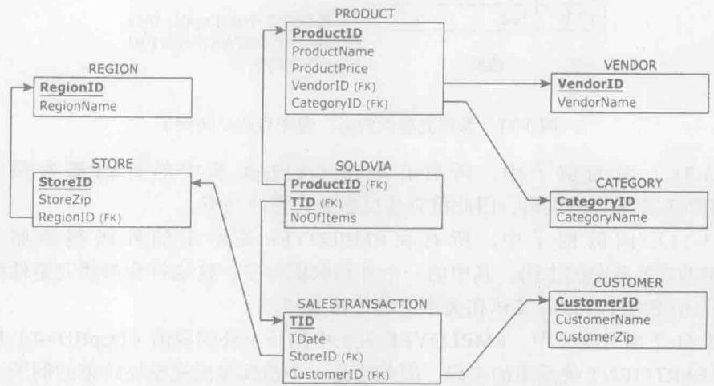

图 3-32 将 ER 图映射为关系模式的例子：ZAGI 零售公司

这张 ER 图中有 7 个实体和 1 个多对多关系。因此，其关系模式中就有 8 个关系表，对应为 7 个实体与 1 个实体间的多对多关系。 

一旦图 3-32 所示的关系模式作为关系数据库实现，它就可以装载数据，如图 3-33 所示。 

REGION

<table><tr><td>RegionID</td><td>RegionName</td></tr><tr><td>C</td><td>Chicagoland</td></tr><tr><td>T</td><td>Tristate</td></tr></table>

PRODUCT

<table><tr><td>ProductID</td><td>ProductName</td><td>ProductPrice</td><td>VendorID</td><td>CategoryID</td></tr><tr><td>1X1</td><td>Zzz Bag</td><td>$100</td><td>PG</td><td>CP</td></tr><tr><td>2X2</td><td>Easy Boot</td><td>$70</td><td>MK</td><td>FW</td></tr><tr><td>3X3</td><td>Cosy Sock</td><td>$15</td><td>MK</td><td>FW</td></tr><tr><td>4X4</td><td>Dura Boot</td><td>$90</td><td>PG</td><td>FW</td></tr><tr><td>5X5</td><td>Tiny Tent</td><td>$150</td><td>MK</td><td>CP</td></tr><tr><td>6X6</td><td>Biggy Tent</td><td>$250</td><td>MK</td><td>CP</td></tr></table>

VENDOR

<table><tr><td>VendorID</td><td>VendorName</td></tr><tr><td>PG</td><td>Pacifica Gear</td></tr><tr><td>MK</td><td>Mountain King</td></tr></table>

STORE

<table><tr><td>StoreID</td><td>StoreZip</td><td>RegionID</td></tr><tr><td>S1</td><td>60600</td><td>C</td></tr><tr><td>S2</td><td>60605</td><td>C</td></tr><tr><td>S3</td><td>35400</td><td>T</td></tr></table>

CATEGORY

<table><tr><td>CategoryID</td><td>CategoryName</td></tr><tr><td>CP</td><td>Camping</td></tr><tr><td>FW</td><td>Footwear</td></tr></table>

SALES TRANSACTION

<table><tr><td>TID</td><td>CustomerID</td><td>StoreID</td><td>TDate</td></tr><tr><td>T111</td><td>1-2-333</td><td>S1</td><td>1-Jan-2013</td></tr><tr><td>T222</td><td>2-3-444</td><td>S2</td><td>1-Jan-2013</td></tr><tr><td>T333</td><td>1-2-333</td><td>S3</td><td>2-Jan-2013</td></tr><tr><td>T444</td><td>3-4-555</td><td>S3</td><td>2-Jan-2013</td></tr><tr><td>T555</td><td>2-3-444</td><td>S3</td><td>2-Jan-2013</td></tr></table>

SOLDVIA

<table><tr><td>ProductID</td><td>TID</td><td>NoOfItems</td></tr><tr><td>1X1</td><td>T111</td><td>1</td></tr><tr><td>2X2</td><td>T222</td><td>1</td></tr><tr><td>3X3</td><td>T333</td><td>5</td></tr><tr><td>1X1</td><td>T333</td><td>1</td></tr><tr><td>4X4</td><td>T444</td><td>1</td></tr><tr><td>2X2</td><td>T444</td><td>2</td></tr><tr><td>4X4</td><td>T555</td><td>4</td></tr><tr><td>5X5</td><td>T555</td><td>2</td></tr><tr><td>6X6</td><td>T555</td><td>1</td></tr></table>

CUSTOMER

<table><tr><td>CustomerID</td><td>CustomerName</td><td>CustomerZip</td></tr><tr><td>1-2-333</td><td>Tina</td><td>60137</td></tr><tr><td>2-3-444</td><td>Tony</td><td>60611</td></tr><tr><td>3-4-555</td><td>Pam</td><td>35401</td></tr></table>

图 3-33 图 3-32 所示 ZAGI 零售公司销售部门数据库的样本数据记录

## 3.13 将拥有若干候选码（多个唯一属性）的实体映射为关系

第 2 章中曾提到一个实体可以具有多个唯一属性。在这种情况下，每个唯一属性称为一个“候选码”。术语“候选码”得名于这样一个事实：候选码中的一个必将由数据库设计者选中作为实体－关系映射过程中的主码，而其他没有被选中的候选码则被映射为非主码列。 

图 3-34 展示了一个拥有若干候选码的实体映射为关系的例子。 

在关系模式中，只有主码有下划线。在图 3-34 所示的关系中，只有 EmpID 有下划线，因为数据库设计者选择它作为主码。SSN 没有下划线，因为在这里它并没有被选择作为主码。尽管如此，我们还是可以在非主码的唯一属性后面用带括号的大写字母 U 来表示其可被唯一标识。 

一旦图 3-35 所示的关系模式作为数据库实现，它便可以装载数据，如图 3-35 所示。 

当候选码中同时存在复合的和规则的（非复合的）候选码时，则以非复合候选码作为主码将会是更好的选择。如图 3-36 所示。 

LPNumber（牌照号码）列和 State（所属州）列组合起来虽可构成 VEHICLE 关系的复合唯一属性，但 VIN（车牌号）因为是非复合唯一属性而最终被选作主码。 

一旦图 3-36 所示的关系作为关系数据库的一部分得以实现，它就可以加载数据，如图 3-37 所示。 

实体

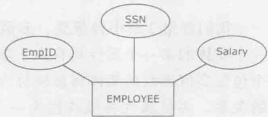

得到的关系

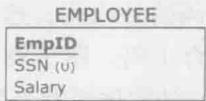

图 3-34 将具有候选码的实体映射为关系

EMPLOYEE

<table><tr><td>EmpID</td><td>SSN</td><td>Salary</td></tr><tr><td>1234</td><td>111-11-1111</td><td>$75,000</td></tr><tr><td>2345</td><td>222-22-2222</td><td>$50,000</td></tr><tr><td>3456</td><td>333-33-3333</td><td>$55,000</td></tr><tr><td>1324</td><td>444-44-4444</td><td>$70,000</td></tr></table>

图 3-35 图 3-34 所示关系的样本数据记录

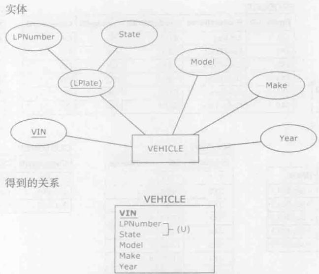

图 3-36 将具有常规及复合候选码的实体映射为关系

VEHICLE

<table><tr><td>VIN</td><td>LPNumber</td><td>State</td><td>Make</td><td>Model</td><td>Year</td></tr><tr><td>11111</td><td>X123</td><td>IL</td><td>Ford</td><td>Fiesta</td><td>2012</td></tr><tr><td>22222</td><td>X456</td><td>IL</td><td>Ford</td><td>Escape</td><td>2009</td></tr><tr><td>33333</td><td>X123</td><td>MI</td><td>Chevrolet</td><td>Volt</td><td>2012</td></tr></table>

图 3-37 图 3-36 所示关系的样本数据记录

## 3.14 将具有多值属性的实体映射为关系数据库组件

我们在第2章中曾提到，多值属性适用于同一个实体的某一个属性具有多个取值的情况。一个包含多值属性的实体将被映射为不含多值属性的关系。多值属性将被映射为一个单独的关系，这个关系中包含一个代表多值属性的列和一个连接相应主码的外码列，这两列组成这个单独关系的一个复合主码。图3-38中展示了如何将一个具有多值属性的实体映射为关系。 

一旦如图 3-38 所示的关系模式作为关系数据库实现，它就可以装载数据，如图 3-39 所示。 

ER图

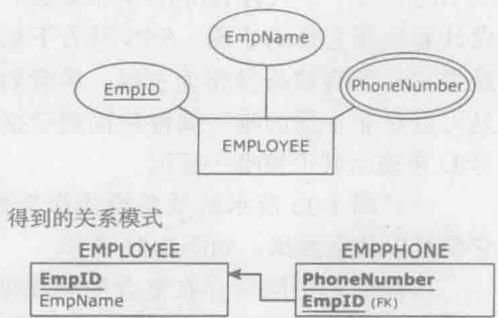

图 3-38 将具有多值属性的实体映射为关系

由于 EMPLOYEE 实体中有多值属性 PhoneNumber，所以在 EMPPHONE 关系中，将允许在多行中出现不同的电话号码属于相同的雇员。 

EMPPHONE 关系中的两列都不是唯一标识的（例如雇员 1234、3456 及 1324 共享同一个电话号码），但是 EmpID 和 PhoneNumber 这两列的组合却是可唯一标识的。因此，在 EMPPHONE 关系中，EmpID 和 PhoneNumber 将组合起来形成复合主码。 

<table><tr><td colspan="2">EMPLOYEE</td><td colspan="2">EMPPHONE</td></tr><tr><td>EmplD</td><td>EName</td><td>EmplD</td><td>PhoneNumber</td></tr><tr><td>1234</td><td>Becky</td><td>1234</td><td>630-111-4567</td></tr><tr><td>2345</td><td>Molly</td><td>1234</td><td>630-222-4567</td></tr><tr><td>3456</td><td>Rob</td><td>2345</td><td>630-333-4567</td></tr><tr><td>1324</td><td>Ted</td><td>3456</td><td>630-111-4567</td></tr><tr><td></td><td></td><td>3456</td><td>630-444-4567</td></tr><tr><td></td><td></td><td>1324</td><td>630-111-4567</td></tr><tr><td></td><td></td><td>1324</td><td>630-555-4567</td></tr><tr><td></td><td></td><td>1324</td><td>630-666-4567</td></tr></table>

图 3-39 图 3-38 所示关系数据库的样本数据记录

## 3.15 将具有派生属性的实体映射为关系

在第 2 章中我们曾提到，一个派生属性是那些属性值并非永久存储在数据库中的属性。派生属性的属性值是通过计算其他存储在数据库中的属性值而得到的。派生属性并不会被映射为关系模式的一部分，如图 3-40 所示。 

一旦图 3-40 所示的关系作为关系数据库实现，它就可以加载数据，如图 3-41 所示。 

尽管派生属性不属于关系模式的一部分，但它仍可以作为所创建数据库的前端应用的一部分得以实现。举例来说，一个基于数据库的前端 应用包含一个 STORE 关系，如图 3-41 所示，这个关系中包含了一个新增的计算得到的列 YearsInBusiness，这个列的值通过表达式（当前日期－开始日期）得到。图 3-42 展示了一个用户在 2013 年夏季可以在前端应用中看到的关系。 

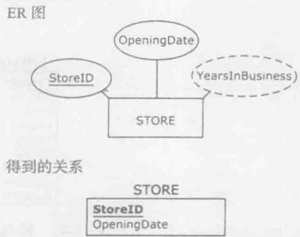

图 3-40 将具有派生属性的实体映射到关系

<table><tr><td>StoreID</td><td>OpeningDate</td></tr><tr><td>1111</td><td>1.1.2000</td></tr><tr><td>2222</td><td>2.2.2001</td></tr><tr><td>3333</td><td>3.3.2002</td></tr><tr><td>4444</td><td>2.2.2001</td></tr></table>

图 3-41 图 3-40 所示关系的样本数据记录

<table><tr><td>Sid</td><td>OpeningDate</td><td>YearsInBusiness</td></tr><tr><td>1111</td><td>1.1.2000</td><td>13</td></tr><tr><td>2222</td><td>2.2.2001</td><td>12</td></tr><tr><td>3333</td><td>3.3.2002</td><td>11</td></tr><tr><td>4444</td><td>2.2.2001</td><td>12</td></tr></table>

图 3-42 将图 3-41 所示的关系在终端应用程序中展示给用户

## 3.16 实例：将具有多种类型属性的实体映射为关系模式

为了对各种类型的属性的映射规则做一个总结，我们采用图3-43来展示一个从EMPLOYEE实体映射得到的关系模式（图中内容曾在前一章的图2-25中展示过。为方便讲解，在此我们将其重新给出）。 

一旦图 3-43 所示的关系模式作为关系数据库实现，它就可以装载数据，如图 3-44 所示。 

得到的关系模式

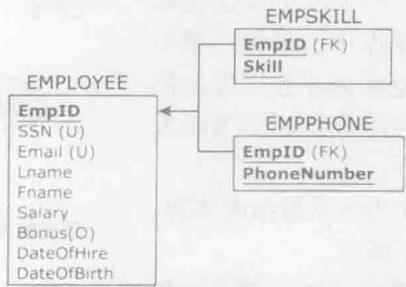

图 3-43 将具有多种类型属性的实体映射到关系

EMPLOYEE

<table><tr><td>EmpID</td><td>SSN</td><td>Email</td><td>FName</td><td>LName</td><td>Salary</td><td>Bonus</td><td>DateOfHire</td><td>DateOfBirth</td></tr><tr><td>1234</td><td>111-11-1111</td><td>bk@compx.com</td><td>Becky</td><td>Kaiser</td><td>$75,000</td><td></td><td>1.1.2002</td><td>11.12.1970</td></tr><tr><td>2345</td><td>222-22-2222</td><td>mn@compx.com</td><td>Molly</td><td>Neps</td><td>$50,000</td><td>$10,000</td><td>2.2.2002</td><td>9.8.1973</td></tr><tr><td>3456</td><td>333-33-3333</td><td>rd@compx.com</td><td>Rob</td><td>Duzs</td><td>$55,000</td><td>$4,000</td><td>3.4.2003</td><td>11.11.1976</td></tr><tr><td>1324</td><td>444-44-4444</td><td>ti@compx.com</td><td>Ted</td><td>Lovett</td><td>$70,000</td><td></td><td>9.8.2004</td><td>5.6.1971</td></tr></table>

EMPPHONE

<table><tr><td>EmpID</td><td>PhoneNumber</td></tr><tr><td>1234</td><td>630-111-4567</td></tr><tr><td>1234</td><td>630-222-4567</td></tr><tr><td>2345</td><td>630-333-4567</td></tr><tr><td>3456</td><td>630-111-4567</td></tr><tr><td>3456</td><td>630-444-4567</td></tr><tr><td>1324</td><td>630-111-4567</td></tr><tr><td>1324</td><td>630-555-4567</td></tr><tr><td>1324</td><td>630-666-4567</td></tr></table>

EMPSKILL

<table><tr><td>EmpID</td><td>Skill</td></tr><tr><td>1234</td><td>CPA</td></tr><tr><td>1234</td><td>CFP</td></tr><tr><td>2345</td><td>CPA</td></tr><tr><td>3456</td><td>CPA</td></tr><tr><td>3456</td><td>CFP</td></tr><tr><td>3456</td><td>CPP</td></tr><tr><td>1324</td><td>CFP</td></tr></table>

图 3-44 图 3-43 所示关系数据库的样本数据记录

## 3.17 一元联系的映射

ER 图中的一元联系可以用与二元联系同样的方式映射为关系模式，即使用一对多和一对一关系中的外码，以及在多对多关系中由两个外码构成的新关系来实现这样的映射。这里我们将对一对多、多对多以及一对一的一元关系映射进行描述。 

### 3.17.1 1: M一元联系的映射

下面是一对多一元联系的映射规则： 

一个由一对多一元联系实体映射得到的关系中包含一个外码，并且这个外码对应于关系自身的主码。 

图 3-45 展示了一对多一元联系的映射。 

注意，外码列 ReferredBy 有一个区别于其相应主码列 ClientID 的名称，这是合法的，这一点在本章中已有提及。实际上，在这个例子中，重命名是必须的，因为不能有名称完全相同的两列。重命名也说明了关系表中外码的角色。 

同时应该注意，因为在参照关系的一侧有选择性参与，所以外码 ReferredBy 也是选择性的。 

一旦图 3-45 所示的关系作为关系数据库实现，它就可以装载数据，如图 3-46 所示。 

注意，图 3-46 中有一个顾客（C111）并没有被任何其他顾客所介绍，并且其中有两个顾客（C333 和 C444）也没有介绍任何其他顾客。这样的情况是允许的，因为图 3-45 中的关系 Refers 对于两侧来说都是可选择的。 

### 3.17.2 M : N 一元联系的映射

ER图

得到的关系

图 3-45 1 : M一元联系映射

CLIENT

<table><tr><td>ClientID</td><td>ClientName</td><td>ReferredBy</td></tr><tr><td>C111</td><td>Mark</td><td></td></tr><tr><td>C222</td><td>Mike</td><td>C111</td></tr><tr><td>C333</td><td>Lilly</td><td>C111</td></tr><tr><td>C444</td><td>Jane</td><td>C222</td></tr></table>

下面是多对多一元联系映射的规则： 

图 3-46 图 3-45 所示关系的样本数据记录 

除了多对多一元联系中的实体需要映射为关系之外，多对多联系本身也需要映射为另一个关系。这个新关系有两个外码，它们由多对多联系中的两个实体的主码映射得到。其中每一个外码都将作为新关系中复合主码的一部分。 

图 3-47 说明了多对多一元联系的映射。 

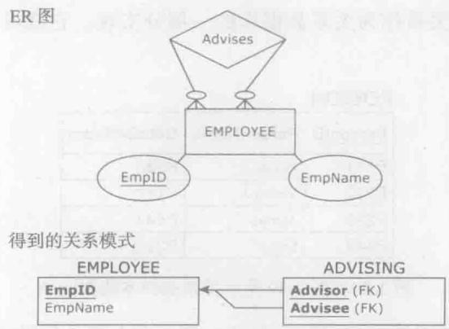

图 3-47 M : N 一元联系映射

两个外码都被重命名以表达它们在关系 ADVISING 中的角色。一旦图 3-47 所示的关系模式作为关系数据库实现，它就可以装载数据，如图 3-48 所示。 

因为图 3-47 中的 ADVISING 关系在其两侧都是可选性的，所以在 EMPLOYEE 关系中，允许出现没有作为指导者的雇员（1324，Ted），以及没有被指导的雇员（1234，Becky）。 

EMPLOYEE

<table><tr><td>EmpID</td><td>EmpName</td></tr><tr><td>1234</td><td>Becky</td></tr><tr><td>2345</td><td>Molly</td></tr><tr><td>3456</td><td>Rob</td></tr><tr><td>1324</td><td>Ted</td></tr></table>

ADVISING

<table><tr><td>Advisor</td><td>Advisee</td></tr><tr><td>1234</td><td>2345</td></tr><tr><td>1234</td><td>3456</td></tr><tr><td>2345</td><td>1324</td></tr><tr><td>3456</td><td>1324</td></tr><tr><td>1234</td><td>1324</td></tr></table>

图 3-48 图 3-47 所示关系模式的样本数据记录

### 3.17.3 1:1一元联系的映射

一对一一元联系的映射同一对多一元联系的映射很相似，如图3-49中的例子所示。这个例子描述了（在Secret Santa节日里的）礼物赠送事件，在这个事件中，每一个人将赠送另一个人一份礼物，并且每一个人会从确定的人那里得到礼物。 

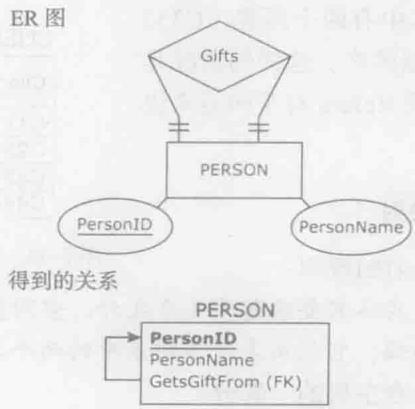

图 3-49 1:1 一元联系映射

一旦图 3-49 所示的关系作为关系数据库的一部分实现，它就可以装载数据，如图 3-50 所示。 

PERSON

<table><tr><td>PersonID</td><td>PersonName</td><td>GetsGiftFrom</td></tr><tr><td>P111</td><td>Rose</td><td>P333</td></tr><tr><td>P222</td><td>Violet</td><td>P111</td></tr><tr><td>P333</td><td>James</td><td>P444</td></tr><tr><td>P444</td><td>Lena</td><td>P222</td></tr></table>

图 3-50 图 3-49 所示关系的样本数据记录

注意，送礼关系在其两侧都是强制参与的，每一个人都必须送出一份礼物，并且每一个人也必须得到一份礼物，如图 3-50 中 PERSON 关系表中的记录所示。 

## 3.18 相同实体间的多个联系的映射

如第 2 章所述，在 ER 图中相同的实体之间有多于一个联系存在的情况并不常见。图 3-51 所示的例子展示了在相同实体间的多个联系。 

ER图

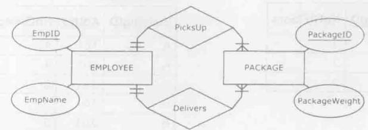

得到的关系模式

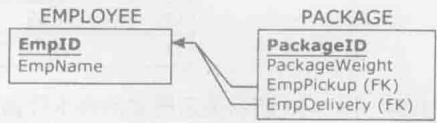

图 3-51 在相同实体之间映射多个关系

注意，PACKAGE 关系有两个外码，它们都参照于 EMPLOYEE 关系中的主码。两个外码都被重命名以更好地诠释 EMPLOYEE 关系的角色。 

一旦图 3-51 所示的关系模式作为关系数据库实现，它就可以装载数据，如图 3-52 所示。 

76 

EMPLOYEE

<table><tr><td>EmpID</td><td>EmpName</td></tr><tr><td>1234</td><td>Becky</td></tr><tr><td>2345</td><td>Molly</td></tr><tr><td>3456</td><td>Rob</td></tr><tr><td>1324</td><td>Ted</td></tr></table>

PACKAGE

<table><tr><td>PackageID</td><td>PackageWeight</td><td>EmpPickup</td><td>EmpDelivery</td></tr><tr><td>P111</td><td>5</td><td>1234</td><td>2345</td></tr><tr><td>P222</td><td>12</td><td>1234</td><td>1324</td></tr><tr><td>P333</td><td>3</td><td>2345</td><td>1234</td></tr><tr><td>P444</td><td>10</td><td>3456</td><td>1234</td></tr><tr><td>P555</td><td>7</td><td>1324</td><td>3456</td></tr></table>

图 3-52 图 3-51 所示关系模式的样本数据记录

## 3.19 弱实体的映射

弱实体的映射与常规实体的映射很相似。映射得到的关系有一个复合主码，这个复合主码由部分标识符、与属主实体主码相连的外码共同来构成。图 3-53 展示了弱实体的映射。 

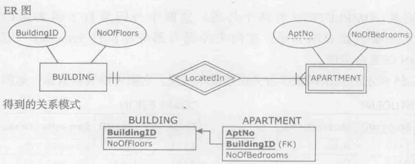

图 3-53 弱实体映射

一旦图 3-53 所示的关系模式作为关系数据库实现，它就可以装载数据，如图 3-54 所示。 

在图 3-54 中，一个雇主实体实例可以由多个弱实体实例联合构成，这些弱实体都有彼此不同的部分码值。举例来说，在图 3-54 的 APARTMENT 关系中，建筑 A 有三个部门，且这三个部门有不同的部门编号，则部分码 AptNo 和 BuildingID 共同组成了关系 APARTMENT 的主码。 

<table><tr><td>BuildingID</td><td>NoOfFloors</td></tr><tr><td>A</td><td>3</td></tr><tr><td>B</td><td>2</td></tr><tr><td>C</td><td>2</td></tr></table>

<table><tr><td>BuildingID</td><td>AptNo</td><td>NoOfBedrooms</td></tr><tr><td>A</td><td>101</td><td>4</td></tr><tr><td>A</td><td>201</td><td>4</td></tr><tr><td>A</td><td>301</td><td>5</td></tr><tr><td>B</td><td>101</td><td>2</td></tr><tr><td>B</td><td>201</td><td>2</td></tr><tr><td>C</td><td>101</td><td>3</td></tr><tr><td>C</td><td>102</td><td>3</td></tr><tr><td>C</td><td>201</td><td>4</td></tr></table>

图 3-54 图 3-53 所示关系模式的样本数据记录

弱实体可以有多个雇主实体。在那种情况下，由弱实体映射得到的关系有一个复合主码，这个复合主码由部分标识符及所有雇主主码相对应的外码构成。图 3-55 展示了有两个雇主实体的一个弱实体的映射。 

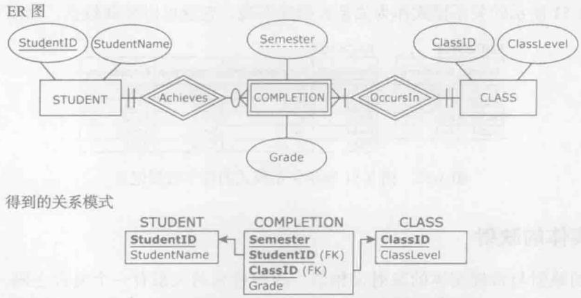

图3-55 有两个雇主实体的一个弱实体的映射

注意，关系 COMPLETION 有两个外码，这两个外码来自于弱实体 COMPLETION 的两个雇主实体映射而成的关系。这两个外码与部分标识符 Semester 一起构成了关系 COMPLETION 的复合主码。 

一旦图 3-55 所示的关系模式作为关系数据库实现，它就可以装载数据，如图 3-56 所示。 

<table><tr><td>StudentID</td><td>StudentName</td></tr><tr><td>1111</td><td>Robin</td></tr><tr><td>2222</td><td>Pat</td></tr><tr><td>3333</td><td>Jami</td></tr></table>

<table><tr><td>StudentID</td><td>ClassID</td><td>Semester</td><td>Grade</td></tr><tr><td>1111</td><td>IS101</td><td>Spring10</td><td>D</td></tr><tr><td>1111</td><td>IS101</td><td>Spring11</td><td>D</td></tr><tr><td>1111</td><td>IS101</td><td>Spring12</td><td>A</td></tr><tr><td>1111</td><td>IS241</td><td>Fall12</td><td>B</td></tr><tr><td>2222</td><td>IS101</td><td>Fall12</td><td>A</td></tr><tr><td>2222</td><td>IS241</td><td>Fall12</td><td>C</td></tr><tr><td>2222</td><td>IS247</td><td>Spring13</td><td>B</td></tr><tr><td>3333</td><td>IS101</td><td>Fall12</td><td>A</td></tr></table>

<table><tr><td>ClassID</td><td>ClassLevel</td></tr><tr><td>IS101</td><td>Freshman</td></tr><tr><td>IS241</td><td>Sophomore</td></tr><tr><td>IS247</td><td>Sophomore</td></tr></table>

图 3-56 图 3-55 所示关系模式的样本数据记录

在第 2 章中我们曾讲解过这个实例，学生可能会多次学习同一门课程直到他们通过了最低通过分数 C。所以，举个例子，如果学生 1111 学习了课程 IS101 三次，前两次他得到分数 D，第三次他得到分数 A。 

当一个联系是一对一的联系时，其中的一个弱实体就没有部分标识符。这时，由属主实体映射得到的关系的主码就成为了这个弱实体映射得到关系的主码。图 3-57 展示了将一对一联系中的弱实体映射为关系。 

图 3-57 没有部分标识符的弱实体映射

因为实体 SPOUSE 没有部分标识符，所以关系 SPOUSE 中的外码同时也是其主码，而并非由部分码组成的复合主码。 

一旦图 3-57 所示的关系模式作为关系数据库实现，它就可以装载数据，如图 3-58 所示。 

<table><tr><td>EmpID</td><td>EmpName</td></tr><tr><td>1234</td><td>Becky</td></tr><tr><td>2345</td><td>Molly</td></tr><tr><td>3456</td><td>Rob</td></tr><tr><td>1324</td><td>Ted</td></tr></table>

SPOUSE

<table><tr><td>EmplD</td><td>SpouseName</td><td>SpouseBdate</td></tr><tr><td>1234</td><td>Steve</td><td>Jan 18</td></tr><tr><td>3456</td><td>Luchy</td><td>Jun 21</td></tr><tr><td>1324</td><td>Tina</td><td>Feb 11</td></tr></table>

图 3-58 图 3-57 所示关系模式的样本数据记录

## 3.20 实例：将另一个 ER 图映射为关系模式

为了再次说明本章中介绍的 ER 图－关系模式映射规则，图 3-59 展示了由 HAFH Realty Company Property 管理数据库的 ER 图映射得到的关系模式（这个例子曾在前一章的图 2-38 中列举过，重放在此以方便讲解）。 

这张 ER 图有 6 个实体以及 2 个多对多联系。其中一个实体有多值属性。因此，映射得到的关系模式有 9 个关系，每个实体对应为一个联系，每个多对多联系也对应为一个关系，另外还有一个多值属性对应为一个关系。 

一旦图 3-59 所示的关系模式作为关系数据库实现，它就可以装载数据，如图 3-60 所示。 

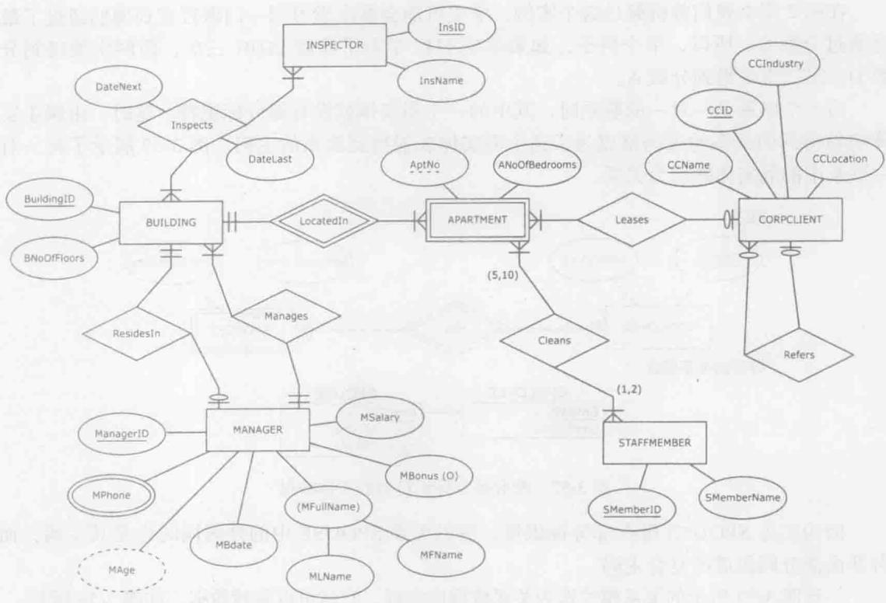

图 3-59 另一个将 ER 图映射为关系模式的例子：HAFH Realty

INSPECTOR

<table><tr><td>InsID</td><td>InsName</td></tr><tr><td>I11</td><td>Jane</td></tr><tr><td>I22</td><td>Niko</td></tr><tr><td>I33</td><td>Mick</td></tr></table>

BUILDING

<table><tr><td>BuildingID</td><td>BNoOfFloors</td><td>BManagerID</td></tr><tr><td>B1</td><td>5</td><td>M12</td></tr><tr><td>B2</td><td>6</td><td>M23</td></tr><tr><td>B3</td><td>4</td><td>M23</td></tr><tr><td>B4</td><td>4</td><td>M34</td></tr></table>

图 3-60 图 3-59 所示 HAFH Realty Company Property 管理数据库的样本数据记录

APARTMENT

<table><tr><td>BuildingID</td><td>AptNo</td><td>ANoOfBedrooms</td><td>CCID</td></tr><tr><td>B1</td><td>41</td><td>1</td><td></td></tr><tr><td>B1</td><td>21</td><td>1</td><td>C111</td></tr><tr><td>B2</td><td>11</td><td>2</td><td>C222</td></tr><tr><td>B2</td><td>31</td><td>2</td><td></td></tr><tr><td>B3</td><td>11</td><td>2</td><td>C777</td></tr><tr><td>B4</td><td>11</td><td>2</td><td>C777</td></tr></table>

INSPECTING

<table><tr><td>InsID</td><td>BuildingID</td><td>DateLast</td><td>DateNext</td></tr><tr><td>I11</td><td>B1</td><td>15-MAY-2012</td><td>14-MAY-2013</td></tr><tr><td>I11</td><td>B2</td><td>17-FEB-2013</td><td>17-MAY-2013</td></tr><tr><td>I22</td><td>B2</td><td>17-FEB-2013</td><td>17-MAY-2013</td></tr><tr><td>I22</td><td>B3</td><td>11-JAN-2013</td><td>11-JAN-2014</td></tr><tr><td>I33</td><td>B3</td><td>12-JAN-2013</td><td>12-JAN-2014</td></tr><tr><td>I33</td><td>B4</td><td>11-JAN-2013</td><td>11-JAN-2014</td></tr></table>

MANAGER

<table><tr><td>ManagerID</td><td>MFName</td><td>MLName</td><td>MBDate</td><td>MSalary</td><td>MBonus</td><td>MResBuildingID</td></tr><tr><td>M12</td><td>Bons</td><td>Grant</td><td>20-JUN-1980</td><td>60000</td><td></td><td>B1</td></tr><tr><td>M23</td><td>Austin</td><td>Lee</td><td>30-OCT-1975</td><td>50000</td><td>5000</td><td>B2</td></tr><tr><td>M34</td><td>George</td><td>Sherman</td><td>11-JAN-1976</td><td>52000</td><td>2000</td><td>B4</td></tr></table>

CLEANING

<table><tr><td>BuildingID</td><td>AptNo</td><td>SMemberID</td></tr><tr><td>B1</td><td>21</td><td>5432</td></tr><tr><td>B1</td><td>41</td><td>9876</td></tr><tr><td>B2</td><td>11</td><td>9876</td></tr><tr><td>B2</td><td>31</td><td>5432</td></tr><tr><td>B3</td><td>11</td><td>5432</td></tr><tr><td>B4</td><td>11</td><td>7652</td></tr></table>

MANAGERPHONE

<table><tr><td>ManagerID</td><td>MPhone</td></tr><tr><td>M12</td><td>555-2222</td></tr><tr><td>M12</td><td>555-3232</td></tr><tr><td>M23</td><td>555-9988</td></tr><tr><td>M34</td><td>555-9999</td></tr></table>

STAFFMEMBER

<table><tr><td>SMemberID</td><td>SMemberName</td></tr><tr><td>5432</td><td>Brian</td></tr><tr><td>9876</td><td>Boris</td></tr><tr><td>7652</td><td>Caroline</td></tr></table>

CORPCLIENT

<table><tr><td>CCID</td><td>CCName</td><td>CCIndustry</td><td>CCLocation</td><td>CCIDReferredBy</td></tr><tr><td>C111</td><td>BlingNotes</td><td>Music</td><td>Chicago</td><td></td></tr><tr><td>C222</td><td>SkyJet</td><td>Airline</td><td>Oak Park</td><td>C111</td></tr><tr><td>C777</td><td>WindyCT</td><td>Music</td><td>Chicago</td><td>C222</td></tr><tr><td>C888</td><td>SouthAlps</td><td>Sports</td><td>Rosemont</td><td>C777</td></tr></table>

图 3-60 （续）

## 3.21 关系数据库约束

如本章前述，一系列约束旨在形成令关系数据库有效的规则。关系数据库规则符合下面两种约束中的一种：隐含约束（implicit constraint）和用户自定义约束（user defined constraint）。 

### 3.21.1 隐含约束

- 关系模式的每一个关系必须有独一无二的关系名。 

- 每一个关系必须符合以下条件： 

- 每一列必须有不同的名字。 

- 不能有完全相同的行。 

- 在每一行的每一列中的取值应该是单值。 

- 每一列中的取值应该服从预定义的域（这一限制也称为域约束）。 

- 列顺序无关。 

- 行顺序无关。 

- 每一个关系必须有一个主码，主码必须能唯一标识一行记录（这一限制也称为主码约束）。 

- 主码值不能为空（实体完整性约束）。 

- 在一个包含外码的关系的每一行中，外码的取值要么匹配其参照关系的主码，要么为空（参照完整性约束）。 

### 3.21.2 用户自定义约束

除了隐含约束外，关系数据库的设计者也可为数据库设定特定的其他约束，这样的约束称为“用户自定义约束”。这里我们列举一些用户自定义约束的例子（在第6章中我们将介绍在已执行的数据库中采用用户自定约束的机制）。 

一个用户自定义约束的例子是指定 ER 图中的可选属性并将其映射为关系模式。例如，设计者可以分别指定实体 EMPLOYEE 以及图 3-11 和图 3-12 所示的 EMPLOYEE 关系中的 Bonus 为可选性。 

另一个用户自定义约束的例子是指定一个强制性外码，如图 3-15 和图 3-16 中所示。在这个例子中，关系 EMPLOYEE 中的 DeptID 列是强制性的，这是因为 ReportsTo 关系的 1 侧是强制参与的。 

图 3-15 和图 3-16 中还同时展示了另一个用户自定义约束，即关系 DEPARTMENT 上的限制。该关系中的每一行必须被 EMPLOYEE 关系中的一个外码所参照，这是因为在关系 ReportsTo 中的 M 侧是强制参与的。注意，图 3-19 和图 3-20 中，部门实体的隶属关系在 M 侧的可选参与，将使得同一约束不会同时存在于图 3-19 和图 3-20 中。 

其他用户自定义约束的例子还包括图 3-61 和图 3-62 所示的指定最小和最大基数。 

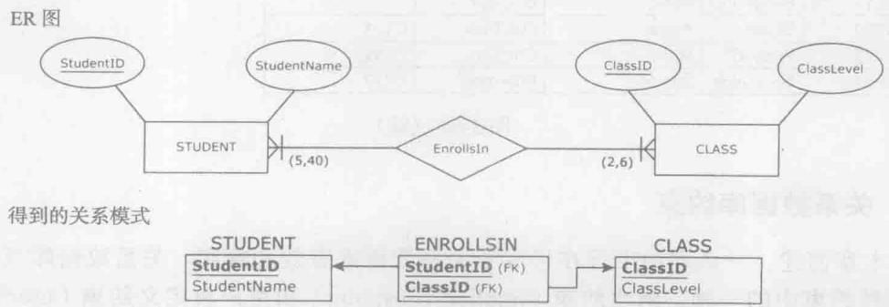

图 3-61 指定最小和最大基数

STUDENT

<table><tr><td>StudentID</td><td>SName</td></tr><tr><td>1111</td><td>Robin</td></tr><tr><td>2222</td><td>Pat</td></tr><tr><td>3333</td><td>Jami</td></tr><tr><td>4444</td><td>Zach</td></tr><tr><td>5555</td><td>Louie</td></tr></table>

ENROLLSIN

<table><tr><td>StudentID</td><td>ClassID</td></tr><tr><td>1111</td><td>IS346</td></tr><tr><td>2222</td><td>IS346</td></tr><tr><td>3333</td><td>IS346</td></tr><tr><td>4444</td><td>IS346</td></tr><tr><td>5555</td><td>IS346</td></tr><tr><td>1111</td><td>IS401</td></tr><tr><td>2222</td><td>IS401</td></tr><tr><td>3333</td><td>IS401</td></tr><tr><td>4444</td><td>IS401</td></tr><tr><td>2222</td><td>IS401</td></tr></table>

CLASS

<table><tr><td>ClassID</td><td>ClassLevel</td></tr><tr><td>IS346</td><td>Junior</td></tr><tr><td>IS401</td><td>Senior</td></tr></table>

图 3-62 图 3-61 所示关系数据库的样本数据记录

一旦图 3-61 所示的关系模式作为关系数据库实现，它就可以装载数据，如图 3-62 所示。可以看到，在关系的两侧，所有的记录都服从指定的最大和最小基数限制，即每门课程有 5 名学生，每名学生可以选 2 门课程。如前所述，我们将在第 6 章介绍执行约束的机制。 

到目前为止，我们所提到的用户自定义约束都将被指定作为 ER 图的一部分。另外一种用户自定义约束称为业务规则（business rule），是在最终生成的数据库中来指定约束，该约束并没有作为创建 ER 图的一部分。业务规则可以以注释的方式添加（如脚注、评论、特殊符号或者其他种类的记号）。 

举个例子来说，一个业务规则中指定任意雇员的薪水将不能低于5万美元或者高于20万美元，这个规则可以以脚注的形式放在一个ER图中，如图3-63所示。 

图3-63 薪水数额的业务规则

一旦图 3-63 所示的关系模式作为关系数据库实现，它就可以装载数据，如图 3-64 所示。所输入的记录同时也会服从雇员薪水限制的业务规则。 

另外一个例子如图 3-65 所示，一个业务规则规定了学生的毕业年份不得早于其注册年份。 

一旦图 3-65 中的关系模式作为关系数据库实现，它就可以装载数据，如图 3-66 所示，所输入的记录同时也会服从学生毕业年份不得早于其注册年份的业务规则。 

EMPLOYEE

<table><tr><td>EmpID</td><td>Salary</td></tr><tr><td>1234</td><td>$75,000</td></tr><tr><td>2345</td><td>$50,000</td></tr><tr><td>3456</td><td>$55,000</td></tr><tr><td>1324</td><td>$70,000</td></tr></table>

图3-64 图3-63所示关系的样本数据记录

图 3-65 注册年份和毕业年份的业务规则

STUDENT

<table><tr><td>StudentID</td><td>YearEnrolled</td><td>YearOfGraduation</td></tr><tr><td>1111</td><td>2012</td><td>2016</td></tr><tr><td>2222</td><td>2013</td><td>2017</td></tr><tr><td>3333</td><td>2013</td><td>2017</td></tr></table>

图 3-66 图 3-65 所示关系的样本数据记录

又如图 3-67 中的业务规则，规定了每一个学生组织必须同时有男性和女性会员。 

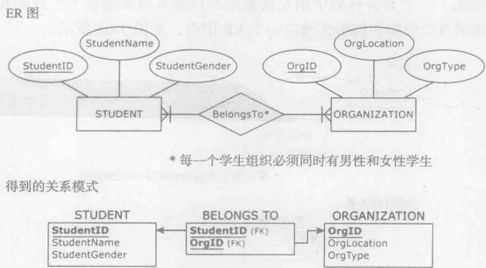

图 3-67 学生组织中学生性别的业务规则

一旦图 3-67 所示的关系模式作为关系数据库实现，它就可以装载数据，如图 3-68 所示。输入数据库的数据将服从学生组织必须有男性和女性会员的约束。代表组织会员的初始数据一旦向三张表格中加载，便会有一个机制去验证数据是否服从数据库的业务规则。 

在第 6 章中，我们将会进一步讨论在数据库中设定业务规则（如同以上列举的实例中所展示的那样）的意义和方法。 

这一章介绍了有关关系数据库建模的最基础的问题，下面的内容将涉及一些数据库建模的其他问题。 

STUDENT

<table><tr><td>StudentID</td><td>StudentName</td><td>StudentGender</td></tr><tr><td>1111</td><td>Robin</td><td>M</td></tr><tr><td>2222</td><td>Pat</td><td>M</td></tr><tr><td>3333</td><td>Jami</td><td>F</td></tr></table>

BELONGSTO

<table><tr><td>StudentID</td><td>OrgID</td></tr><tr><td>1111</td><td>O11</td></tr><tr><td>3333</td><td>O11</td></tr><tr><td>2222</td><td>O11</td></tr><tr><td>3333</td><td>O41</td></tr><tr><td>2222</td><td>O41</td></tr><tr><td>3333</td><td>O47</td></tr><tr><td>1111</td><td>O47</td></tr></table>

ORGANIZATION

<table><tr><td>OrgID</td><td>OrgLocation</td><td>OrgType</td></tr><tr><td>O11</td><td>Student Hall</td><td>Charity</td></tr><tr><td>O41</td><td>Damen Hall</td><td>Sport</td></tr><tr><td>O47</td><td>Student Hall</td><td>Charity</td></tr></table>

图 3-68 图 3-67 所示关系数据库的样本数据记录

## 3.22 问题说明：关联实体映射

在第 2 章中我们曾提到关联实体这个 ER 建模概念，可以将其视作另一种描述多对多关系的方法。所以，关联实体将采用和多对多关系一样的方法映射为关系数据库构件。在这两种方法中，都会创建一个额外的关系，这个关系中有两个外码，分别指向由涉及多对多联系的两个实体映射得到的关系。 

图 3-69 展示了一个多对多联系及其关联实体形式是如何以相同的方式映射为关系模式的。 

ER 图 (M : N 版本) 

同一个 ER 图（关联实体版本） 

得到的关系模式（上面两个ER图中的任何一个） 

图 3-69 多对多联系及其关联实体形式以相同的方式映射为关系模式

## 3.23 问题说明：三元联系映射

在第 2 章中曾提到三元联系是多对多对多的联系。三元联系的映射与多对多联系的映射 非常相似。一个带有若干外码的新关系将被创建，这些外码都来自参与的关系，它们共同组成这个新关系的主码。图 3-70 展示了三元联系的映射。 

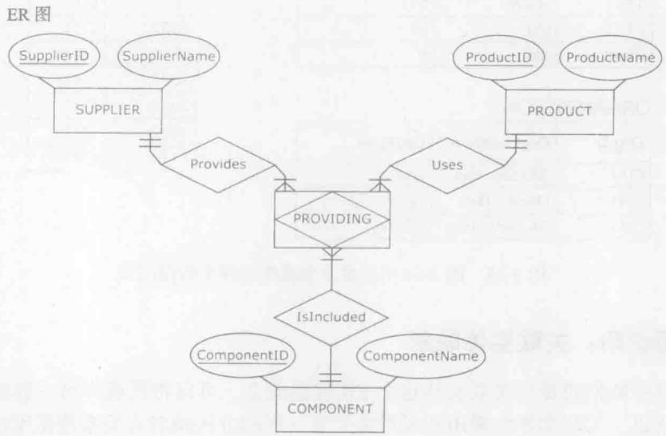

得到的关系模式

图3-70 三元联系的映射

一旦图 3-70 所示的关系模式作为关系数据库实现，它就可以加载数据，如图 3-71 所示。 

SUPPLIER

<table><tr><td>SupplierID</td><td>SupplierName</td></tr><tr><td>S1</td><td>Acme</td></tr><tr><td>S2</td><td>Xparts</td></tr><tr><td>S3</td><td>Compy</td></tr></table>

PRODUCT

<table><tr><td>ProductID</td><td>ProductName</td></tr><tr><td>P1</td><td>Bicycle</td></tr><tr><td>P2</td><td>Tricycle</td></tr><tr><td>P3</td><td>Scooter</td></tr></table>

COMPONENT

<table><tr><td>ComponentID</td><td>ComponentName</td></tr><tr><td>C1</td><td>Wheel</td></tr><tr><td>C2</td><td>Handle</td></tr><tr><td>C3</td><td>Seat</td></tr></table>

PROVIDING

<table><tr><td>SupplierID</td><td>ProductID</td><td>ComponentID</td></tr><tr><td>S1</td><td>P1</td><td>C1</td></tr><tr><td>S2</td><td>P1</td><td>C1</td></tr><tr><td>S3</td><td>P1</td><td>C1</td></tr><tr><td>S1</td><td>P1</td><td>C2</td></tr><tr><td>S2</td><td>P1</td><td>C2</td></tr><tr><td>S3</td><td>P1</td><td>C2</td></tr><tr><td>S1</td><td>P1</td><td>C3</td></tr><tr><td>S2</td><td>P1</td><td>C3</td></tr><tr><td>S3</td><td>P1</td><td>C3</td></tr><tr><td>S1</td><td>P2</td><td>C1</td></tr><tr><td>S1</td><td>P2</td><td>C2</td></tr><tr><td>S1</td><td>P2</td><td>C3</td></tr><tr><td>S1</td><td>P3</td><td>C1</td></tr><tr><td>S1</td><td>P3</td><td>C2</td></tr></table>

图 3-71 图 3-70 所示关系数据库的样本数据记录

在本例中，图 3-71 中的记录表明三个供应商提供了自行车的三个部件，并且供应商 A1 还专门为三轮车和轻便摩托车提供部件。 

## 3.24 问题说明：设计者创建的主码和自动编号选项

很多现代数据库设计和 DBMS 工具为数据库设计者提供了一个自动编号数据类型选项，这个选项可以自动地在一列中生成连续数值型数据值。这个选项最常见的用途是创建设计者设定的主码列。举例来说，考虑以下需求： 

- 医院数据库将保持对病患的跟踪。 

- 对于每一个病患，医院将保持对其唯一的SSN（即出生日期和姓名）的掌握。 

基于这种关系的实体及其映射得到的关系如图 3-72 所示。 

PatientID 列并没有在需求中写明。但是，在与终端用户讨论后，设计者决定不使用病患的 SSN 作为主码，而是创建另外一列 PatientID 作为关系 PATIENT 的主码，并且用自动增长的整数数据来装载关系表。首先，需求被更改如下： 

- 医院数据库将保持对病患的跟踪。 

- 对于每一个病患，医院将保持对其唯一的SSN以及唯一的PatientID的掌握（PatientID是一个简单的整数，每一个新病患都会被赋予紧随当前已分配整数之后的一个整数）。 

如图 3-73 所示，根据修改过的需求，ER 图也需做相应的修改。结果映射得到的关系中新增了 PatientID 这一列。 

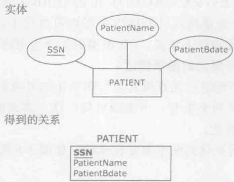

图 3-72 实体及其得到的关系 PATIENT

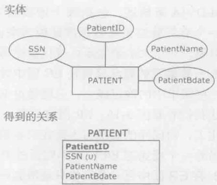

图 3-73 实体以及添加了设计者创建的主键列以后的关系 PATIENT

在关系 PATIENT 的实现过程中，自动编号数据类型被选择作为 PatientID 列的值。关系 PATIENT 中的数据如图 3-74 所示。SSN、PatientBdate 以及 PatientName 这三列的数据需要输入。PatientID 列的数值则由数据库系统来自动生成。 

PATIENT

<table><tr><td>PatientID</td><td>SSN</td><td>PatientName</td><td>PatientBdate</td></tr><tr><td>1</td><td>123-44-4444</td><td>Ernest</td><td>1/1/1929</td></tr><tr><td>2</td><td>567-88-8888</td><td>Hans</td><td>2/2/1931</td></tr><tr><td>3</td><td>912-33-3333</td><td>Sally</td><td>4/3/1951</td></tr></table>

图 3-74 图 3-73 所示关系的样本数据记录

## 3.25 问题说明：ER 建模和关系建模

85 

一般教材中的数据库建模方法是在收集需求的同时进行 ER 建模，然后将 ER 模型映射为关系模式。但是，很多从业人员更倾向于直接从需求中创建关系模式，采用这种方式时，ER 建模的阶段就被省略了。 

有经验的数据库建模者常感到他们的专业程度已经处于相当高的水平，不再需要针对每一个数据库都创建两种类型的图表。他们觉得看着需求立刻创建出可以被 DBMS 软件包所执行的关系模式是更可取的做法，这种做法直接跳过了 ER 图建模这一阶段。 

这种简化的数据库建模方法乍一看非常有吸引力，因为它可以使目的变得简单并且节省时间。尽管如此，我们还是给出一些反对这种做法的建议，原因如下： 

- ER 模型更有利于将需求可视化。 

- 一些确定的概念只有在 ER 图中才能得到可视化的图形描述。 

- 在 ER 图中每一个属性只被提到一次。 

- ER 模型是更好的交流和文档化工具。 

下面将就上述各原因进行讨论。 

### 1. ER 模型更有利于将需求可视化

所有的需求都能以直接明了的形式在 ER 图中得到显式的可视化表达。换句话说，有一些需求在关系模式中的表达并没有那么直接明了。 

让我们看看图 3-32。举例来说，“每一个产品都通过一笔或多笔交易销售，而每一笔销售交易都包括一个或多个产品”这个需求可由 ER 图得到可视化描述。同样的需求也可由关系 SOLDVIA 来描述，包括两个连接到关系 SALESTRANSACTION 和 PRODUCT 的外码。对于一个有经验的关系数据库建模者来说，这个关系模式已经可以很好地可视化上述需求了。但是，对于大多数需要可视化描述需求的商业委托人来说，ER 模型更简单也更清楚。 

### 2. 一些确定的概念只有在 ER 图中才能得到可视化的图形描述

一些需求中的确定概念，只能通过 ER 图而不能通过关系模式进行图形化的可视描述。 

让我们看看图 3-15。ER 图将 “每一个部门必须至少有一个隶属雇员” 这一需求捕捉并可视化了，而同样的需求将不能在关系模式中可视化。 

另外一个能通过 ER 图而不能通过关系模式可视化的例子是复合属性，如图 3-6 所示。 

### 3. 在 ER 图中每一个属性只被提到一次

看看那些对应于结果数据库的属性，由于 ER 图中每个属性只被提到一次，所以 ER 图是更简单的方法。 

让我们看看图 3-59。BuildingID 是实体 BUILDING 的一个属性，它在 ER 图中只被提到过一次，同 ER 图中出现的其他属性一样。而在关系模式中，BuildingID 属性在关系 BUILDING 中提到一次，并且作为外码在其他三个不同的关系中出现，共被提到 4 次。一个有经验的数据库建模者也许可以将原始属性和其外码区分开来。但是，一个普通的商业用户在面临满是外码以及同一属性的多个实例的关系模式时可能会崩溃。 

### 4. ER 模型是更好的交流和文档化工具

由于上述各种原因，在数据库设计的所有环节中，采用 ER 图都比采用关系模式更加便于交流。ER 图更有利于解释、讨论以及验证需求和最终得到的数据库，并更有利于数据库开发过程以及后续的数据库执行过程。 

86 

## 总结

除了 3.2 节的表 3-1 外，表 3-2 和表 3-3 总结了本章介绍的基本的关系概念。 

表 3-2 关系数据库的基本约束总结

<table><tr><td>约束</td><td>描述</td></tr><tr><td>命名关系</td><td>关系模式中的每个关系都必须有不同的名称</td></tr><tr><td>命名列</td><td>在一个关系中,每一列都必须有不同的名称</td></tr><tr><td>行唯一</td><td>在一个关系中,每一行必须唯一</td></tr><tr><td>列值为单值</td><td>在一个关系的每一行中,每一列的值必须为单值</td></tr><tr><td>域约束</td><td>在一个关系中,每一列的所有值必须来自预先定义的域</td></tr><tr><td>列的顺序</td><td>在一个关系中,列的顺序是无关的</td></tr><tr><td>行的顺序</td><td>在一个关系中,行的顺序是无关的</td></tr><tr><td>主码约束</td><td>每一个关系必须有一个主码,主码是一列(或一组列),其值对于每一行是唯一的</td></tr><tr><td>实体完整性约束</td><td>主码列不能为空值</td></tr><tr><td>外码</td><td>外码是关系中的一列,它参照另一个(被参照的)关系的主码</td></tr><tr><td>参照完整性约束</td><td>在包含外码的关系中,每一行的外码取值要么对应其参照关系中的主码取值,要么为空</td></tr></table>

表 3-3 将关系模式映射为规则的基本 ER 总结

<table><tr><td>ER 构件</td><td>映射规则</td></tr><tr><td>一般实体</td><td>映射为关系</td></tr><tr><td>一般属性</td><td>映射为关系的列</td></tr><tr><td>唯一属性</td><td>实体的一个唯一属性映射为主码,如果还有其他的唯一属性,则被标记为唯一(但不作为主码)</td></tr><tr><td>复合属性</td><td>只有复合属性的各个部分映射为关系的列(复合属性本身不作映射)</td></tr><tr><td>复合的唯一属性</td><td>只有它的各个部分被映射。如果实体中没有单值唯一属性,则复合属性的各部分变为复合主码。否则,将各部分标记为唯一(不作为主码)</td></tr><tr><td>多值属性</td><td>映射为带有复合主码的单独的关系。复合主码是由表示多值属性的列和外码组成的,该外码参照了表示包含多值属性实体的关系的主码</td></tr><tr><td>派生属性</td><td>不作映射</td></tr><tr><td>可选属性</td><td>映射为一列,标记为可选</td></tr><tr><td>1:M二元联系</td><td>属于M侧的实体所映射得到的关系有一个外码,这个外码对应于由1侧的实体映射得到的关系中的主码</td></tr><tr><td>M:N二元联系</td><td>映射为带有两个外码的新关系,这两个外码对应于多对多关系中两个实体的主码。这两个外码构成这个表示多对多联系的新关系的复合主码。如果存在属性,则联系的属性映射为新关系的列</td></tr><tr><td>1:M一元联系</td><td>一对多一元联系实体映射得到的关系中包含一个外码,并且这个外码对应于关系自身的主码</td></tr><tr><td>M:N一元联系</td><td>映射为带有两个外码的新关系,这两个外码都对应于多对多关系中实体的主码。每一个外码都将作为新关系中复合主码的一部分</td></tr><tr><td>关联实体</td><td>与映射M:N联系的规则相同。创建一个带有外码的新关系,外码对应于表示参与关联实体的关系的主码</td></tr><tr><td>弱实体</td><td>映射为带有一个外码的新关系,外码对应于表示主实体的关系的主码。由部分码映射得到的列和主实体的外码一起作为复合主码(如果没有部分码,外码单独作为主码)</td></tr><tr><td>三元联系</td><td>与关联实体的映射规则相同</td></tr></table>

## 关键术语

attribute (of a relation) ((关系的) 属性), 57 

autonumber data type (自动编号数据类型), 84 

bridge relation (桥关系), 66 

business rule (业务规则), 81 

column (列), 57 

composite primary key(复合主码), 61 designer-created primary key (设计者创建的主码), 84 

domain constraint (域约束), 79 

entity integrity constrain (实体完整性约束), 62 

foreign key(外码), 63 

implicit constrain (隐含约束), 78 

primary key (主码), 59 

primary key constrain (主码约束), 79 

record（记录），57 

referential integrity constrain (参照完整性约束), 69 

referential integrity constrain line (参照完整性约 

束连线），69 

relation (关系), 57 

relation database (关系数据库), 57 

relation database model (关系数据库模型), 57 

relational DBMS, RDBMS (关系数据库管理系统), 57 

relation schema (关系模式), 57 

relation table (关系表), 57 

row (行), 57 

table (表), 57 

tuple（元组），57 

user-defined constrain (用户自定义约束), 78 

## 复习题

Q3.1 一张表成为一个关系必须满足哪些条件？ 

Q3.2 什么是主码？ 

Q3.3 如何将一个具有普通属性的普通实体映射为一个关系？ 

Q3.4 如何将一个复合属性映射为一个关系？ 

Q3.5 如何将一个唯一的复合属性映射为一个关系? 

Q3.6 如何将一个可选性属性映射为一个关系？ 

Q3.7 给出实体完整性约束的定义。 

Q3.8 什么是外码？ 

Q3.9 如何将两个实体间的一对多联系映射为关系模式？ 

Q3.10 如何将两个实体间的多对多联系映射为关系模式? 

Q3.11 如何将两个实体间的一对一联系映射为关系模式? 

Q3.12 给出参照完整性约束的定义。 

Q3.13 如何将候选码映射为关系？ 

Q3.14 如何将多值属性映射为关系模式? 

Q3.15 如何将派生属性映射为关系模式? 

Q3.16 如何将一对多一元联系映射为关系模式? 

Q3.17 如何将多对多一元联系映射为关系模式? 

Q3.18 如何将一对一一元联系映射为关系模式? 

Q3.19 如何将弱实体映射为关系模式? 

Q3.20 如何将三元联系映射为关系模式? 

Q3.21 列出关系数据库模型的隐含约束。 

Q3.22 什么是用户自定义约束? 

Q3.23 什么是业务规则？ 

Q3.24 什么是设计者所创建的主码? 

Q3.25 反对不创建 ER 模型而直接创建关系数据库模型的主要原因是什么？ 

## 练习

E3.1 给出两个实例，一个是属于关系的表，另一个是不属于关系的表。 

E3.2 给出两个实例，一个是服从实体完整性约束的关系，另一个是违反实体完整性约束的关系。 

E3.3 给出两个实例，一个是服从参照完整性约束的关系，另一个是违反参照完整性约束的关系。 

E3.4 将 E2.1 中的实体映射为关系。 

E3.5 将以下练习题中的 ER 图映射为关系模式，并满足以下要求： 

E3.5a 对于 E2.2a，在每一个关系中给出几个记录，并且为这些取值标明是在 1 侧的可选参与还是在 M 侧的可选参与。 

E3.5b 对于 E2.2b，在每一个关系中给出几个记录，并且为这些取值标明是在 1 侧的可选参与还是在 M 侧的强制参与。 

E3.5c 对于 E2.2c，在每一个关系中给出几个记录，并且为这些取值标明是在 1 侧的强制参与还是在 M 侧的强制参与。 

E3.5d 对于 E2.2d，在每一个关系中给出几个记录，并且为这些取值标明是在 1 侧的可选参与还是在 M 侧的可选参与。 

E3.5e 对于 E2.2e，在每一个关系中给出几个记录，并且为这些取值标明是在 1 侧的强制参与还是在另一侧的可选参与。 

E3.5f 对于 E2.2f，在每一个关系中给出几个记录，并且为这些取值标明是在 1 侧的强制参与还是在其他边的强制参与。 

E3.5g 对于 E2.2g，在每一个关系中给出几个记录，并且为这些取值标明是在 1 侧的可选参与还是在其他边的强制参与。 

E3.5h 对于 E2.2h，在每一个关系中给出几个记录，并且为这些取值标明是在 1 侧的强制参与还是在其他边的可选参与。 

E3.5i 对于 E2.2i，在每一个关系中给出几个记录，并且为这些取值标明是在 1 侧的强制参与还是在其他边的强制参与。 

E3.5j 对于 E2.2j，在每一个关系中给出几个记录，并且为这些取值标明是在 1 侧的可选参与还是在其他边的可选参与。 

E3.6 将 E2.3 中的 ER 图映射为关系，在得到的关系中给出几个记录。 

E3.7 将 E2.4 中的实体映射为关系，在得到的关系中给出几个记录。 

E3.8 将 E2.5 中的实体映射为关系，在得到的关系中给出几个记录。 

E3.9 将 E2.6 中的实体映射为关系，在得到的关系中给出几个记录。 

E3.10 将 E2.7 中的实体映射为关系，在得到的关系中给出几个记录。 

E3.11 将 E2.8 中的实体映射为关系，在得到的关系中给出几个记录。 

E3.12 将 E2.9 中的实体映射为关系，在得到的关系中给出几个记录。 

E3.13 将 E2.10 中的 ER 图映射为关系，在得到的关系中给出几个记录。 

E3.14 将基于 E2.11 中的需求得到的 ER 图映射为关系，在得到的关系中给出几个记录。 

E3.15 将基于 E2.12 中的需求得到的 ER 图映射为关系，在得到的关系中给出几个记录。 

E3.16 将基于 E2.13 中的需求得到的 ER 图映射为关系，在得到的关系中给出几个记录。 

E3.17 构造一个服从某业务规则的 ER 图实例，将这个 ER 图映射为关系并给出几个记录，以说明它们服从业务规则。 