# 数据库系统概论

# Introduction to Database Systems

# 第 7 章 数据库设计

华中师范大学计算机学院 

# 第 7 章 数据库设计

7.1 数据库设计概述 

7.2 需求分析 

7.3 概念结构设计 

7.4 逻辑结构设计 

7.5 物理结构设计 

7.6 数据库的实施和维护 

本章小结 

# 7.1 数据库设计概述

# 数据库设计

■ 数据库设计是指对于一个给定的应用环境，构造（设计）优化的数据库逻辑模式和物理结构，并据此建立数据库及其应用系统，使之能够有效地存储和管理数据，满足各种用户的应用需求，包括信息管理要求和数据操作要求。 

■ 信息管理要求：在数据库中应该存储和管理哪些数据对象。 

■ 数据操作要求：对数据对象需要进行哪些操作，如查询、增加、删除、修改、统计和分析等操作。 

# 数据库设计概述（续）

# 数据库设计

■ 数据库设计的目标是为用户和各种应用系统提供一个信息基础设施和高效的运行环境。 

■ 高效的运行环境 

- 数据库数据的高存取效率 

- 数据库存储空间的高利用率 

- 数据库系统运行维护的高效率 

# 7.1 数据库设计概述

7.1.1 数据库设计的特点 

7.1.2 数据库设计的方法 

7.1.3 数据库设计的基本步骤 

7.1.4 数据库设计过程中的各级模式 

# 7.1.1 数据库设计的特点

# 1. 重视基础数据

■ 三分技术，七分管理，十二分基础数据 

■ 管理 

- 数据库设计作为一个大型工程项目本身的项目管理 

- 项目所属企业（即应用部门）的业务管理 

■ 基础数据 

● 数据的收集、整理、组织和不断更新 

# 数据库设计的特点（续）

# 2. 数据库设计和数据处理设计相结合

■ 将数据库模式设计和数据处理设计密切结合 

# 结构和行为分离的设计

■ 传统的软件工程：重 行为设计 

- 忽视对应用中数据语义的分析和抽象，只要有可能就尽量推迟数据结构设计的决策 

■ 早期的数据库设计：重 结构设计 

- 致力于数据模型和数据库建模方法研究，忽视了行为设计对结构设计的影响 

# 数据库设计的特点（续）

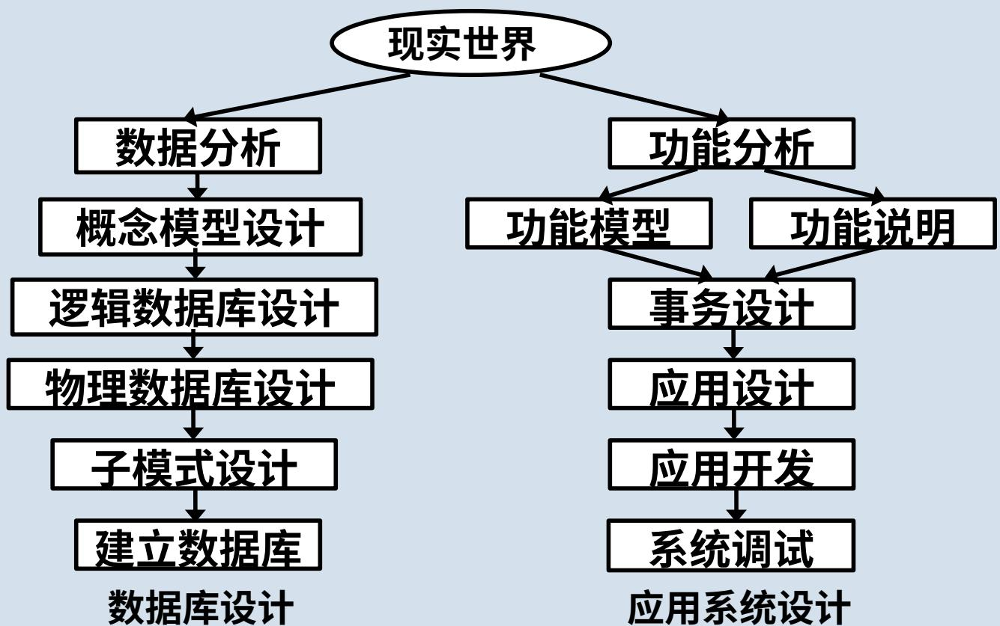

图 7.1 数据库设计和应用系统设计分离的设计

# 7.1 数据库设计概述

7.1.1 数据库设计的特点 

7.1.2 数据库设计的方法 

7.1.3 数据库设计的基本步骤 

7.1.4 数据库设计过程中的各级模式 

# 7.1.2 数据库设计的方法

大型数据库设计是涉及多学科的综合性技术，又是一项庞大的工程项目。 

✿ 它要求多方面的知识和技术。主要包括： 

■ 计算机的基础知识 

■ 软件工程的原理和方法 

■ 程序设计的方法和技巧 

■ 数据库基本知识 

■ 数据库设计技术 

■ 应用领域知识 

# 数据库设计的方法（续）

# 手工与经验相结合的方法

■ 设计质量与设计人员的经验和水平有直接关系 

■缺乏科学理论和工程方法支持，工程质量难以保证 

■ 数据库运行一段时间后，又不同程度发现各种问题，增加了维护代价 

# 数据库设计的方法（续）

# 规范设计法

■手工设计方法 

■基本思想 

- 过程迭代和逐步求精 

■典型方法 

- 新奥尔良（New Orleans）方法 

- 基于 E-R 模型的数据库设计方法 

- 3NF（第三范式）的设计方法 

- 面向对象的数据库设计方法 

- 统一建模语言（UML）方法 

# 数据库设计方法（续）

# 计算机辅助设计

■ ORACLE Designer 

■ SYBASE PowerDesigner 

# 7.1 数据库设计概述

7.1.1 数据库设计的特点 

7.1.2 数据库设计方法 

7.1.3 数据库设计的基本步骤 

7.1.4 数据库设计过程中的各级模式 

# 7.1.3 数据库设计的基本步骤

# 数据库设计分 6 个阶段

■ 需求分析 

■ 概念结构设计 

■ 逻辑结构设计 

■ 物理结构设计 

■ 数据库实施 

■ 数据库运行和维护 

需求分析和概念设计独立于任何数据库管理系统 

逻辑设计和物理设计与选用数据库管理系统密切相关 

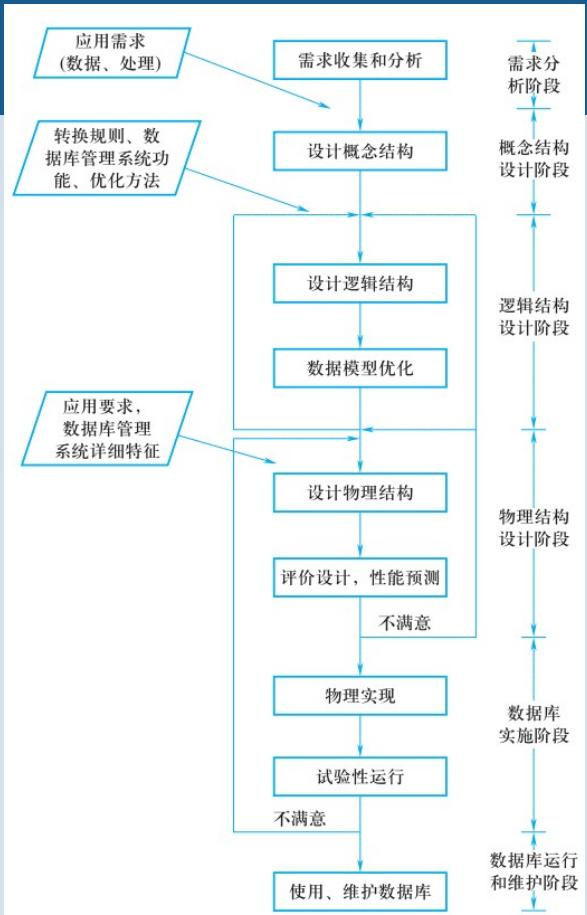

图 7.2 数据库设计的基本步骤

# 数据库设计的基本步骤（续）

# ✿ 参加数据库设计的人员

■ 系统分析员和数据库设计员 

- 数据库设计的核心人员，其水平决定了数据库系统的质量 

■ 数据库管理员和最终用户代表 

- 主要参加需求分析与数据库的运行和维护 

■ 应用程序员 

- 包括程序员和操作员 

- 在系统实施阶段参与进来，分别负责编制程序和准备软硬件环境 

# 数据库设计的基本步骤（续）

# 1. 需求分析阶段

■ 是否做得充分与准确，决定了构建数据库的速度和质量 

# 2. 概念结构设计阶段

■ 通过对用户需求进行综合、归纳与抽象，形成一个独立于具体数据库管理系统的概念模型 

# 3. 逻辑结构设计阶段

■ 将概念结构转换为某个数据库管理系统支持的数据模型，并对其进行优化 

# 数据库设计的基本步骤（续）

# 4. 物理结构设计阶段

■ 为逻辑数据结构选取一个最适合应用环境的物理结构 

■ 包括存储结构和存取方法 

# 5. 数据库实施阶段

■ 根据逻辑设计和物理设计的结果创建数据库 

■ 编写与调试应用程序 

■ 组织数据入库并进行试运行 

# 6. 数据库运行和维护阶段

■ 经过试运行后即可投入正式运行 

■ 在运行过程中必须不断对其进行评估、调整与修改 

# 数据库设计的基本步骤（续）

设计一个完善的数据库应用系统，往往是上述6个阶段的不断反复 

这个设计步骤既是数据库设计的过程，也包括了数据库应用系统的设计过程 

✿ 把数据库的设计和对数据库中数据处理的设计紧密结合起来，将这两个方面的需求分析、抽象、设计、实现在各个阶段同时进行，相互参照，相互补充，以完善两方面的设计 

# 数据库设计的基本步骤（续）

图 7.3 数据库设计各个阶段的设计描述

<table><tr><td>设计阶段</td><td>设计描述</td></tr><tr><td>需求分析</td><td>数据字典:全系统中数据项、数据结构、数据流、数据存储、处理过程的描述</td></tr><tr><td>概念结构设计</td><td>概念模型(E-R图)</td></tr><tr><td>逻辑结构设计</td><td>某种数据模型关系 非关系</td></tr><tr><td>物理结构设计</td><td>存储布局存取方法选择存取路径建立是否压缩存储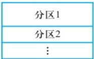</td></tr><tr><td>数据库实施</td><td>创建数据库模式装载数据数据库试运行</td></tr><tr><td>数据库运行和维护</td><td>性能监测、转储/恢复、数据库重组和重构</td></tr></table>

# 7.1 数据库设计概述

7.1.1 数据库设计的特点 

7.1.2 数据库设计方法 

7.1.3 数据库设计的基本步骤 

7.1.4 数据库设计过程中的各级模式 

# 7.1.4 数据库设计过程中的各级模式

# 数据库设计不同阶段形成的数据库各级模式

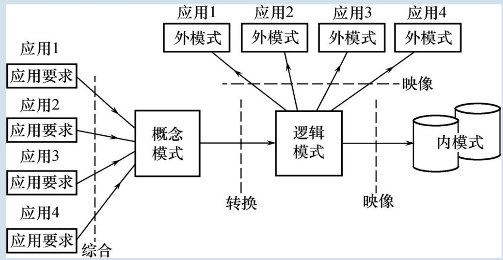

图 7.4 数据库的各级模式

# 数据库设计过程中的各级模式（续）

# 数据库设计不同阶段形成的数据库各级模式

需求分析阶段： 

综合各个用户的应用需求

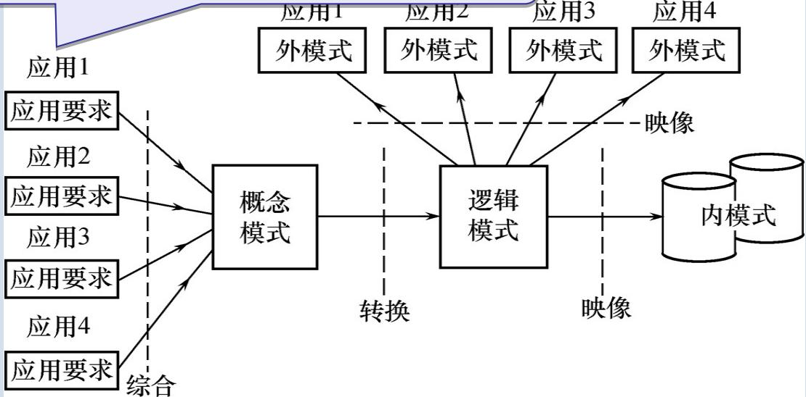

图 7.4 数据库的各级模式

# 数据库设计过程中的各级模式（续）

# 数

概念设计阶段： 

形成独立于机器特点，独立于各个数据库管理系统产品的概念模式（E-R 图） 

# 据库各级模式

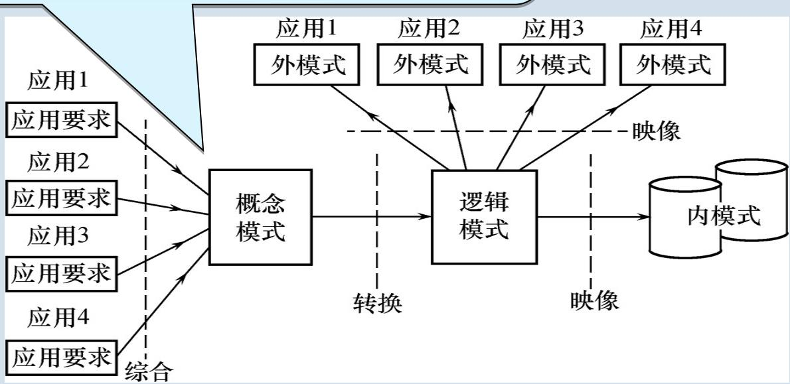

图 7.4 数据库的各级模式

# 数据库设计过程中的各级模式（续）

# 数据库设计不同阶段形成的数据库各级模式

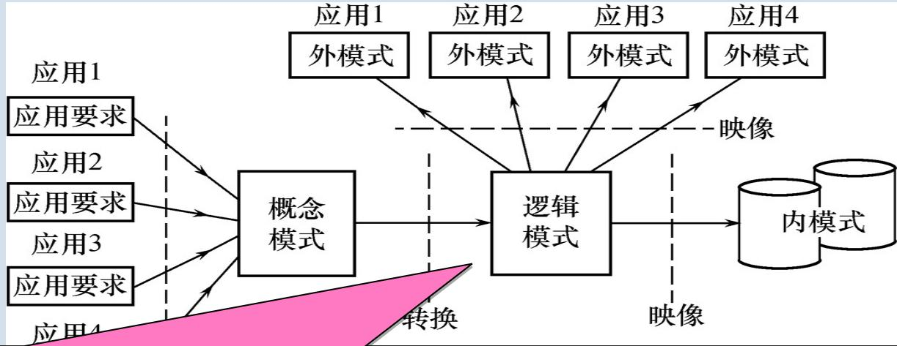

# 逻辑设计阶段:

1. 将 E-R 图转换成具体的数据库产品支持的数据模型，如关系模型，形成数据库逻辑模式 

2. 然后根据用户处理的要求、安全性的考虑，在基本表基础上再建立必要的视图（View），形成数据的外模式 

# 数据库设计过程中的各级模式（续）

# 数据库设计不同

# 物理设计阶段：

根据数据库管理系统特点和处理的需要，进行物理存储安排，建立索引，形成数据库内模式 

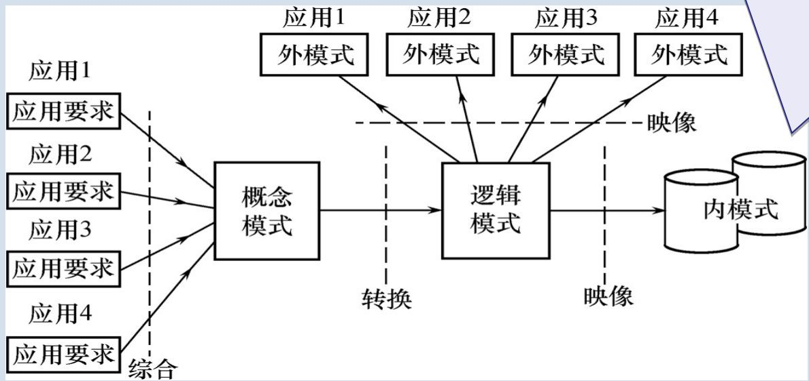

图 7.4 数据库的各级模式

# 第 7 章 数据库设计

7.1 数据库设计概述 

7.2 需求分析 

7.3 概念结构设计 

7.4 逻辑结构设计 

7.5 物理结构设计 

7.6 数据库的实施和维护 

本章小结 

# 7.2 需求分析

7.2.1 需求分析的任务 

7.2.2 需求分析的方法 

7.2.3 数据字典 

# 需求分析（续）

# 需求分析就是分析用户的要求

■ 是设计数据库的起点 

■ 结果是否准确地反映了用户的实际要求，将直接影响到后面各个阶段的设计，并影响到设计结果是否合理和实用 

# 7.2.1 需求分析的任务

详细调查现实世界要处理的对象（组织、部门、企业等） 

充分了解原系统（手工系统或计算机系统）工作概况 

明确用户的各种需求 

在此基础上确定新系统的功能 

新系统必须充分考虑今后可能的扩充和改变 

# 需求分析的任务（续）

✿ 调查的重点是 “数据” 和 “处理”，获得用户对数据库的要求 

(1) 信息要求 

- 用户需要从数据库中获得信息的内容与性质 

- 由信息要求可以导出数据要求，即在数据库中需要存储哪些数据 

(2) 处理要求 

- 用户要完成的处理功能 

- 对处理性能的要求 

（3）安全性与完整性要求 

# 需求分析的任务（续）

# 确定用户最终需求的难点

■ 用户缺少计算机知识，不能准确地表达自己的需求，他们所提出的需求往往不断地变化。 

■ 设计人员缺少用户的专业知识，不易理解用户真正需求，甚至误解用户需求 

# ◆ 解决方法

■ 设计人员必须不断深入地与用户进行交流，才能逐步确定用户的实际需求 

# 7.2 需求分析

7.2.1 需求分析的任务 

7.2.2 需求分析的方法 

7.2.3 数据字典 

# 7.2.2 需求分析的方法

✿ 调查清楚用户的实际需求并进行初步分析 

与用户达成共识 

分析与表达这些需求 

# 调查用户需求的步骤

(1) 调查组织机构总体情况 

(2) 调查各部门的业务活动情况 

(3) 协助用户明确对新系统的各种要求，包括信息要求、处理要求、完全性与完整性要求 

(4) 确定新系统的边界 

# 常用调查方法

(1) 跟班作业 

■ 通过亲身参加业务工作了解业务活动的情况 

(2) 开调查会 

■ 通过与用户座谈来了解业务活动情况及用户需求 

(3) 请专人介绍 

(4) 询问 

■ 对某些调查中的问题，可以找专人询问 

(5) 问卷调查 

■ 调查表设计合理，则很有效 

(6) 查阅记录 

■ 查阅与原系统有关的数据记录 

# 进一步分析和表达用户需求

# 分析方法

■ 结构化分析方法（structured analysis，简称 SA 方法） 

- SA 方法从最上层的系统组织机构入手 

- 采用自顶向下、逐层分解的方式分析系统 

对用户需求进行分析与表达后，需求分析报告必须提交给用户，征得用户的认可 

# 需求分析过程

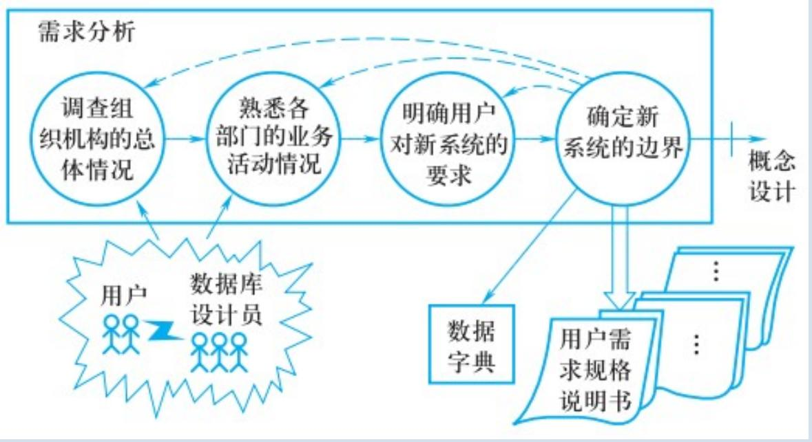

图 7.5 需求分析过程

# 7.2 需求分析

7.2.1 需求分析的任务 

7.2.2 需求分析的方法 

7.2.3 数据字典 

# 7.2.3 数据字典

✿ 数据字典是关于数据库中数据的描述，即元数据，不是数据本身 

✿ 数据字典在需求分析阶段建立，在数据库设计过程中不断修改、充实、完善 

✿ 数据字典是进行详细的数据收集和数据分析所获得的主要成果 

注意： 

和关系数据库管理系统中数据字典的区别和联系 

# 数据字典（续）

# 数据字典的内容

■ 1. 数据项 

■ 2. 数据结构 

■ 3. 数据流 

4. 数据存储 

■ 5. 处理过程 

数据项是数据的最小组成单位 

若干个数据项可以组成一个数据结构 

✿ 数据字典通过对数据项和数据结构的定义来描述数据流、数据存储的逻辑内容 

# 1. 数据项

数据项是不可再分的数据单位 

对数据项的描述 

数据项描述 = { 数据项名，数据项含义说明，别名，数据类型，长度，取值范围，取值含义，与其他数据项的逻辑关系，数据项之间的联系 } 

■ “取值范围”、“与其他数据项的逻辑关系”定义了数据的完整性约束条件，是设计数据检验功能的依据 

■ 可以用关系规范化理论为指导，用数据依赖的概念分析和表示数据项之间的联系 

# 2. 数据结构

✿ 数据结构反映了数据项之间的组合关系。 

一个数据结构可以由若干个数据项组成，也可以由若干个数据结构组成，或由若干个数据项和数据结构混合组成。 

对数据结构的描述 

数据结构描述 = 

{数据结构名，含义说明，组成：{数据项或数据结构}} 

# 3. 数据流

✿ 数据流是数据结构在系统内传输的路径。 

对数据流的描述 

数据流描述 = { 数据流名，说明，数据流来源，数据流去向，组成：{ 数据结构 },平均流量，高峰期流量 } 

■ 数据流来源：说明该数据流来自哪个过程 

■ 数据流去向：说明该数据流将到哪个过程去 

■ 平均流量：在单位时间（每天、每周、每月等）里的传输次数 

■ 高峰期流量：在高峰时期的数据流量 

# 4. 数据存储

✿ 数据存储是数据结构停留或保存的地方，也是数据流的来源和去向之一。 

对数据存储的描述 

数据存储描述 = { 数据存储名，说明，编号，输入的数据流，输出的数据流，组成：{ 数据结构 }, 数据量，存取频度，存取方式 } 

■ 存取频度：每小时、每天或每周存取次数，每次存取的数据量等信息 

■ 存取方法：批处理 / 联机处理；检索 / 更新；顺序检索 / 随机检索 

■ 输入的数据流：数据流来源 

■ 输出的数据流：数据流去向 

# 5. 处理过程

处理过程的具体处理逻辑一般用判定表或判定树来描述。数据字典中只需要描述处理过程的说明性信息 

处理过程说明性信息的描述 

处理过程描述 = { 处理过程名，说明，输入：{ 数据流 }，
输出：{ 数据流 }，处理：{ 简要说明 } } 

■ 简要说明：说明该处理过程的功能及处理要求 

- 功能：该处理过程用来做什么 

- 处理要求：处理频度要求，如单位时间里处理多少事务，多少数据量、响应时间要求等 

- 处理要求是后面物理设计的输入及性能评价的标准 

# 需求分析小结

✿ 把需求收集和分析作为数据库设计的第一阶段十分重要 

❖ 第一阶段收集的基础数据（用数据字典来表达）是下一步进行概念设计的基础。 

强调两点 

(1) 设计人员应充分考虑到可能的扩充和改变, 使设计易于更改, 系统易于扩充 

(2) 必须强调用户的参与 

# 第 7 章 数据库设计

7.1 数据库设计概述 

7.2 需求分析 

7.3 概念结构设计 

7.4 逻辑结构设计 

7.5 物理结构设计 

7.6 数据库的实施和维护 

本章小结 

# 7.3 概念结构设计

# 7.3.1 概念模型

# 7.3.2 E-R 模型

# *7.3.3 扩展的 E-R 模型

# *7.3.4 用 UML 中的类图表示 E-R 图

# 7.3.5 用 E-R 图进行概念结构设计

# 7.3.1 概念模型

将需求分析得到的用户需求抽象为信息结构（即概念模型）的过程就是概念结构设计 

概念模型的特点 

(1) 能真实、充分地反映现实世界, 是现实世界的一个真实模型 

(2) 易于理解, 从而可以用它和不熟悉计算机的用户交换意见 

（3）易于更改，当应用环境和应用要求改变时，容易对概念模型修改和扩充 

（4）易于向关系模型、网状模型、层次模型等各种数据模型转换 

描述概念模型的工具 

E-R 模型 

# 7.3 概念结构设计

7.3.1 概念结构 

7.3.2 E-R 模型 

*7.3.3 扩展的 E-R 模型 

*7.3.4 用 UML 中的类图表示 E-R 图 

7.3.5 用 E-R 图进行概念结构设计 

# 7.3.2 E-R 模型

# 1. 实体之间的联系

(1) 两个实体型之间的联系: 

①一对一联系（1:1） 

② 一对多联系（1:n） 

③ 多对多联系（m:n） 

# E-R 模型（续）

① 一对一联系（1:1） 

如果对于实体型 A 中的每一个实体，实体型 B 中至多有一个（也可以没有）实体与之联系，反之亦然，则称实体型 A 与实体型 B 具有一对一联系，记为 1:1 

例如，学校的某个学院只有一位教师任职院长，而一位教师只在一个学院中任职院长，则教师与学院之间就担任院长具有一对一联系 

# E-R 模型（续）

②一对多联系（1:n） 

如果对于实体型 A 中的每一个实体，实体型 B 中有 n 个实体（ $n \geq 0$ ）与之联系，反之，对于实体型 B 中的每一个实体，实体型 A 中至多只有一个实体与之联系，则称实体型 A 与实体型 B 有一对多联系，记为 1:n 

例如，一个学院中设置了若干个系，而每个系只能归属于一个学院，则学院与系之间具有一对多关系。 

# E-R 模型（续）

③ 多对多联系（m:n） 

如果对于实体型 A 中的每一个实体，实体型 B 中有 n 个实体（ $n \geq 0$ ）与之联系，反之，对于实体型 B 中的每一个实体，实体型 A 中也有 m 个实体（ $m \geq 0$ ）与之联系，则称实体型 A 与实体型 B 具有多对多联系，记为 m:n 

例如，一门课程同时有若干个学生选修，而一个学生可以同时选修多门课程，则课程与学生之间具有多对多联系 

# E-R 模型（续）

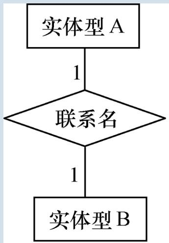

(a) 1:1 联系

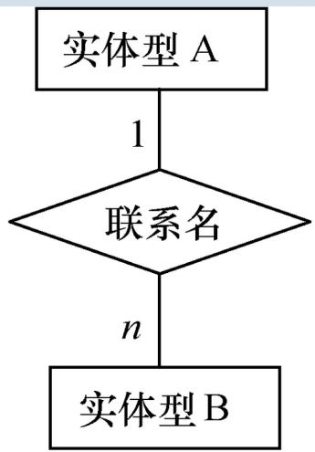

(b) $1:n$ 联系

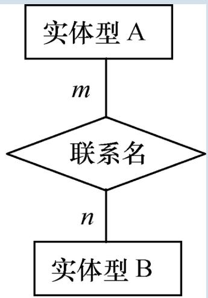

(c) m:n 联系

图 7.6 两个实体型之间的三类联系

# E-R 模型（续）

# (2) 两个以上的实体型之间的联系

- 一般地，两个以上的实体型之间也存在着一对一、一对多、多对多联系 

- 对于学生、课程、教师三类实体型，如果每位学生可以对其选修的多门课程中每一位授课教师单独进行课程评价；每位教师也可以针对其讲授的多门课程中每一位学生的课程评价进行意见反馈，则学生、课程、教师之间的课程评价联系是多对多的，如图7.7(a)所示 

# E-R 模型（续）

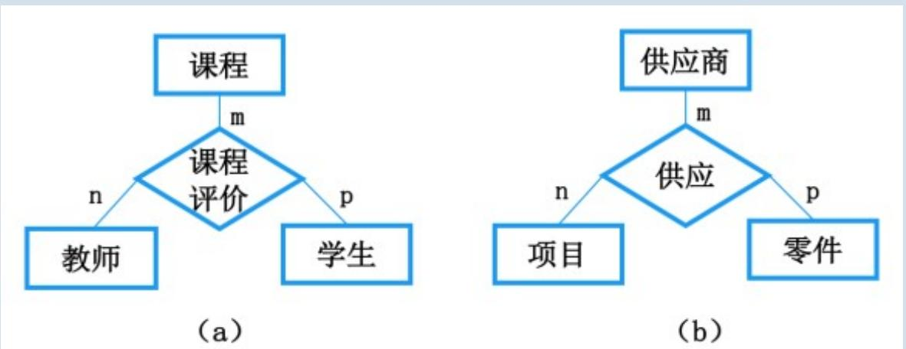

图 7.7 三个实体型之间的联系示例

对于供应商、项目、零件三类实体型，一个供应商可以供给多个项目多种零件，而每个项目可以使用多个供应商供应的零件，每种零件可由不同供应商供给，由此看出供应商、项目、零件三者之间是多对多的供应联系，如图7.7(b)所示 

# E-R 模型（续）

# (3) 单个实体型内的联系

- 同一个实体集内的各实体之间也可以存在一对一、一对多、多对多的联系。 

第 2 章中我们假设一门课只列出直接先修课，每门课可以是多门课程的直接先修课，所以课程内部的“先修”是一对多的联系，如图 7.8(a) 所示 

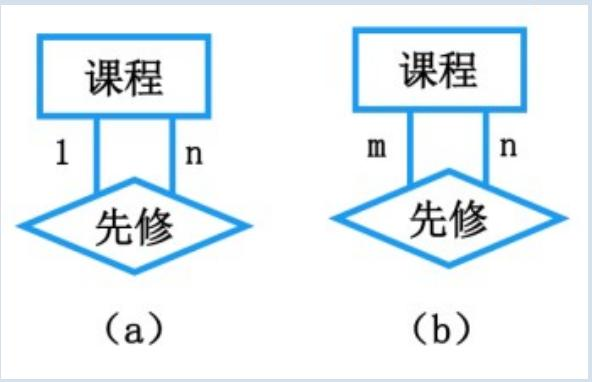

实际上一门课程也可以有多门直接先修课，某一门课程也可以作为多门课程的先修课，这时课程内部的“先修”是多对多的联系，如图7.8（b）所示 

图 7.8 单个实体型内的联系示例 

# E-R 模型 (续)

# ■联系的度：参与联系的实体型的数目

- 2个实体型之间的联系度为2，也称为二元联系 

- 3个实体型之间的联系度为3，称为三元联系 

- $N$ 个实体型之间的联系度为 $N$ ，也称为 $N$ 元联系 

# E-R 模型（续）

# 2. E-R 图

■ E-R 图提供了表示实体型、属性和联系的方法： 

- 实体型：用矩形表示，矩形框内写明实体名 

- 属性：用椭圆形表示，并用无向边将其与相应的实体型连接起来 

例如，学生实体具有学号、姓名、性别、出生年份等属性，用 E-R 图表示如图 7.9 所示 

图 7.9 学生实体及属性

# E-R 模型（续）

- 联系：用菱形表示，菱形框内写明联系名，并用无向边分别与有关实体型连接起来，同时在无向边旁标上联系的类型（1:1，1:n或m:n） 

- 联系可以具有属性 

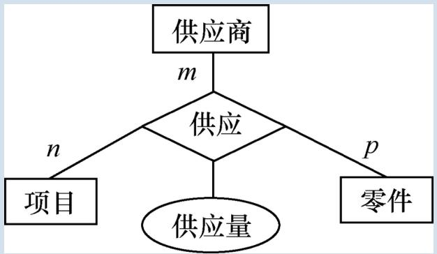

图 7.10 实体型及联系 E-R 图表示示例

# E-R 模型 (续)

# 3. 一个实例

# ■ 设学生学籍管理涉及以下 5 类实体：

- 学院：学院编号、学院名、建院时间 

- 系：系编号、系名、联系人、联系方式 

● 专业：专业编码、专业名、类别、年限 

● 学生：学号、姓名、性别、出生日期 

- 教师：职工号、姓名、职称、出生日期 

# E-R 模型（续）

# ■这些实体型之间的联系如下：

(1) 一个学院可以设置多个系, 一个系只能归属一个学院; 一个学院只有一个教师任职院长, 一个教师只在一个学院中任职院长。因此, “学院” 和 “系” 之间具有一对多联系, “学院” 与 “教师” 之间就 “担任院长” 关联具有一对一联系 

(2) 一个系可以设置多个专业, 一个专业只能归属一个系; 一个系只能由一个教师担任系主任, 一个教师只能担任一个系的系主任。因此, “系” 和 “专业” 之间具有一对多联系, “系” 与 “教师” 之间就任职系主任关联具有一对一联 

# E-R 模型（续）

# ■ 这些实体之间的联系如下（续）：

(3) 一个教师只能在一个系工作, 一个系由多位教师构成。“系”和“教师”之间构成一对多联系 

(4) 一个学生只属于一个学院, 一个学院有多位学生, “学院”和“学生”之间构成一对多联系 

(5) 一个专业同时有若干个学生选择，一个学生可以选择一个专业作为主修，另外若干个专业作为辅修。因此，“专业”和“学生”之间具有多对多联系 

# E-R 模型（续）

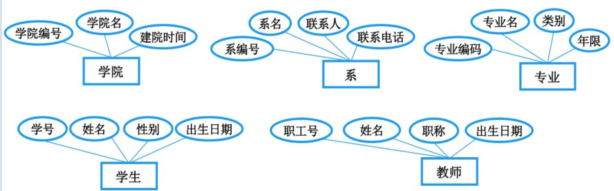

(a) 实体属

性图

# E-R 模型（续）

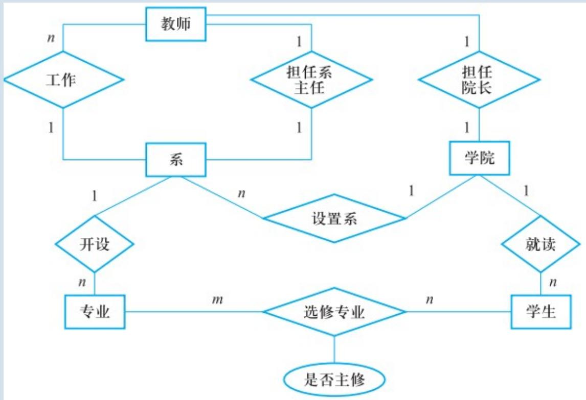

图 7.11 “学生学籍管理”

子系统的分 E-R 图

# E-R 模型 (续)

# E-R 图，可以参见：

# ■ 爱课程网 “数据库系统概论” 课程 7.3 节动画

“E-R 图难点解析（1）” 

“E-R 图难点解析（2）” 

“E-R 图难点解析（3）” 

# 7.3 概念结构设计

7.3.1 概念结构 

7.3.2 E-R 模型 

*7.3.3 扩展的 E-R 模型 

*7.3.4 用 UML 中的类图表示 E-R 图 

7.3.5 用 E-R 图进行概念结构设计 

# 7.3.3 扩展的 ER 模型

# 1. ISA 联系

■ 某些实体型是某个实体型的子类型，这种父类 - 子类联系称为 ISA 联系，表示 “is a” 语义。 

■ ISA 联系的重要性质：子类继承了父类的所有属性，子类也可以有自己的属性。 

图 7.12 ISA 联系示例

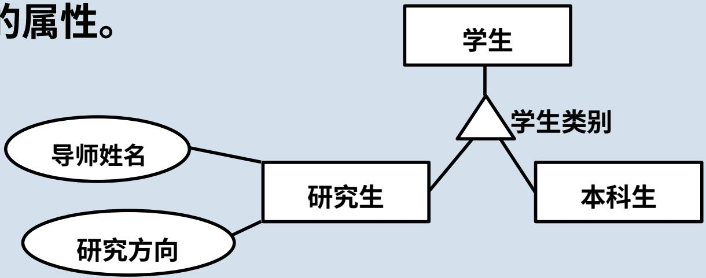

# 7.3.3 扩展的 ER 模型（续）

# (1) 分类属性

- 分类属性是父实体型的一个属性 

- 分类属性的值把父实体型中的实体分派到子实体型中 

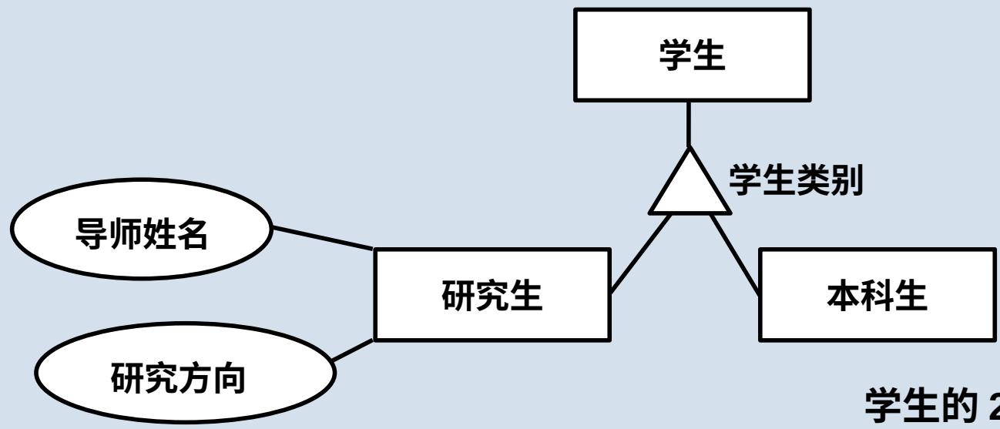

学生的 2 个子类和分类属性

# 7.3.3 扩展的 ER 模型（续）

# (2) 不相交约束与可重叠约束

- 不相交约束：描述父类中的一个实体不能同时属于多个子类中的实体集。即一个父类中的实体最多属于一个子类实体集，用 ISA 联系符号三角形的一个叉号 “X” 来表示。 

- 可重叠约束：父类中的一个实体能同时属于多个子类中的实体集。子类符号中没有叉号表示是可重叠的。 

# 7.3.3 扩展的 ER 模型（续）

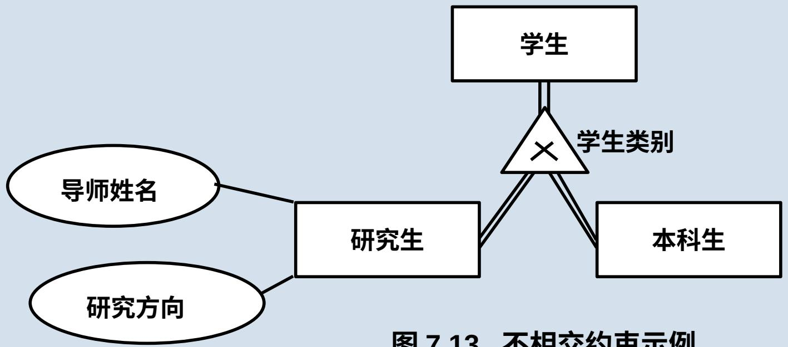

图 7.13 不相交约束示例

- 图7.13表明一个学生不能既是本科生又是研究生 

# 7.3.3 扩展的 ER 模型（续）

# (3) 完备性约束

- 描述父类中的一个实体是否必须是某一个子类中的实体。 

如果是，则叫做完全特化（full specialization） 

➢ 否则叫做部分特化（partial specialization） 

- 完全特化用父类到子类的双线连接来表示 

- 部分特化用父类到子类的单线连接来表示 

# 7.3.3 扩展的 ER 模型（续）

# 2. 基数约束

■ 对实体之间一对一、一对多、多对多联系的细化。 

■ 参与联系的每个实体型用基数约束来说明实体型中的任何一个实体可以在联系中出现的最少次数和最多次数。 

■ 约束用一个数对 min..max 表示，0≤min≤max。例如，0..1，1..3，1..*，其中，*代表无穷大。 

■ min=1 的约束叫做强制参与约束，即被施加基数约束的实体型中的每个实体都要参与联系； 

■ min=0 的约束叫做非强制参与约束，被施加基数约束的实体型中的实体可以出现在联系中，也可以不出现在联系中 

# 7.3.3 扩展的 ER 模型（续）

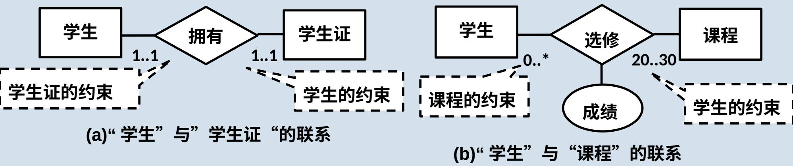

图 7.14 基数约束示例

# 7.3.3 扩展的 ER 模型（续）

# 3. Part-of 联系

■ 表明某个实体型是另外一个实体型的一部分。 

■ Part-of 联系可以分为两种情况 

- 一种是整体实体如果被破坏，部分实体仍然可以独立存在，称为非独占的 Part-of 联系 

- 另一种是整体实体如果被破坏，部分实体不能存在，称为独占的 Part-of 联系，简称独占联系。 

# 7.3.3 扩展的 ER 模型（续）

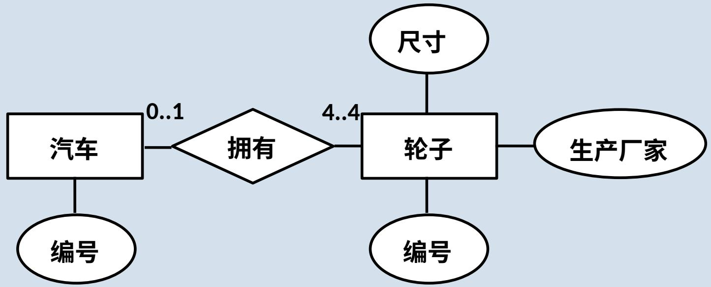

图 7.15 用非强制参与联系表示非独占 Part-of 联系

# 7.3.3 扩展的 ER 模型（续）

# - 独占联系

如果一个实体型的存在依赖于其它实体型的存在，则这个实体型叫做弱实体型，否则叫做强实体型。 

一般地，如果不能从一个实体型的属性中找出可以作为码的属性，则这个实体型是弱实体型。 

在 E-R 图中用双矩形表示弱实体型，用双菱型表示识别联系。 

# 7.3.3 扩展的 ER 模型（续）

图 7.16 弱实体型和识别联系

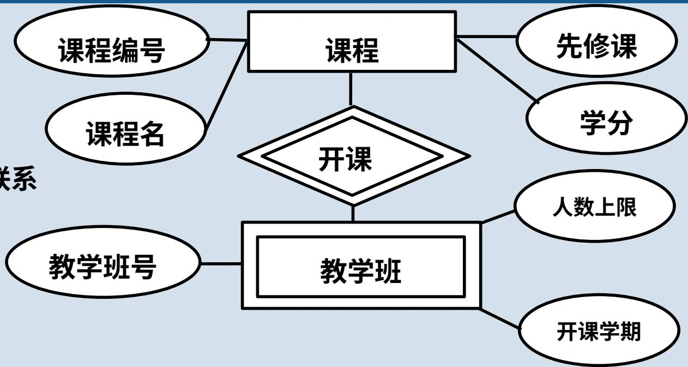

教学班是一个弱实体型，它只有“教学班号”“人数上限”“开课学期”三个属性。这些属性的任何组合都不能作为教学班的码。教学班的存在必须依赖于课程，没有课程自然没有教学班。 

# 7.3.3 扩展的 ER 模型（续）

图7.17 教室是一个弱实体

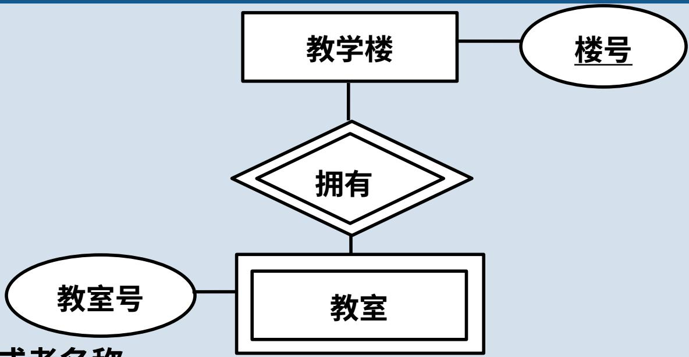

每座教学楼都有唯一的编号或者名称 

每个教室都有一个编号，教室号不包含楼号 

➢教室号不能作为码，因为不同的教学楼中可能有编号相同的房间 

教室是一个弱实体 

# 7.3 概念结构设计

7.3.1 概念结构 

7.3.2 E-R 模型 

*7.3.3 扩展的 E-R 模型 

*7.3.4 用 UML 中的类图表示 E-R 图 

7.3.5 用 E-R 图进行概念结构设计 

# 7.3.4 UML

✿ UML 称为统一建模语言（Unified Modeling Language），是对象管理组织（Object Management Group，OMG）的一个标准。 

✿ UML 是为软件开发的所有阶段提供模型化和可视化支持的规范语言，从需求规格描述到系统完成后的测试和维护。 

✿ UML 可以用于数据建模，业务建模，对象建模，组件建模等。 

✿ UML 提供了多种类型的模型描述图（diagram），借助这些图可以使应用程序更易理解。 

# 用 UML 的类图建立概念模型

# ✿ UML 中的类（class）大致对应 E-R 图中的实体。

■ 1. 实体型：用类表示，矩形框中实体名放在上部，下面列出属性名 

■ 2. 实体的码：在类图中在属性后面加 “PK” （primary key）来表示主码属性。 

■ 3. 联系：用类图之间的“关联”来表示。 

<table><tr><td>学生 Student</td><td rowspan="2">选修 SC</td><td>课程 Course</td></tr><tr><td>学号 Sno PK</td><td>课程号 Cno PK</td></tr><tr><td>姓名 Sname</td><td>0..* 20..30</td><td>课程名 Cname</td></tr><tr><td>性别 Ssex</td><td></td><td>学分 Ccredit</td></tr><tr><td>出生日期 Sbirthdate</td><td></td><td>先修课 Cpno</td></tr><tr><td>主修专业 Smajor7.18</td><td colspan="2">用 UML 的类图表示 E-R 图示</td></tr></table>

# 用 UML 的类图建立概念模型 (续)

# ■ 4. 基数约束

- UML 中关联类之间的基数约束的概念、表示和 E-R 图中的基数约束类似。 

# ■ 5.UML 中的子类

- 面向对象技术支持超类 - 子类概念，子类可以继承超类的属性，也可以有自己的属性。 

- 这些概念和 E-R 图的父类 - 子类联系、ISA 联系是一致的 

# 7.3 概念结构设计

7.3.1 概念结构 

7.3.2 E-R 模型 

*7.3.3 扩展的 E-R 模型 

*7.3.4 用 UML 中的类图表示 E-R 图 

7.3.5 用 E-R 图进行概念结构设计 

# 7.3.5 用 E-R 图进行概念结构设计

# 1. 实体与属性的划分原则

■ 为了简化 E-R 图的处置，现实世界的事物能作为属性对待的，尽量作为属性对待 

■ 两条准则： 

（1）属性不能再具有需要描述的性质。即属性必须是不可分的数据项，不能包含其他属性 

(2) 属性不能与其他实体具有联系, 即 E-R 图中所表示的联系是实体之间的联系 

# 用 E-R 图进行概念结构设计（续）

[例] 教师是一个实体型，“职工号”、“姓名”、“出生日期”是“教师”的属性 

■ “职称”如果没有与工资、福利挂钩，根据准则（1）可以作为“教师”实体的属性 

■ 如果不同的职称有不同的工资、岗位津贴和不同的附加福利，则职称作为一个实体更恰当 

图 7.19 “职称” 作为一类实体

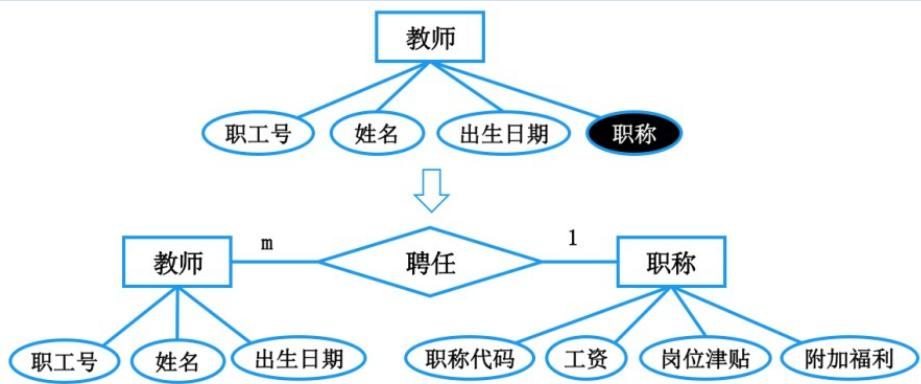

# 用 E-R 图进行概念结构设计（续）

[例]一个学生如果只能选择一个专业，且专业没有跟专业类别、专业年限等挂钩，则可以把“主修专业”作为“学生”实体的属性但如果一个学生可以选择多个专业（例如其中有一个专业为主修专业，其他专业为辅修专业），则需要把“专业”单独作为一类实体，并建立学生与专业的多对多专业选择联系 

图 7.20 “专业” 作为一类实体

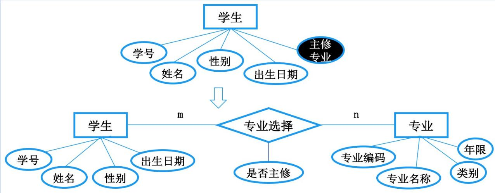

# 用 E-R 图进行概念结构设计（续）

[例]一门课程如果只存在一门直接的先修课，则可以把先修课的课程号作为“课程”实体的属性 

但如果一门课程存在多门直接的先修课，则需要把“先修课”作为单独的一类实体。由于“先修课”实体型也是课程实体型，因此“先修课”与“课程”之间是单个实体型内的多对多联系 

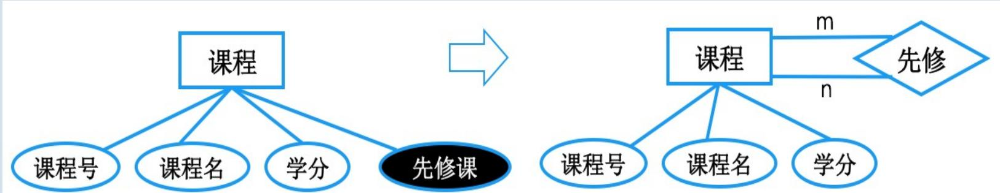

图 7.21 “先修课” 作为一类实体（与 “课程” 实体型相同）

# 用 E-R 图进行概念结构设计（续）

# ✿ [例 7.1] 教师教学管理子系统的分 E-R 图的设计

# ■ 该子系统的主要功能是：

- 为每个教学班安排授课教师 

- 为每个教学班排课，设置教室、上课时间 

- 针对学生对教学班的课堂评价，授课教师需要对学生的意见进行反馈 

# 用 E-R 图进行概念结构设计（续）

# ✿ 该子系统涉及的实体及属性如下：

(1) 教师实体的属性包括: 职工号、姓名、出生日期、职称 (为方便讨论, 本子系统将 “职称” 作为 “教师” 的属性) 

(2) 教学班: 教学班号、人数上限、开课学期 

(3) 学生: 学号、姓名、性别、出生日期 

(4) 教室实体包括教室号（教室号的编码中已经包括了楼号，例如教室号“003101”表示教3楼101教室），教学楼号、联系人、联系方式等属性 

# 用 E-R 图进行概念结构设计（续）

(5) 时间片实体包括时间片编码（例如 “10102” 表示星期一第 1 节课开始，第 2 节课下课结束）、星期几、开始时间、截止时间 

注意：时间片实体也可以作为“教学班”与“教师”的“排课”联系属性。考虑到同一个教学班在一周内可以安排在相同的教室、但在不同的时间段讲授多次，本子系统将时间片单独作为实体类 

# 用 E-R 图进行概念结构设计（续）

# 实体间的联系如下

(1) 一个教学班可以安排多个教师来讲授，一个教师也可以讲授多个教学班，因此教师与教学班具有多对多的“讲授”联系，联系的属性包括“是否为主讲教师”（一个教学班设置一个主讲教师） 

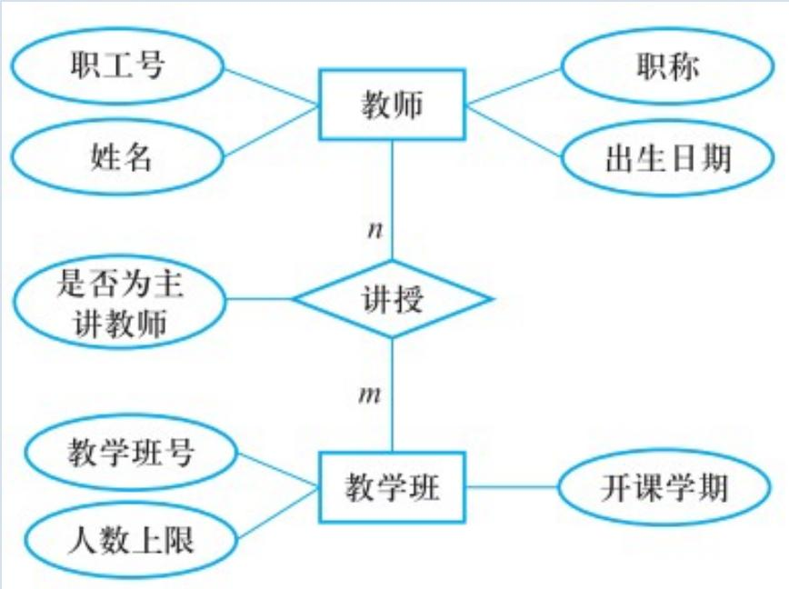

图 7.23 “教师”与“教学班”实体之间的讲授联系

# 用 E-R 图进行概念结构设计（续）

(2) 学生可以针对其选择的教学班中的任一位老师进行课堂评价，授课教师也需要对其讲授的所有教学班中每一位学生提出的评价进行一一反馈。因此，教师、学生、教学班三者之间就课堂评价关联存在多对多联系 

图 7.24 “教师” “教学班” “学生” 三个实体之间的“课程评价”联系

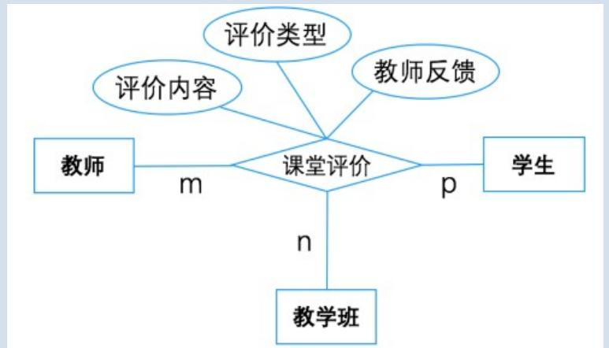

# 用 E-R 图进行概念结构设计（续）

(3) 教室”与“教学班”和“时间片”实体之间的“排课”联系属于一对多联系，确定了某个教学班、某个时间片，则教室可以唯一确定（一个教室在同一时间段只能安排一门课程） 

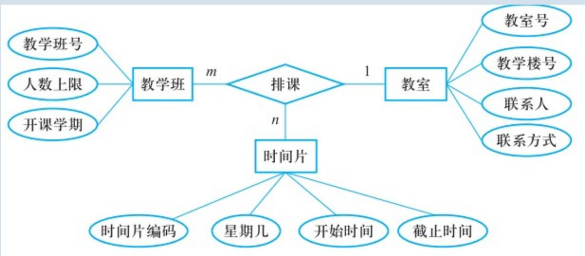

图7.24“教室”“教学班”“时间片”三个实体之间的“排课”联系

# 用 E-R 图进行概念结构设计（续）

✿ 最后得到教师教学管理子系统 E-R 图如下图所示

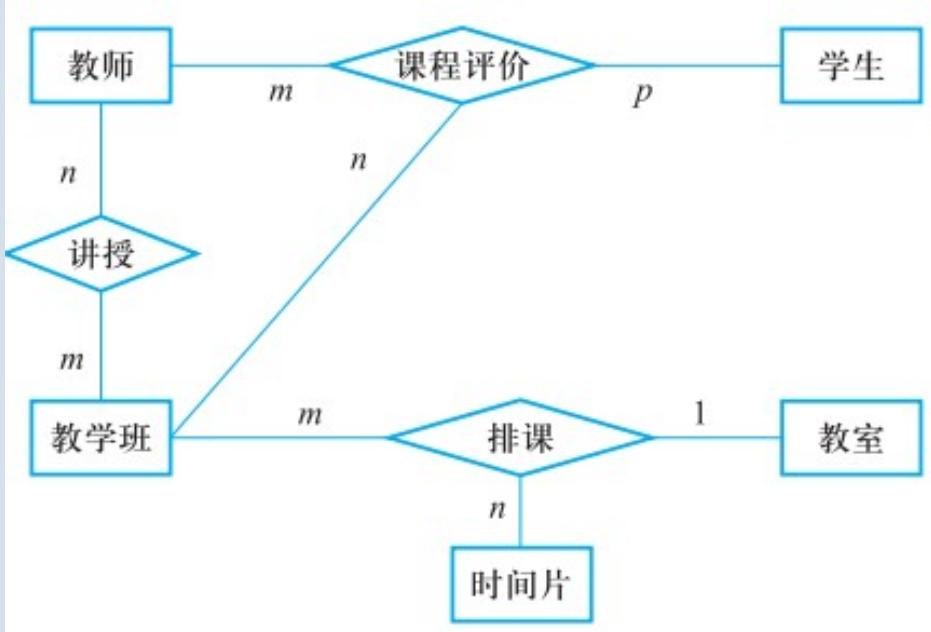

图 7.26 “教师教学管理” 子系统的分 E-R 图

# 用 E-R 图进行概念结构设计（续）

✿ 教师教学管理子系统中对每个实体定义的属性如下： 

■ 教师：Teacher(Tno, Tname, Ttitle, Tbirthdate, Dno) 

■ 学生：Student(Sno, Sname, Ssex, Sbirthdate, SHno) 

■ 教学班表：TeachingClass(TCno, TCapacity, Semester, Cno) 

■ 教室表：Classroom(CRno, CRbuilding, CRcontact, CRtel) 

■ 时间片表：TimeSlice(TSno, TSdayoftheweek, TSstarttime, TSendtime) 

# 用 E-R 图进行概念结构设计（续）

✿ 教师教学管理子系统中对多对多联系定义的属性如下: 

■ 排课：Schedule(TCno, Tsno, CRno) 

■ 讲授： Lecture(Tno, TCno, isLeading) 

■ 课堂评价 :ClassAssess(Sno, Tno, TCno, Access,CAtype,Feedback) 

# 用 E-R 图进行概念结构设计（续）

# 2. E-R 图的集成

# ■ E-R 图的集成一般需要分两步

- 合并。解决各分 E-R 图之间的冲突，将分 E-R 图合并起来生成初步 E-R 图 

- 修改和重构。消除不必要的冗余，生成基本 E-R 图 

图 7.27 E-R 图的集成示意图

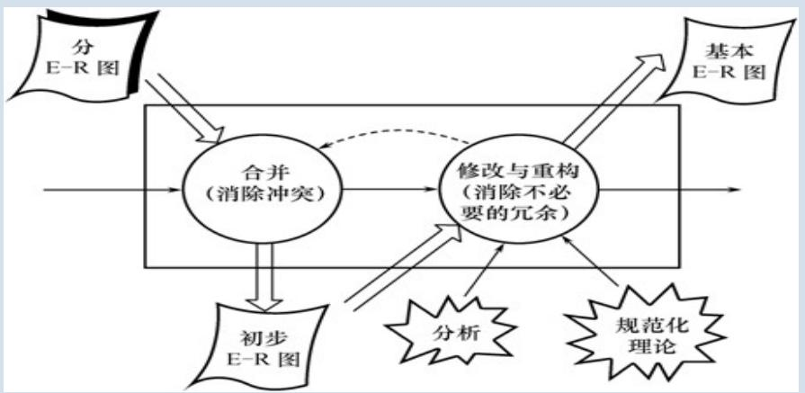

# 用 E-R 图进行概念结构设计（续）

# (1) 合并 E-R 图，生成初步 E-R 图

- 各个局部应用所面向的问题不同，各个子系统的 E-R 图之间必定会存在许多不一致的地方，称之为“冲突”。 

- 子系统 E-R 图之间的冲突主要有三类: 

① 属性冲突 

② 命名冲突 

③ 结构冲突 

# 用 E-R 图进行概念结构设计（续）

# ① 属性冲突

- 属性域冲突，即属性值的类型、取值范围或取值集合不同。 

例如教学班号，有的部门把它定义为整数，有的部门把它定义为字符型，不同部门对教学班号的编码也不同 

➢年龄，某些部门以出生日期形式表示职工的年龄，而另一些部门用整数表示职工的年龄 

- 属性取值单位冲突 

例如出生日期有的精确到年，有的精确到月，有的精确到日 

# 用 E-R 图进行概念结构设计（续）

# ② 命名冲突

- 同名异义，即不同意义的对象在不同的局部应用中具有相同的名字 

- 异名同义（一义多名），即同一意义的对象在不同的局部应用中具有不同的名字 

如对科研项目，财务科称为项目，科研处称为课题，生产管理处称为工程 

- 命名冲突 

可能发生在实体、联系一级上 

也可能发生在属性一级上 

通过讨论、协商等行政手段加以解决 

# 用 E-R 图进行概念结构设计（续）

# ③ 结构冲突

- 同一对象在不同应用中具有不同的抽象 

例如，职工在某一局部应用中被当作实体，而在另一局部应用中则被当作属性 

➢ 解决方法：把属性变换为实体或把实体变换为属性，使同一对象具有相同的抽象 

- 同一实体在不同子系统的 E-R 图中所包含的属性个数和属性排列次序不完全相同 

➢ 解决方法：使该实体的属性取各子系统的 E-R 图中属性的并集，再适当调整属性的次序 

# 用 E-R 图进行概念结构设计（续）

# ③ 结构冲突（续）

- 实体间的联系在不同的 E-R 图中为不同的类型 

实体 E1 与 E2 在一个 E-R 图中是多对多联系，在另一个 E-R 图中是一对多联系 

> 解决方法是根据应用的语义对实体联系的类型进行综合或调整 

# 用 F-R 图进行概念结构设计（续）

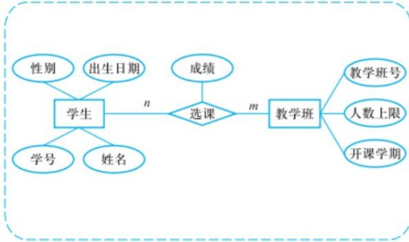

(a) “学生选课管理”子系统中“学生”与“教学班”之间的联系

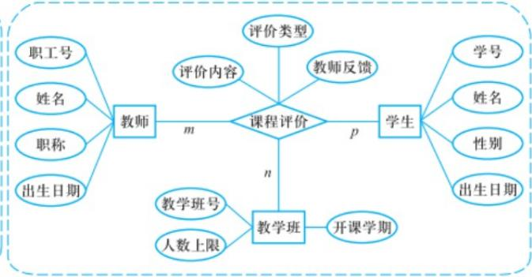

(b) “教师教学管理”子系统中“学生”“教学班”“教师”之间的联系

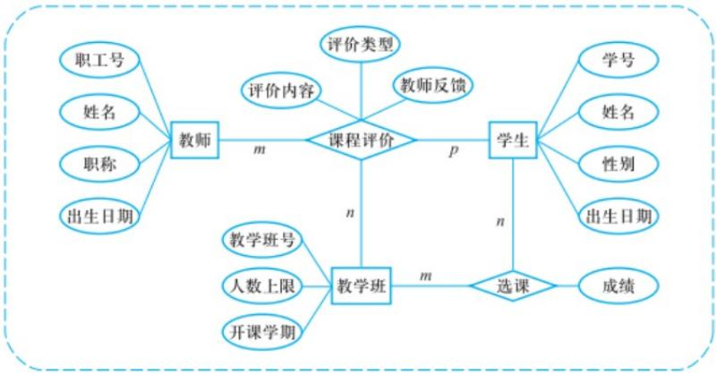

(c)合并(a)与(b)之后的E-R图

图 7.28 合并两个 E-R 图示例

# 用 E-R 图进行概念结构设计（续）

# (2) 消除不必要的冗余, 设计基本 E-R 图

- 所谓冗余的数据是指可由基本数据导出的数据，冗余的联系是指可由其他联系导出的联系 

- 消除冗余主要采用分析方法，即以数据字典和数据流图为依据，根据数据字典中关于数据项之间逻辑关系的说明来消除冗余 

# 用 E-R 图进行概念结构设计（续）

- 学生与课程的“已修”关系（记录学生选修合格及以上的选课信息），可以由学生与教学班之间的选课关系、以及教学班与课程的开课关系导出，因此，已修关系为冗余关系，可以消去 

图 7.29 消除冗余示例

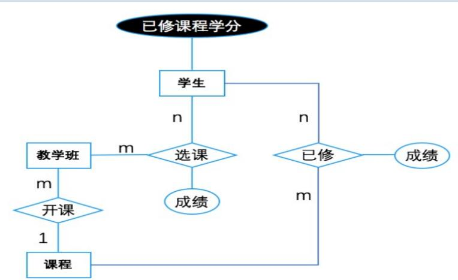

并不是所有的冗余数据与冗余联系都必须加以消除，有时为了提高效率，不得不以冗余信息作为代价。 

# 用 E-R 图进行概念结构设计（续）

# ✿ 用规范化理论来消除冗余

① 确定分 E-R 图实体之间的数据依赖。 

- 实体之间一对一、一对多、多对多的联系可以用实体码之间的函数依赖来表示。于是有函数依赖集 $F_{L}$ 

- 例如学院和系之间一对多的联系可表示为系编号 $\rightarrow$ 学院编号，系和专业之间一对多的联系可表示为专业编码 $\rightarrow$ 系编号。专业和学生之间多对多的联系可表示为（学号，专业编码） $\rightarrow$ 是否主修等 

# 用 E-R 图进行概念结构设计（续）

②求 $F_{L}$ 的最小覆盖 $G_{L}$ ，差集为 $D = F_{L} - G_{L}$ 

- 逐一考察D中的函数依赖，确定是否是冗余的联系，若是，就把它去掉 

# 用 E-R 图进行概念结构设计（续）

■ 由于规范化理论受到泛关系假设的限制，应注意下面两个问题： 

- 冗余的联系一定在 D 中，而 D 中的联系不一定是冗余的 

- 当实体之间存在多种联系时，要将实体之间的联系在形式上加以区分。例如教师和系之间一对一的联系“系主任”就要表示为 

系主任. 职工号→系编号，系编号→系主任. 职工号 

# 用 E-R 图进行概念结构设计（续）

# ✿ [例 7.2]“高校本科教务管理”信息系统的视图集成

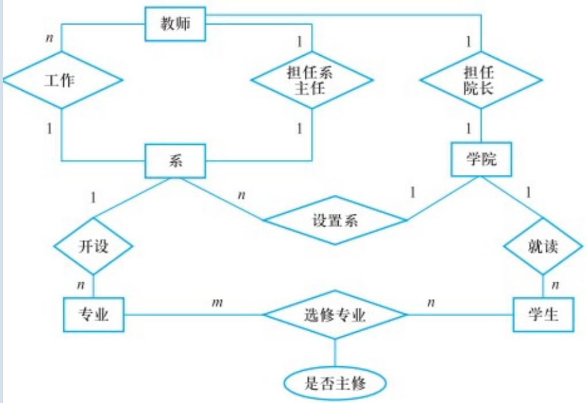

学生学籍管理子系统分 E-R 图

# 用 E-R 图进行概念结构设计（续）

✿ [例 7.2] “高校本科教务管理” 信息系统的视图集成。 

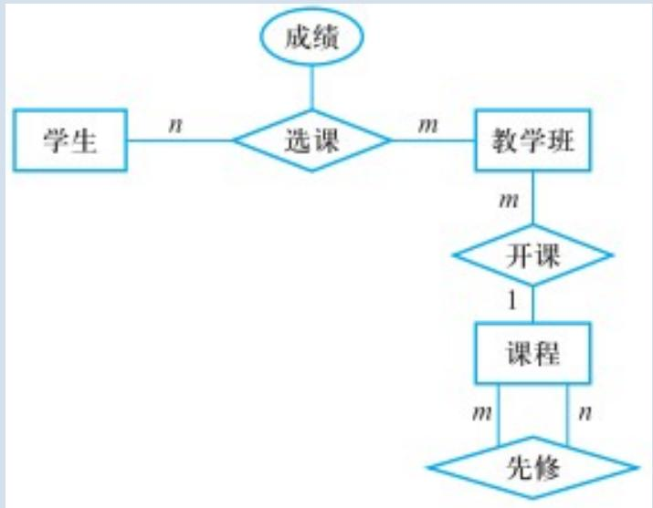

学生选课管理子系统的分 E-R 图

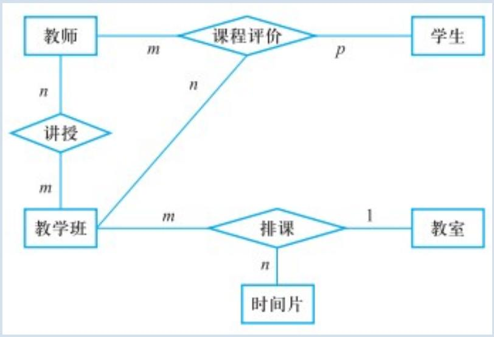

教师教学管理子系统的分 E-R 图

# 用 E-R 图进行概念结构设计（续）

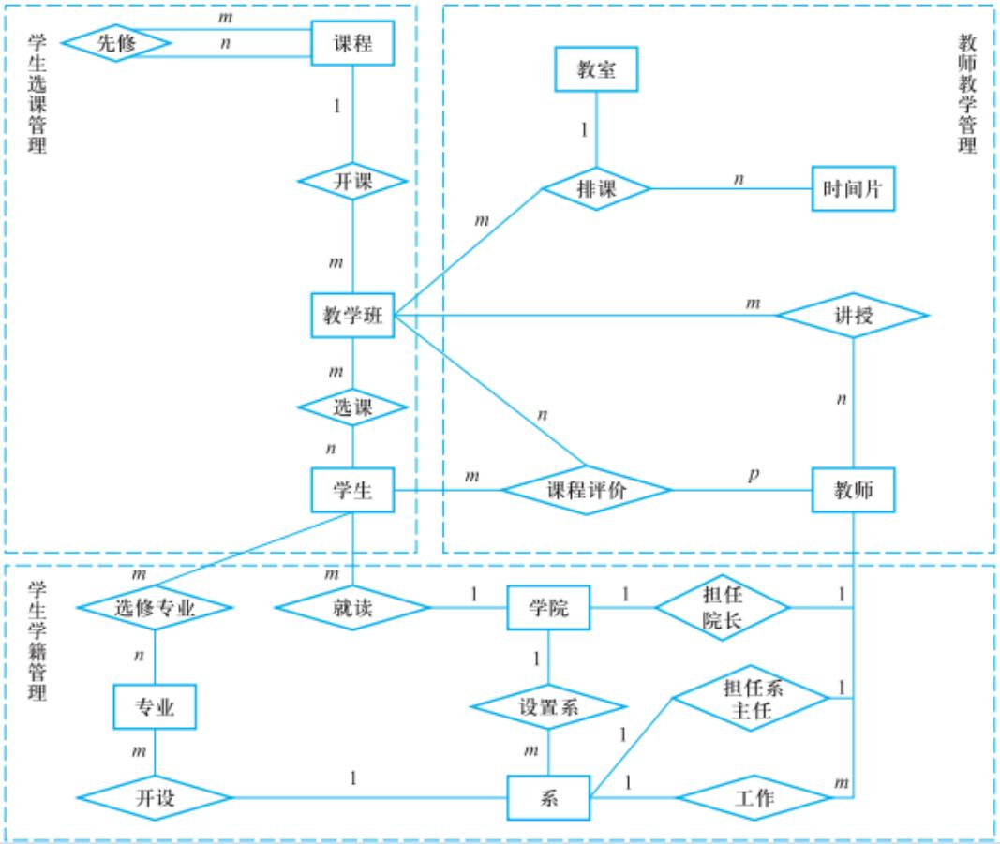

图7.30“高校本科教务管理”信息系统的基本E-R图
