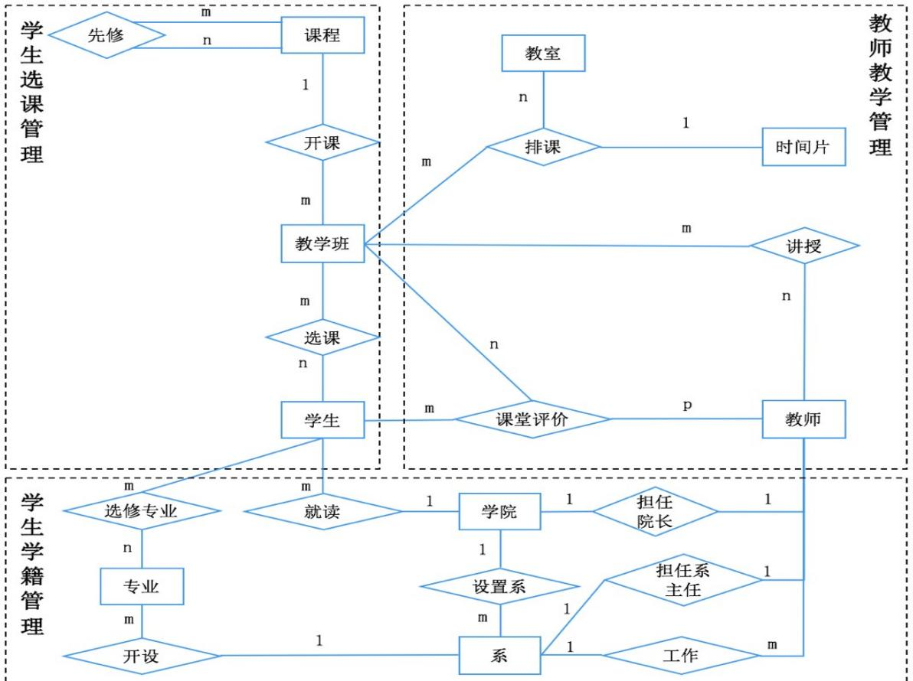
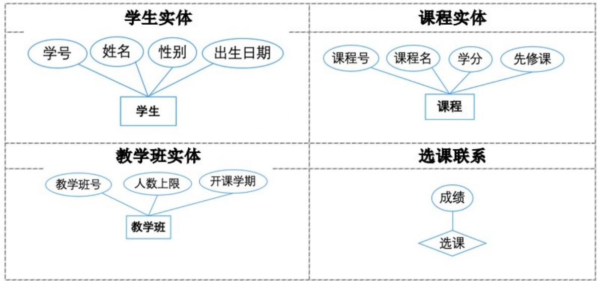
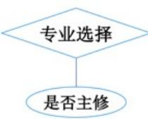

# 数据库系统概论

# Introduction to Database Systems

# 第 7 章 数据库设计（续）

华中师范大学计算机学院 

# 第 7 章 数据库设计

7.1 数据库设计概述 

7.2 需求分析 

7.3 概念结构设计 

7.4 逻辑结构设计 

7.5 物理结构设计 

7.6 数据库的实施和维护 

本章小结 

# 7.4 逻辑结构设计

# 逻辑结构设计的任务

■ 把概念结构设计阶段设计好的基本 E-R 图转换为与选用数据库管理系统产品所支持的数据模型相符合的逻辑结构 

# 7.4 逻辑结构设计

# 7.4.1 E-R 图向关系模型的转换

7.4.2 数据模型的优化 

7.4.3 设计用户外模式 

# E-R 图向关系模型的转换（续）

# 转换内容

■ E-R 图由实体型、实体的属性和实体型之间的联系三个要素组成 

■ 关系模型的逻辑结构是一组关系模式的集合 

■ 将 E-R 图转换为关系模型：将实体型、实体的属性和实体型之间的联系转化为关系模式 

# E-R 图向关系模型的转换（续）

# 转换原则

1. 一个实体型转换为一个关系模式。 

■ 关系的属性：实体的属性 

■ 关系的码：实体的码 

# E-R 图向关系模型的转换（续）

# 2. 实体型间的联系有以下不同情况

（1）一个一对一联系可以转换为一个独立的关系模式，也可以与任意一端对应的关系模式合并。 

① 转换为一个独立的关系模式 

关系的属性：与该联系相连的各实体的码以及联系本身的属性 

关系的候选码：每个实体的码均是该关系的候选码 

# E-R 图向关系模型的转换（续）

② 与某一端实体对应的关系模式合并 

合并后关系的属性：加入对应关系的码和联系本身的属性 

合并后关系的码：不变 

# E-R 图向关系模型的转换（续）

(2) 一个一对多联系可以转换为一个独立的关系模式,也可以与 $n$ 端对应的关系模式合并。 

① 转换为一个独立的关系模式 

关系的属性：与该联系相连的各实体的码以及联系本身的属性 

关系的码：n 端实体的码 

# E-R 图向关系模型的转换（续）

② 与 n 端对应的关系模式合并 

合并后关系的属性：在 n 端关系中加入 1 端关系的码和联系本身的属性 

合并后关系的码：不变 

可以减少系统中的关系个数，一般情况下更倾向于采用这种方法 

# E-R 图向关系模型的转换（续）

# （3）一个多对多联系转换为一个关系模式

- 关系的属性：与该联系相连的各实体的码以及联系本身的属性 

- 关系的码或关系码的一部分：各实体码的组合 

[例]“选修”联系是一个多对多联系，可以将它转换为如下关系模式，其中学号与教学班号为关系的组合码： 

选修（学号，教学班号，成绩） 

# E-R 图向关系模型的转换（续）

（4）三个或三个以上实体间的一个多元联系转换为一个关系模式。 

- 关系的属性：与该多元联系相连的各实体的码以及联系本身的属性 

- 关系的码或关系码的一部分：各实体码的组合 

# E-R 图向关系模型的转换（续）

# （5）具有相同码的关系模式可合并

- 目的：减少系统中的关系个数 

- 合并方法: 

将其中一个关系模式的全部属性加入到另一个关系模式中 

然后去掉其中的同义属性（可能同名也可能不同名） 

适当调整属性的次序 

# ✿ E-R 图转换关系，可以参见：

■爱课程网“数据库系统概论”课程7.3节动画“E-R图转换关系(1)” 

# E-R 图向关系模型的转换（续）

[例 7.3] 将 “学生学籍管理” 子系统的分 ER 图转换为关系模型。关系的码用下划线标出。 

# E-R 图向关系模型的转换（续）

# “学生学籍管理”子系统包括如下6个关系模式

■ 学院（学院编号，学院名，建院时间，院长） 

■系（系编号，系名，联系人，联系方式，系主任，所在学院） 

■ 专业（专业编码，专业名，类别，年限，开设系） 

■教师（职工号，姓名，职称，出生日期，所在系） 

■ 学生（学号，姓名，性别，出生日期，所在学院） 

■ 选修专业（学号，专业编码，是否主修） 

# 7.4 逻辑结构设计

7.4.1 E-R 图向关系模型的转换 

7.4.2 数据模型的优化 

7.4.3 设计用户外模式 

# 7.4.2 数据模型的优化

✿ 一般的数据模型还需要向特定数据库管理系统规定的模型进行转换。 

转换的主要依据是所选用的数据库管理系统的功能及限制。没有通用规则。 

对于关系模型来说，这种转换通常都比较简单。 

# 数据模型的优化（续）

数据库逻辑设计的结果不是唯一的。 

得到初步数据模型后，还应该适当地修改、调整数据模型的结构，以进一步提高数据库应用系统的性能，这就是数据模型的优化。 

关系数据模型的优化通常以规范化理论为指导。 

# 数据模型的优化（续）

# 优化数据模型的方法：

(1) 确定数据依赖。 

■ 按需求分析阶段所得到的语义，分别写出每个关系模式内部各属性之间的数据依赖以及不同关系模式属性之间数据依赖 

(2) 对于各个关系模式之间的数据依赖进行极小化处理，消除冗余的联系。 

# 数据模型的优化（续）

(3) 按照数据依赖的理论对关系模式进行分析, 考察是否存在部分函数依赖、传递函数依赖、多值依赖等, 确定各关系模式分别属于第几范式。 

(4) 按照需求分析阶段得到的处理的要求, 分析对于这样的应用环境这些模式是否合适, 确定是否要对某些模式进行合并或分解。 

# 数据模型的优化（续）

# ■ 并不是规范化程度越高的关系就越优

- 当查询经常涉及两个或多个关系模式的属性时，系统必须经常地进行连接运算 

- 连接运算的代价是相当高的 

- 在这种情况下，第二范式甚至第一范式也许是适合的 

# 数据模型的优化（续）

■非BCNF的关系模式虽然会存在不同程度的更新异常或冗余，但如果在实际应用中对此关系模式只是查询，并不执行更新操作，就不会产生实际影响 

■ 对于一个具体应用来说，到底规范化进行到什么程度，需要权衡响应时间和潜在问题两者的利弊才能决定 

# 数据模型的优化（续）

(5) 对关系模式进行必要分解, 提高数据操作效率和存储空间的利用率。 

■ 常用分解方法 

- 水平分解 

- 垂直分解 

# 数据模型的优化（续）

# ■水平分解

- 什么是水平分解 

把（基本）关系的元组分为若干子集合，定义每个子集合为一个子关系，以提高系统的效率。 

- 如何分解 

√ 对符合 “80/20 原则” 的，把经常被使用的数据（约 20%）水平分解出来，形成一个子关系。 

√ 关系 R 上 n 个事务，多数事务存取数据不相交，R 可分解为少于或等于 n 个子关系，使每个事务存取的数据对应一个子关系。 

# 数据模型的优化（续）

# ■垂直分解

- 什么是垂直分解 

把关系模式 R 的属性分解为若干子集合，形成若干子关系模式。 

- 垂直分解的原则 

经常在一起使用的属性从 R 中分解出来形成一个子关系模式 

- 垂直分解的优点 

可以提高某些事务的效率 

- 垂直分解的缺点 

可能使另一些事务不得不执行连接操作，降低了效率 

# 数据模型的优化（续）

# ■垂直分解的适用范围

- 取决于分解后 R 上的所有事务的总效率是否得到了提高 

# ■ 进行垂直分解的方法

- 简单情况：直观分解 

- 复杂情况：用第6章中的模式分解算法 

- 垂直分解必须不损失关系模式的语义（保持无损连接性和保持函数依赖） 

# 7.4 逻辑结构设计

7.4.1 E-R 图向关系模型的转换 

7.4.2 数据模型的优化 

7.4.3 设计用户外模式 

# 7.4.3 设计用户外模式

# 定义用户外模式时应注重三个方面：

# 1. 使用更符合用户习惯的别名

■ 合并各分 E-R 图曾做了消除命名冲突的工作，以使数据库系统中同一关系和属性具有唯一的名字。这在设计数据库整体结构时是非常必要的 

■ 用视图机制可以在设计用户视图时可以重新定义某些属性名，使其与用户习惯一致，以方便使用 

# 设计用户外模式（续）

2. 针对不同级别的用户定义不同的视图，以保证系统的安全性 

■例如针对“教师教学管理”子系统中的教师、学生、教学班三者之间的教学评价关系，建立两个视图： 

- 教师 - 教学班评价视图 

教师 - 教学班评价视图 (职工号、教师 . 姓名、教学班号、课程号、课程名、评价内容、评价类型、教师反馈) 

# 设计用户外模式（续）

- 学生 - 教学班 - 评价视图 

学生 - 教学班 - 评价视图（学号、学生.姓名、教师.姓名、教学班号、课程号、课程名、评价内容、评价类型、教师反馈） 

➢ 教师 - 教学班评价视图包含教师对应教学班的所有课程评价信息，隐藏了提供教学评价意见的学生信息，从而保证了学生信息的安全性； 

➢ 学生 - 教学班 - 评价视图可以看到学生评价信息，也能看到教师反馈。 

# 设计用户外模式（续）

# 3. 简化用户对系统的使用

- 如果某些局部应用中经常要使用某些很复杂的查询，为了方便用户，可以将这些复杂查询定义为视图。 

# 第 7 章 数据库设计

7.1 数据库设计概述 

7.2 需求分析 

7.3 概念结构设计 

7.4 逻辑结构设计 

7.5 物理结构设计 

7.6 数据库的实施和维护 

本章小结 

# 7.5 数据库的物理设计

# 什么是数据库的物理设计

■ 数据库在物理设备上的存储结构与存取方法称为数据库的物理结构，它依赖于选定的数据库管理系统 

■ 为一个给定的逻辑数据模型选取一个最适合应用要求的物理结构的过程，就是数据库的物理设计 

# 数据库的物理设计（续）

# 数据库物理设计的步骤

■ 确定数据库的物理结构 

- 在关系数据库中主要指存取方法和存储结构 

■ 对物理结构进行评价 

- 评价的重点是时间和空间效率 

■ 如果评价结果满足原设计要求，则可进入到物理实施阶段。否则就需要重新设计或修改物理结构，有时甚至要返回逻辑设计阶段修改数据模型 

# 7.5 数据库的物理设计

# 7.5.1 数据库物理设计的内容和方法

7.5.2 选择关系模式存取方法 

7.5.3 确定数据库的存储结构 

7.5.4 评价数据库的物理结构 

# 7.5.1 数据库物理设计的内容和方法

# 设计物理数据库结构的准备工作

■ 对要运行的事务进行详细分析，获得选择物理数据库设计所需参数 

■ 充分了解所用关系型数据库管理系统的内部特征，特别是系统提供的存取方法和存储结构 

# 数据库物理设计的内容和方法（续）

# 选择物理数据库设计所需参数

# ■ 数据库查询事务

- 查询的关系 

- 查询条件所涉及的属性 

- 连接条件所涉及的属性 

- 查询的投影属性 

# ■ 数据更新事务

- 被更新的关系 

- 每个关系上的更新操作条件所涉及的属性 

- 修改操作要改变的属性值 

# ■ 每个事务在各关系上运行的频率和性能要求

# 数据库物理设计的内容和方法（续）

# 关系数据库物理设计的内容

■为关系模式选择存取方法（建立存取路径） 

■设计关系、索引等数据库文件的物理存储结构 

# 7.5 数据库的物理设计

7.5.1 数据库物理设计的内容和方法 

7.5.2 选择关系模式存取方法 

7.5.3 确定数据库的存储结构 

7.5.4 评价数据库的物理结构 

# 7.5.2 关系模式存取方法选择

数据库系统是多用户共享的系统，对同一个关系要建立多条存取路径才能满足多用户的多种应用要求。 

✿ 物理结构设计的任务之一是根据关系数据库管理系统支持的存取方法确定选择哪些存取方法。 

# 关系模式存取方法选择（续）

# 数据库管理系统常用存取方法

1. B+ 树索引存取方法 

2. 哈希索引存取方法 

3. 聚簇存取方法 

# 1. B+ 树索引方法的选择

# ■ 根据应用要求确定

- 对哪些属性列建立索引 

- 对哪些属性列建立组合索引 

- 对哪些索引要设计为唯一索引 

# B+ 树索引方法的选择（续）

# B+ 树索引存取方法的一般规则

■如果一个（或一组）属性经常在查询条件中出现， 

则考虑在这个（或这组）属性上建立索引（或组合索引） 

■如果一个属性经常作为最大值和最小值等聚集函数的参数，则考虑在这个属性上建立索引 

■如果一个（或一组）属性经常在连接操作的连接条件中出现，则考虑在这个（或这组）属性上建立索引 

# B+ 树索引方法的选择（续）

# 关系上定义的索引数过多会带来较多的额外开销

■ 维护索引的开销 

■ 查找索引的开销 

# 2. 哈希索引方法的选择

如果一个关系的属性主要出现在等值连接条件中或主要出现在等值比较选择条件中，且满足两个条件之一 

■ 该关系的大小可预知，而且不变 

■ 该关系的大小动态改变，但所选用的数据库管理系统提供了动态哈希存取方法 

# 3. 聚簇方法的选择

# 什么是聚簇

■为了提高某个属性（或属性组）的查询速度，把这个或这些属性（称为聚簇码）上具有相同值的元组集中存放在连续的物理块中称为聚簇 

■ 该属性（或属性组）称为聚簇码（cluster key） 

■ 许多关系型数据库管理系统都提供了聚簇功能 

■ 聚簇存放与聚簇索引的区别 

# 聚簇方法的选择（续）

# ◆聚簇索引

■ 建立聚簇索引后，基表中数据也需要按指定的聚簇属性值的升序或降序存放。也即聚簇索引的索引项顺序与表中元组的物理顺序一致 

■ 在一个基本表上最多只能建立一个聚簇索引 

# ◆聚簇索引的适用条件

■ 很少对基表进行增删操作 

■ 很少对其中的变长列进行修改操作 

# 聚簇方法的选择（续）

# 聚簇的用途

# ■ 对于某些类型的查询，可以提高查询效率

# 1. 大大提高按聚簇属性进行查询的效率

[例] 假设学生关系按所在系建有索引，现在要查询信息系的所有学生名单。 

计算机系的 500 名学生分布在 500 个不同的物理块上时，至少要执行 500 次 I/O 操作。 

如果将同一系的学生元组集中存放，则每读一个物理块可得到多个满足查询条件的元组，从而显著地减少了访问磁盘的次数。 

# 聚簇方法的选择（续）

# 2. 节省存储空间

➢聚簇以后，聚簇码相同的元组集中在一起了，因而聚簇码值不必在每个元组中重复存储，只要在一组中存一次就行了。 

# 聚簇方法的选择（续）

# ◆ 聚簇的局限性

■ 聚簇只能提高某些特定应用的性能 

■ 建立与维护聚簇的开销相当大 

- 对已有关系建立聚簇，将导致关系中元组的物理存储位置移动，并使此关系上原有的索引无效，必须重建。 

- 当一个元组的聚簇码改变时，该元组的存储位置也要做相应改变。 

# 聚簇方法的选择（续）

# 聚簇的适用范围

■既适用于单个关系独立聚簇，也适用于多个关系组合聚簇 

■ 当通过聚簇码进行访问或连接是该关系的主要应用，与聚簇码无关的其他访问很少或者是次要的时，可以使用聚簇 

- 尤其当 SQL 语句中包含有与聚簇码有关的 ORDER BY, GROUP BY, UNION, DISTINCT 等子句或短语时，使用聚簇特别有利，可以省去或减化对结果集的排序操作 

# 聚簇方法的选择（续）

# 选择聚簇存取方法

# ■ 设计候选聚簇

（1）常在一起进行连接操作的关系可以建立组合聚簇 

(2) 如果一个关系的一组属性经常出现在相等比较条件中, 则该单个关系可建立聚簇; 

(3) 如果一个关系的一个（或一组）属性上的值重复率很高，则此单个关系可建立聚簇。 

# 聚簇方法的选择（续）

# ■检查候选聚簇中的关系，取消其中不必要的关系

（1）从聚簇中删除经常进行全表扫描的关系 

(2) 从聚簇中删除更新操作远多于连接操作的关系 

(3) 不同的聚簇中可能包含相同的关系, 一个关系可以在某一个聚簇中, 但不能同时加入多个聚簇。要从这多个聚簇方案 (包括不建立聚簇) 中选择一个较优的, 即在这个聚簇上运行各种事务的总代价最小。 

# 7.5 数据库的物理设计

7.5.1 数据库物理设计的内容和方法 

7.5.2 选择关系模式存取方法 

7.5.3 确定数据库的存储结构 

7.5.4 评价数据库的物理结构 

# 7.5.3 确定数据库的存储结构

确定数据库物理结构主要指确定数据的存放位置和存储结构，包括：确定关系、索引、聚簇、日志、备份等的存储安排和存储结构，确定系统配置等。 

确定数据的存放位置和存储结构要综合考虑存取时间、存储空间利用率和维护代价三个方面的因素。 

# 确定数据库的存储结构（续）

# 影响数据存放位置和存储结构的因素

■ 硬件环境 

■ 应用需求 

- 存取时间 

- 存储空间利用率 

- 维护代价 

必须进行权衡，选择一个折中方案 

这三个方面常常是相互矛盾的 

# 1. 确定数据的存放位置

# 基本原则

# ■ 根据应用情况将

- 易变部分与稳定部分分开存放 

- 经常存取部分与存取频率较低部分分开存放 

# [例]

■ 可以将比较大的表分别放在两个磁盘上，加快存取速度，这在多用户环境下特别有效。 

■ 可以将日志文件与数据库对象（表、索引等）放在不同的磁盘以改进系统的性能。 

# 2. 确定系统配置

# 数据库管理系统一般都提供了一些存储分配参数

- 同时使用数据库的用户数 

- 同时打开的数据库对象数 

- 内存分配参数 

- 缓冲区分配参数（使用的缓冲区长度、个数） 

- 存储分配参数 

- 物理块的大小 

- 物理块装填因子 

- 时间片大小 

- 数据库的大小 

- 锁的数目等 

# 确定系统配置（续）

系统都为这些变量赋予了合理的缺省值。 

在进行物理设计时需要根据应用环境确定这些参数值，以使系统性能最优。 

✿ 在物理设计时对系统配置变量的调整只是初步的，要根据系统实际运行情况做进一步的调整，以期切实改进系统性能。 

# 7.5 数据库的物理设计

7.5.1 数据库物理设计的内容和方法 

7.5.2 选择关系模式存取方法 

7.5.3 确定数据库的存储结构 

7.5.4 评价数据库的物理结构 

# 7.5.4 评价物理结构

对数据库物理设计过程中产生的多种方案进行评价，从中选择一个较优的方案作为数据库的物理结构。 

评价方法 

■ 定量估算各种方案 

- 存储空间 

- 存取时间 

- 维护代价 

■ 对估算结果进行权衡、比较，选择出一个较优的合理的物理结构 

# 第 7 章 数据库设计

7.1 数据库设计概述 

7.2 需求分析 

7.3 概念结构设计 

7.4 逻辑结构设计 

7.5 物理结构设计 

7.6 数据库的实施和维护 

# 本章小结

# 7.6 数据库的实施和维护

7.6.1 数据的载入和应用程序的编码与调试 

7.6.2 数据库的试运行 

7.6.3 数据库的运行和维护 

# 数据的载入

数据库结构建立好后，就可以向数据库中装载数据了。组织数据入库是数据库实施阶段最主要的工作。 

数据装载方法 

■ 人工方法 

■ 计算机辅助数据入库 

# 应用程序的编码与调试

数据库应用程序的设计应该与数据设计并行进行 

✿ 在组织数据入库的同时还要编码和调试应用程序 

# 7.6 数据库的实施和维护

7.6.1 数据的载入和应用程序的编码与调试 

7.6.2 数据库的试运行 

7.6.3 数据库的运行和维护 

# 7.6.2 数据库的试运行

应用程序调试完成，并且已有一小部分数据入库后，就可以开始对数据库系统进行联合调试，也称数据库的试运行。 

主要工作包括： 

■ 功能测试：实际运行应用程序，执行对数据库的各种操作，测试应用程序的各种功能是否满足设计要求 

■ 性能测试：测量系统的性能指标，分析是否符合设计目标 

# 数据库的试运行（续）

# 数据库性能指标的测量

■ 数据库物理设计阶段在评价数据库结构估算时间、空间指标时，作了许多简化和假设，忽略了许多次要因素，因此结果必然很粗糙 

■有些参数的最佳值往往是通过运行调试找到的，如果测试结果不符合设计目标，则需要返回物理设计阶段，调整物理结构，修改系统参数；有时甚至需要返回逻辑设计阶段，修改逻辑结构 

# 数据库的试运行（续）

# ✿ 数据的分期入库

■ 重新设计物理结构甚至逻辑结构，会导致数据重新入库 

■ 由于数据入库工作量实在太大，所以可以采用分期输入数据的方法 

- 先输入小批量数据供先期联合调试使用 

- 待试运行基本合格后再输入大批量数据 

- 逐步增加数据量，逐步完成运行评价 

# 数据库的试运行（续）

# 数据库的转储和恢复

■ 在数据库试运行阶段，系统还不稳定，硬软件故障随时都可能发生 

■ 系统的操作人员对新系统还不熟悉，误操作也不可避免 

■ 因此必须做好数据库的转储和恢复工作，尽量减少对数据库的破坏 

# 7.6 数据库的实施和维护

7.6.1 数据的载入和应用程序的编码与调试 

7.6.2 数据库的试运行 

7.6.3 数据库的运行和维护 

# 7.6.3 数据库的运行和维护

✿ 在数据库运行阶段，对数据库经常性的维护工作主要是由数据库管理员完成的，包括： 

1. 数据库的转储和恢复 

- 数据库管理员要针对不同的应用要求制定不同的转储计划，定期对数据库和日志文件进行备份 

- 一旦发生介质故障，即利用数据库备份及日志文件备份，尽快将数据库恢复到某种一致性状态 

# 数据库的运行和维护（续）

# 2. 数据库的安全性、完整性控制

# - 初始定义

数据库管理员根据用户的实际需要授予不同的操作权限 

根据应用环境定义不同的完整性约束条件 

# - 修改定义

当应用环境发生变化，对安全性的要求也会发生变化，数据库管理员需要根据实际情况修改原有的安全性控制 

由于应用环境发生变化，数据库的完整性约束条件也会变化，也需要数据库管理员不断修正，以满足用户要求 

# 数据库的运行和维护（续）

# 3. 数据库性能的监督、分析和改造

- 在数据库运行过程中，数据库管理员必须监督系统运行，对监测数据进行分析，找出改进系统性能的方法 

➢ 利用监测工具获取系统运行过程中一系列性能参数的值 

通过仔细分析这些数据，判断当前系统是否处于最佳运行状态 

如果不是，则需要通过调整系统物理参数或对数据库进行重组或重构来进一步改进数据库性能 

# 数据库的运行和维护（续）

# 4. 数据库的重组与重构

# (1) 数据库的重组

- 为什么要重组织数据库 

数据库运行一段时间后，由于记录的不断更新，会使数据库的物理存储变坏，从而降低数据库存储空间的利用率和数据的存取效率，使数据库的性能下降 

# 数据库的运行和维护（续）

# ■ 重组织的形式

- 全部重组织 

- 部分重组织 

只对频繁增、删的表进行重组织 

# ■ 重组织的目标

- 提高系统性能 

# 数据库的运行和维护（续）

# ■ 重组织的工作

- 按原设计要求 

重新安排存储位置 

回收垃圾 

减少指针链 

- 数据库的重组织不会改变原设计的数据逻辑结构和物理结构 

■ 数据库管理系统一般都提供了供重组织数据库使用的实用程序，帮助数据库管理员重新组织数据库 

# 数据库的运行和维护（续）

# (2) 数据库的重构

# ■ 为什么要进行数据库的重构造

- 数据库应用环境发生变化，会导致实体及实体间的联系也发生相应的变化，使原有的数据库设计不能很好地满足新的需求 

增加新的应用或新的实体 

取消某些已有应用 

改变某些已有应用 

# 数据库的运行和维护（续）

# ■ 数据库重构造的主要工作

- 根据新环境调整数据库的模式和内模式 

增加或删除某些数据项 

改变数据项的类型 

增加或删除某个表 

改变数据库的容量 

增加或删除某些索引 

# 数据库的运行和维护（续）

# ■ 重构造数据库的程度是有限的

- 若应用变化太大，已无法通过重构数据库来满足新的需求，或重构数据库的代价太大，则表明现有数据库应用系统的生命周期已经结束，应该重新设计新的数据库应用系统了 

# 第 7 章 数据库设计

7.1 数据库设计概述 

7.2 需求分析 

7.3 概念结构设计 

7.4 逻辑结构设计 

7.5 物理结构设计 

7.6 数据库的实施和维护 

# 本章小结

# 本章小结

# 数据库的设计过程

需求分析 

■ 概念结构设计 

■ 逻辑结构设计 

■ 物理结构设计 

■ 数据库实施 

■ 数据库运行维护 

■ 设计过程中往往还会有许多反复 

# 小结（续）

# 数据库各级模式的形成

■需求分析阶段：综合各个用户的应用需求（现实世界的需求） 

■ 概念设计阶段：概念模式（信息世界模型），用 E-R 图来描述 

■ 逻辑设计阶段：逻辑模式、外模式 

■ 物理设计阶段：内模式 

# 小结（续）

# 概念结构设计

■ E-R 模型的基本概念和图示方法 

■ E-R 模型的设计 

■ 把 E-R 模型转换为关系模型的方法 

# 小结（续）

■ 在逻辑设计阶段将 E-R 图转换成具体的数据库产品支持的数据模型如关系模型，形成数据库逻辑模式 

■ 然后根据用户处理的要求，安全性的考虑，在基本表的基础上再建立必要的视图，形成数据的外模式 

■ 在物理设计阶段根据数据库管理系统特点和处理的需要，进行物理存储安排，设计索引，形成数据库内模式 

# 习题

学校中有若干系，每个系有若干班级和教研室，每个教研室有若干教员，其中有的教授和副教授每人各带若干研究生，每个班有若干学生，每个学生选修若干课程，每门课可由若干学生选修。请用 E-R 图画出此学校的概念模型。 

# E-R 图

# 学生选课子系统

1. 学生选课管理子系统

# 转换的关系模型

# 学生选课子系统包括如下 5 个关系模式

■ 课程：Course(Cno,Cname,Ccredit) 

■ 先修课：PreCourse(Cno, Cpno) 

■ 教学班：TeachingClass(TCno, TCapacity, Semester, Cno) 

■ 学生：Student(Sno, Sname, Ssex, Sbirthdate, SHno) 

■ 学生选课：SC(Sno, TCno, Grade) 

# 学生学籍管理子系统

2. 学生学籍管理子系统

<table><tr><td>学院实体</td><td>系实体</td></tr><tr><td></td><td></td></tr><tr><td>专业实体</td><td>教师实体</td></tr><tr><td></td><td></td></tr><tr><td>学生实体</td><td>选修专业联系</td></tr><tr><td></td><td></td></tr></table>

# 转换的关系模型

# 学生学籍管理子系统中包括以下6个关系模式：

学院: School(SHno, SHname, SHFoundDate, Dean) 

系：Department(Dno, Dname, Dcontact, Dtel, Director, SHno) 

■ 专业： Major(Mno, Mname, Mtype, MDuration, Dno) 

■ 教师：Teacher(Tno, Tname, Ttitle, Tbirthdate, Dno) 

■ 学生: Student(Sno, Sname, Ssex, Sbirthdate, SHno) 

■ 选修专业： MajorIn(Sno, Mno, isPrimaryMajor) 

# 教师教学管理子系统

# 3. 教师教学管理子系统

<table><tr><td>教师实体</td><td>教学班实体</td></tr><tr><td></td><td></td></tr><tr><td>学生实体</td><td>教室实体</td></tr><tr><td></td><td></td></tr><tr><td>时间片实体</td><td>讲授联系</td></tr><tr><td></td><td></td></tr><tr><td>课堂评价联系</td><td></td></tr><tr><td></td><td></td></tr></table>

# 转换的关系模型

# ✿ 教师教学管理子系统中包括以下 8 个关系模式：

■ 教师：Teacher(Tno, Tname, Ttitle, Tbirthdate, Dno) 

■ 学生：Student(Sno, Sname, Ssex, Sbirthdate, SHno) 

■ 教学班表：TeachingClass(TCno, Capacity, Semester, Cno) 

■ 教室表：Classroom(CRno, CRbuilding, CRcontact, CRtel) 

■ 时间片表：TimeSlice(TSno, TSdayoftheweek, TSstarttime, TSendtime) 

■ 排课：Schedule(TCno, Tsno, CRno) 

■ 讲授：Teaching(Tno, TCno, isLeading) 

■ 课堂评价：ClassAssess(Sno, Tno, TCno, Assess, CAtype, Feedback) 

# 大作业《数据库设计与应用开发》

基本要求：在某个关系数据库管理系统软件基础上，利用合适的应用系统开发工具为某个部门或单位开发一个数据库应用系统 

实验目的： 

■ 通过实践，掌握本章介绍的数据库设计方法。 

■ 学会在一个实际的关系数据库管理系统软件平台上创建数据库。 

■ 培养团队合作精神，要求 5~6 位同学组成一个开发小组，每位同学承担不同角色（例如：项目管理员、DBA、系统分析员、系统设计员、系统开发员、系统测试员）。 

# 大作业《数据库设计与应用开发》

# ✿ 内容与具体要求：

■ 给出数据库设计各个阶段的详细设计报告 

■ 写出系统的主要功能和使用说明 

■ 提交运行的系统 

■ 写出收获和体会，包括已解决和尚未解决的问题，进一步完善的设想与建议 

■ 每个小组进行 20 分钟的报告和答辩，讲解设计方案，演示系统运行，汇报分工与合作情况 